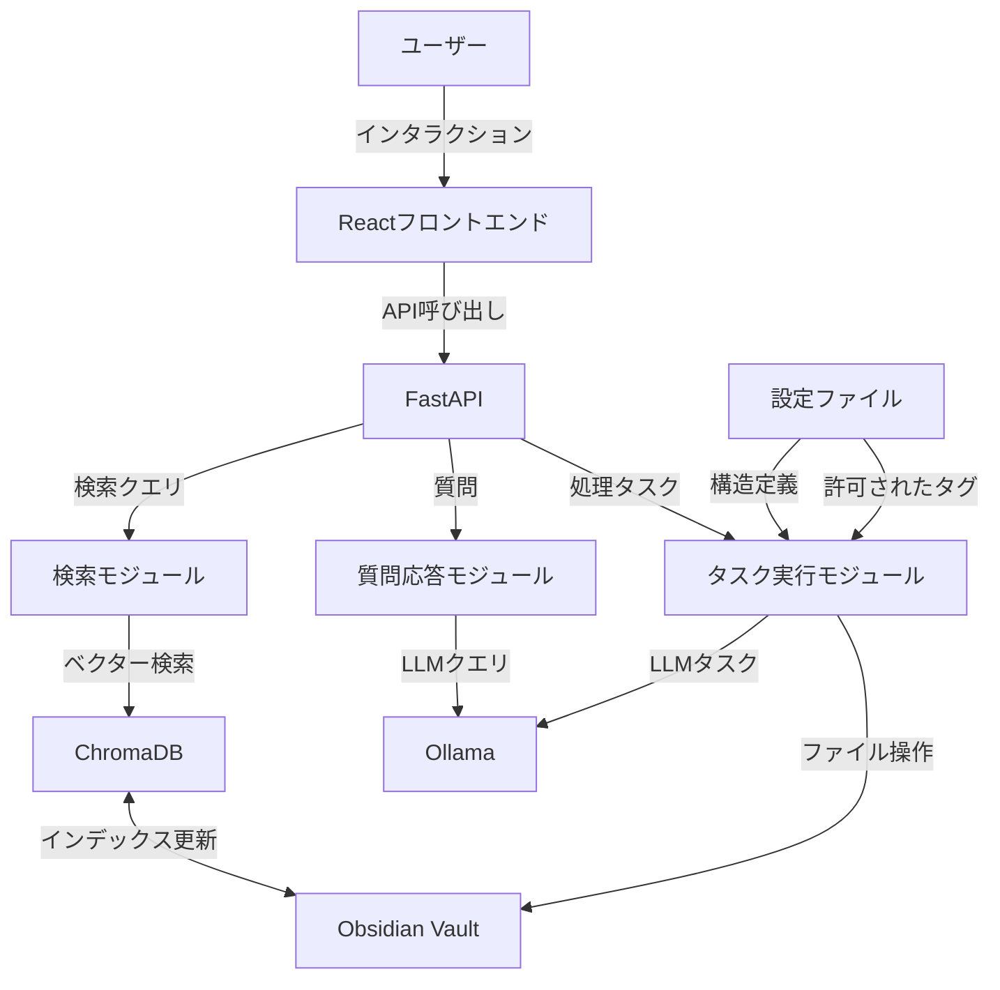

# Obsidian Concierge

Obsidian Conciergeは、Obsidianユーザーのための知識管理アシスタントです。RAG検索、インテリジェントなファイル移動、MOC生成、タグ付けを支援するLLMベースのウェブアプリケーションとして、あなたの知識管理ワークフローを強化します。

## 🌟 主な機能

- **RAG検索**: Vaultの内容をベクトル化して意味検索を実現
- **インテリジェントなファイル移動**: 内容を分析して最適な保存先を提案
- **MOC (Map of Content) 生成**: トピック、フォルダ、タグベースの知識マップを自動生成
- **タグ付け支援**: ノートの内容を分析して適切なタグを提案
- **自動リンク生成**: 関連するノート間のリンクを検出して提案

## 🔧 技術スタック

- **フロントエンド**: React + TypeScript（モダンなWebインターフェース）
- **バックエンド**: FastAPI（RESTful API）
- **言語モデル**: Ollama（gemma3:27b）
- **ベクターデータベース**: ChromaDB
- **エージェントフレームワーク**: Agno
- **プログラミング言語**: Python, TypeScript

## 📋 システムアーキテクチャ



## 🚀 インストールと設定

### 前提条件

- Python 3.10+
- Node.js 18+
- Ollama（gemma3:27bモデルがインストール済み）
- Obsidian Vault

### インストール手順

1. リポジトリをクローン:
   ```bash
   git clone https://github.com/NewAITees/Obsidian-Concierge
   cd obsidian-concierge
   ```

2. バックエンド依存関係をインストール:
   ```bash
   poetry install
   ```

3. フロントエンド依存関係をインストール:
   ```bash
   cd frontend
   npm install
   ```

4. 設定ファイルを作成:
   ```bash
   cp config.example.yaml config.yaml
   ```

5. `config.yaml` を編集して Vault パスなどを設定

### 起動方法

```bash
# バックエンドを起動
poetry run python -m obsidian_concierge

# 別のターミナルでフロントエンドを起動
cd frontend
npm run dev
```

ブラウザで http://localhost:3000 にアクセスしてWebインターフェースを利用できます。

## 🔍 機能の詳細

### 検索機能

ChromaDBを使ってVault内のノートを意味的に検索します。単純なキーワードマッチングではなく、内容の理解に基づいた検索結果を提供します。

### 質問応答

Ollama LLMを使用してVault内の情報に基づいた質問に答えます。関連するノートを自動的に参照して回答を生成します。

### ファイル移動

新しいノートを「移動前」フォルダに置くと、内容を分析して適切なフォルダに自動的に移動します。フォルダ構造は設定ファイルで定義できます。

### MOC生成

以下の3種類のMOC（Map of Content）を生成できます：
- **トピックベース**: 特定のキーワードに関連するノートを集約
- **フォルダベース**: フォルダ内のノートを整理して概要を作成
- **タグベース**: 特定のタグを持つノートを分析して構造化

### タグ付け

ノートの内容を分析して、設定ファイルで定義された許可済みのタグから適切なものを提案します。

### 自動リンク生成

関連するノート間のリンクを検出して提案します。セマンティック類似性とキーワードマッチングの両方を使用して関連性を判断します。

## ⚙️ 設定

設定は `config.yaml` ファイルで管理します。主な設定項目：

```yaml
app:
  name: "Obsidian Concierge"
  version: "0.1.0"
  vault_path: "/path/to/obsidian/vault"

folder_structure:
  - name: "Projects"
    subfolders:
      - "Active"
      - "Archive"
  - name: "Areas"
    subfolders:
      - "Health"
      - "Finance"
      - "Career"
  # 以下省略...

allowed_tags:
  - project
  - area
  - resource
  # 以下省略...
```

## 📈 開発ロードマップ

### フェーズ1: 基本機能の実装
- Vault接続とインデックス作成
- 検索機能
- 基本的なUI

### フェーズ2: LLM統合機能
- 質問応答機能
- ファイル移動機能
- シンプルなMOC生成

### フェーズ3: 高度な機能と最適化
- タグ付け機能の強化
- 詳細なMOC生成
- パフォーマンス最適化

### フェーズ4: ユーザビリティと拡張性
- エラーハンドリングの強化
- ユーザーフレンドリーな設定インターフェース
- プラグインシステムの基盤構築

### フェーズ5: 自動リンク生成と検証機能
- リンク提案システム
- 変更検証メカニズム
- ロールバック機能

### フェーズ6: Vault分析と最適化
- フォルダ構造分析
- タグ体系の最適化提案
- 視覚化ツール

## 🛠️ 開発ガイドライン

プロジェクトは以下の開発ガイドラインに従っています：

- **コード品質**: PEP 8準拠、SOLID原則、DRYの遵守
- **エラー処理**: 具体的な例外型、適切なエラーメッセージ
- **ドキュメンテーション**: 関数やクラスには明確なdocstringsを記述
- **テスト**: ブラックボックステストと単体テストの両方を実施
- **型安全**: 静的型付けとPydanticモデルの積極的な活用

詳細な開発ガイドラインは `.cursor` ディレクトリ内のドキュメントを参照してください。

## 🤝 貢献

貢献は歓迎します！以下の手順で参加できます：

1. リポジトリをフォーク
2. 機能ブランチを作成 (`git checkout -b feature/amazing-feature`)
3. 変更をコミット (`git commit -m 'Add some amazing feature'`)
4. ブランチにプッシュ (`git push origin feature/amazing-feature`)
5. プルリクエストを作成

## 📄 ライセンス

MIT License - 詳細は [LICENSE](LICENSE) ファイルを参照してください。

## 🙏 謝辞

- [Obsidian](https://obsidian.md/) - 素晴らしい知識管理ツールを提供してくれているチーム
- [Ollama](https://ollama.ai/) - ローカルLLMの実行を容易にしてくれているプロジェクト
- [ChromaDB](https://www.trychroma.com/) - 高性能なベクターデータベース
- [React](https://reactjs.org/) - モダンなWebフロントエンド開発を可能にするライブラリ
- [FastAPI](https://fastapi.tiangolo.com/) - 高性能なPython Web APIフレームワーク