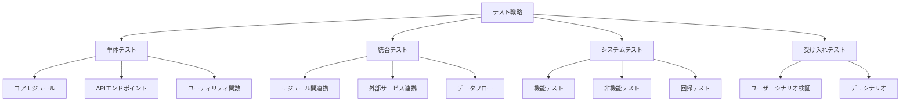
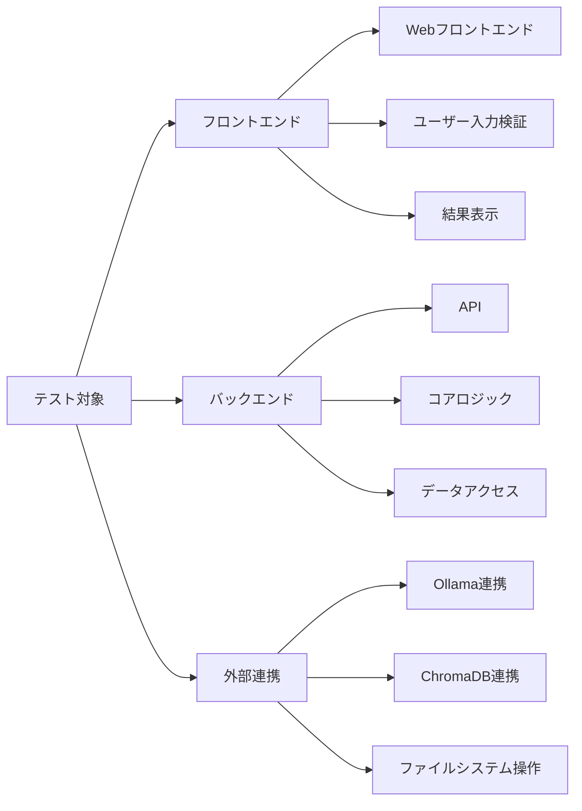
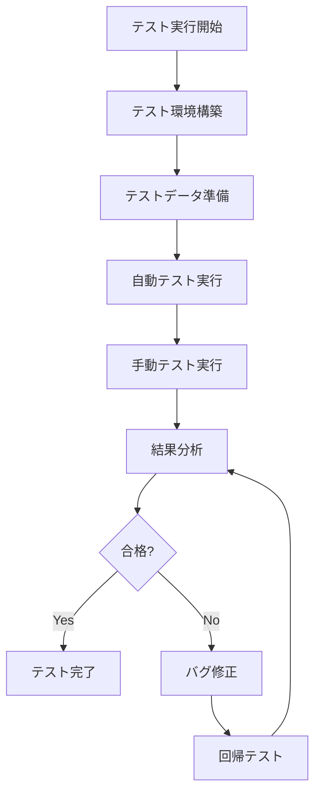
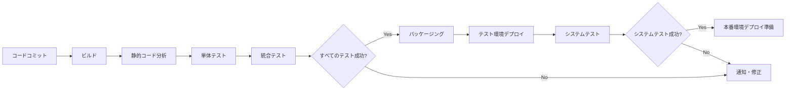

# Obsidian Concierge テスト計画

このドキュメントでは、Obsidian Conciergeのテスト戦略、テスト範囲、実行計画について説明します。

## 1. テスト戦略概要

Obsidian Conciergeのテストは、以下のレベルで行います：



### 1.1 テスト目標

- すべての主要機能が意図したとおりに動作することを確認する
- バグや不具合を早期に発見して修正する
- ユーザーエクスペリエンスが満足できるレベルであることを確認する
- パフォーマンスと安定性の要件を満たしていることを検証する
- システムがObsidianの既存ワークフローを尊重していることを確認する

### 1.2 テスト環境

| 環境 | 目的 | 構成 |
|------|------|------|
| 開発環境 | 単体テスト、統合テスト | 開発者マシン、モックデータ |
| テスト環境 | システムテスト | テスト用Vault、完全なシステム構成 |
| 本番環境 | 受け入れテスト | 実際のユーザーVault、実運用構成 |

## 2. テスト範囲

### 2.1 テスト対象コンポーネント



### 2.2 テスト対象外

- Obsidianアプリケーション自体の機能
- Ollamaの内部実装とモデルの品質
- ユーザーのVault管理方法

## 3. テスト種類と範囲

### 3.1 単体テスト

| モジュール | テスト内容 | 優先度 |
|----------|----------|--------|
| 検索機能 | 検索クエリ処理、結果整形 | 高 |
| 質問応答機能 | プロンプト生成、回答処理 | 高 |
| ファイル移動機能 | 分析ロジック、ファイル操作 | 高 |
| MOC生成機能 | テンプレート処理、コンテンツ生成 | 中 |
| タグ付け機能 | タグ抽出、タグ提案 | 中 |
| リンク生成機能 | リンク候補生成、挿入位置特定 | 中 |
| 設定管理 | 設定読み込み/保存、検証 | 高 |
| ユーティリティ | ファイル操作、バックアップ | 高 |

#### 単体テスト例（Pythonコード）

```python
# tests/core/test_search.py
import pytest
from unittest.mock import MagicMock, AsyncMock
from obsidian_concierge.core.search import SearchService

@pytest.fixture
def mock_repository():
    repository = AsyncMock()
    # レスポンス構造をモック
    mock_response = MagicMock()
    mock_response.ids = [["doc1", "doc2"]]
    mock_response.documents = [["Document content 1", "Document content 2"]]
    mock_response.metadatas = [[
        {"title": "Doc 1", "path": "path/to/doc1.md"},
        {"title": "Doc 2", "path": "path/to/doc2.md"}
    ]]
    mock_response.distances = [[0.1, 0.3]]
    repository.query.return_value = mock_response
    return repository

@pytest.mark.asyncio
async def test_search_returns_results(mock_repository):
    # テスト対象のサービスをセットアップ
    service = SearchService(mock_repository)
    
    # 実行
    results = await service.search("test query")
    
    # 検証
    assert len(results) == 2
    assert results[0].title == "Doc 1"
    assert results[0].path == "path/to/doc1.md"
    assert results[0].relevance == pytest.approx(0.9)  # 1.0 - 0.1
    
    # リポジトリが正しく呼び出されていることを確認
    mock_repository.query.assert_called_once()
    mock_repository.query.assert_called_with("test query", n_results=10)
```

### 3.2 統合テスト

| 統合ポイント | テスト内容 | 優先度 |
|------------|----------|--------|
| 検索-ChromaDB | 検索クエリからベクトル検索までの一連の流れ | 高 |
| 質問応答-Ollama | 質問から回答生成までの連携 | 高 |
| API-コアロジック | APIリクエスト処理からビジネスロジック連携 | 高 |
| UI-API | ユーザー操作からAPIリクエストまでの流れ | 中 |
| ファイルシステム操作 | ファイル読み書き、移動操作の検証 | 高 |

#### 統合テスト例（Pythonコード）

```python
# tests/integration/test_search_integration.py
import pytest
import tempfile
import os
import shutil
from pathlib import Path
from obsidian_concierge.db.chroma import ChromaRepository
from obsidian_concierge.core.search import SearchService
from obsidian_concierge.utils.file_utils import safe_write_file

@pytest.fixture
def temp_vault():
    # テスト用の一時ディレクトリを作成
    temp_dir = tempfile.mkdtemp()
    try:
        # テスト用のノートファイルを作成
        notes_content = {
            "note1.md": "# Test Note 1\nThis is a test note about Python programming.",
            "note2.md": "# Test Note 2\nThis note discusses data analysis with pandas.",
            "folder/note3.md": "# Test Note 3\nLet's learn about machine learning."
        }
        
        for path, content in notes_content.items():
            full_path = os.path.join(temp_dir, path)
            os.makedirs(os.path.dirname(full_path), exist_ok=True)
            with open(full_path, "w", encoding="utf-8") as f:
                f.write(content)
                
        yield temp_dir
    finally:
        # テスト完了後にディレクトリを削除
        shutil.rmtree(temp_dir)

@pytest.fixture
def chroma_repository(temp_vault):
    # テスト用のChromaDBリポジトリを作成
    db_path = os.path.join(temp_vault, ".chroma")
    repo = ChromaRepository(persist_directory=db_path)
    
    # テストデータをインデックス化
    indexer = VaultIndexer(temp_vault, repo)
    indexer.index_vault(force_rebuild=True)
    
    return repo

@pytest.mark.asyncio
async def test_search_integration(chroma_repository, temp_vault):
    # 検索サービスを作成
    search_service = SearchService(chroma_repository)
    
    # テスト実行
    results = await search_service.search("python programming")
    
    # 検証
    assert len(results) > 0
    assert any("Python" in result.title for result in results)
    assert any("Python programming" in result.excerpt for result in results)
```

#### 統合テスト例（フロントエンド）

```typescript
// tests/frontend/integration/search.test.ts
import { render, screen, fireEvent, waitFor } from '@testing-library/react';
import { SearchPage } from '@/pages/search';
import { searchApi } from '@/api/search';
import { mockSearchResults } from '@/mocks/search';

jest.mock('@/api/search');

describe('Search Integration Tests', () => {
  beforeEach(() => {
    jest.clearAllMocks();
  });

  it('should perform search and display results', async () => {
    // APIモックのセットアップ
    (searchApi.search as jest.Mock).mockResolvedValue(mockSearchResults);

    // コンポーネントのレンダリング
    render(<SearchPage />);

    // 検索実行
    const searchInput = screen.getByRole('textbox', { name: /search/i });
    const searchButton = screen.getByRole('button', { name: /search/i });

    fireEvent.change(searchInput, { target: { value: 'test query' } });
    fireEvent.click(searchButton);

    // 結果の検証
    await waitFor(() => {
      expect(screen.getByText(mockSearchResults[0].title)).toBeInTheDocument();
    });

    expect(searchApi.search).toHaveBeenCalledWith('test query');
  });
});
```

### 3.3 システムテスト

| テストタイプ | テスト内容 | 優先度 |
|------------|----------|--------|
| 機能テスト | すべての主要機能の動作確認 | 高 |
| パフォーマンステスト | 大規模Vaultでの応答時間検証 | 高 |
| 負荷テスト | 多数のリクエスト同時処理 | 中 |
| セキュリティテスト | ファイルアクセス制限、入力検証 | 高 |
| 回帰テスト | 既存機能の継続的動作確認 | 高 |
| クロスプラットフォームテスト | Windows/Mac/Linuxでの動作確認 | 中 |

#### テストシナリオ例

| ID | シナリオ名 | 説明 | 前提条件 | 手順 | 期待結果 |
|----|----------|------|---------|------|---------|
| ST-001 | 基本検索機能 | 指定したキーワードでVault内を検索 | Vaultがインデックス済み | 1. 検索タブを開く<br>2. "Python"を入力<br>3. 検索ボタンをクリック | Pythonに関連するノートが表示される |
| ST-002 | 質問応答機能 | Vault内の情報に基づいて質問に回答 | Vaultがインデックス済み | 1. 質問タブを開く<br>2. "Pythonの特徴は？"と入力<br>3. 質問ボタンをクリック | Vault内の情報に基づいた回答が表示される |
| ST-003 | ファイル自動移動 | ファイル内容に基づいて適切なフォルダへ移動 | 移動前フォルダにファイルが存在 | 1. 処理タブを開く<br>2. "ファイル移動"を選択<br>3. 自動分析を選択<br>4. 実行ボタンをクリック | ファイルが適切なフォルダに移動される |
| ST-004 | MOC生成 | トピックに関するMOCを自動生成 | Vaultが十分なノートを含む | 1. 処理タブを開く<br>2. "MOC生成"を選択<br>3. トピック "Python" を入力<br>4. 実行ボタンをクリック | Pythonに関するMOCが生成される |
| ST-005 | タグ付け提案 | ノート内容に基づくタグを提案 | 分析用のノートが存在 | 1. 処理タブを開く<br>2. "タグ付け"を選択<br>3. ファイルを選択<br>4. 実行ボタンをクリック | 内容に関連するタグが提案される |

### 3.4 非機能テスト

| テストタイプ | メトリクス | 目標値 | 優先度 |
|------------|----------|-------|--------|
| パフォーマンス | 検索応答時間 | < 3秒 | 高 |
| パフォーマンス | MOC生成時間 | < 30秒 | 中 |
| パフォーマンス | インデックス作成時間 | < 1秒/ファイル | 高 |
| メモリ使用量 | 最大メモリ使用量 | < 1GB | 中 |
| 負荷 | 同時リクエスト処理 | 5リクエスト | 低 |
| スケーラビリティ | 最大Vaultサイズ | 10,000ノート | 中 |

#### パフォーマンステスト例

```python
# tests/performance/test_search_performance.py
import pytest
import time
import statistics
from obsidian_concierge.core.search import SearchService

@pytest.mark.performance
@pytest.mark.parametrize("vault_size", [100, 1000, 5000])
async def test_search_performance(vault_size, setup_test_vault, chroma_repository):
    # テスト用のVaultをセットアップ（指定サイズ）
    vault_path = setup_test_vault(vault_size)
    
    # 検索サービスを作成
    search_service = SearchService(chroma_repository)
    
    # 複数回のテスト実行で時間を計測
    execution_times = []
    test_queries = ["python", "data analysis", "project management", "notes"]
    
    for query in test_queries:
        start_time = time.time()
        results = await search_service.search(query)
        end_time = time.time()
        execution_times.append(end_time - start_time)
    
    # 統計情報を計算
    avg_time = statistics.mean(execution_times)
    max_time = max(execution_times)
    
    # アサーション
    assert avg_time < 3.0, f"平均応答時間が目標を超えています: {avg_time}秒"
    assert max_time < 5.0, f"最大応答時間が許容値を超えています: {max_time}秒"
```

## 4. テスト環境とデータ

### 4.1 テスト環境

| 環境 | ハードウェア | ソフトウェア | 設定 |
|------|------------|------------|------|
| 開発 | 開発者PC | Python 3.10+, Ollama, ChromaDB | デバッグモード |
| テスト | 仮想環境 | Python 3.10+, Ollama, ChromaDB | テスト用設定 |
| 本番 | ユーザーPC | Python 3.10+, Ollama, ChromaDB | 本番用設定 |

### 4.2 テストデータ

| データセット | 目的 | サイズ | 内容 |
|------------|------|-------|------|
| 最小Vault | 基本機能テスト | 10ノート | 基本的なノート、リンク、タグ |
| 標準Vault | 一般的な使用シナリオ | 100ノート | さまざまなトピック、フォルダ構造 |
| 大規模Vault | パフォーマンステスト | 1,000+ ノート | 複雑なフォルダ構造、多数のリンクとタグ |
| エッジケースVault | 境界テスト | 50ノート | 異常なノート、特殊文字、大きなファイル |

#### テストデータ生成スクリプト例

```python
# scripts/generate_test_vault.py
import os
import random
import string
from pathlib import Path

def generate_test_vault(base_path, num_notes):
    """テスト用のVaultを生成する"""
    vault_path = Path(base_path)
    
    # 基本的なフォルダ構造を作成
    folders = [
        "Projects",
        "Projects/Active",
        "Projects/Archive",
        "Areas",
        "Areas/Health",
        "Areas/Finance",
        "Resources",
        "Resources/Books",
        "Resources/Articles",
        "Archive"
    ]
    
    for folder in folders:
        os.makedirs(vault_path / folder, exist_ok=True)
    
    # ノートのトピックと構造を定義
    topics = ["Python", "Data Science", "Productivity", "Health", "Finance", 
              "Project Management", "Learning", "Books", "Articles", "Ideas"]
    
    tags = ["project", "area", "resource", "active", "archive", "idea", 
            "python", "data", "health", "finance", "book", "article"]
    
    # ノートを生成
    for i in range(num_notes):
        # ランダムな割り当て
        topic = random.choice(topics)
        num_tags = random.randint(1, 4)
        note_tags = random.sample(tags, num_tags)
        folder = random.choice(folders)
        
        # ノート内容を生成
        title = f"{topic} Note {i+1}"
        content = generate_note_content(title, note_tags, topic)
        
        # ファイルを書き込み
        filename = f"{sanitize_filename(title)}.md"
        filepath = vault_path / folder / filename
        
        with open(filepath, "w", encoding="utf-8") as f:
            f.write(content)
    
    print(f"{num_notes}個のノートを生成しました")

def generate_note_content(title, tags, topic):
    """ノート内容を生成する"""
    frontmatter = "---\n"
    frontmatter += f"title: {title}\n"
    frontmatter += f"tags: {tags}\n"
    frontmatter += f"created: {generate_random_date()}\n"
    frontmatter += "---\n\n"
    
    content = f"# {title}\n\n"
    content += generate_paragraphs(3, topic)
    
    return frontmatter + content

def generate_paragraphs(num, topic):
    """指定されたトピックに関するパラグラフを生成"""
    # トピック別のダミーコンテンツ生成ロジック
    # ...（実際の実装は省略）
    
    return "\n\n".join([f"This is a paragraph about {topic}." for _ in range(num)])

def sanitize_filename(name):
    """ファイル名に使用できない文字を置換"""
    return "".join(c if c.isalnum() or c in " -_" else "_" for c in name)

def generate_random_date():
    """ランダムな日付を生成"""
    year = random.randint(2020, 2023)
    month = random.randint(1, 12)
    day = random.randint(1, 28)
    return f"{year}-{month:02d}-{day:02d}"

if __name__ == "__main__":
    import argparse
    parser = argparse.ArgumentParser(description="テスト用Vaultを生成します")
    parser.add_argument("--path", required=True, help="生成先のパス")
    parser.add_argument("--size", type=int, default=100, help="生成するノートの数")
    
    args = parser.parse_args()
    generate_test_vault(args.path, args.size)
```

## 5. テスト実行計画

### 5.1 テスト実施スケジュール

| フェーズ | 開始 | 完了 | 担当 | マイルストーン |
|---------|------|------|------|--------------|
| テスト計画策定 | Week 1 | Week 1 | テストリード | テスト計画書完成 |
| 単体テスト | Week 2 | Week 3 | 開発者 | コアモジュールのテスト完了 |
| 統合テスト | Week 3 | Week 4 | 開発者 | 主要連携ポイントのテスト完了 |
| システムテスト | Week 4 | Week 5 | QAチーム | すべての機能テスト完了 |
| 性能テスト | Week 5 | Week 5 | パフォーマンステスター | 性能指標の達成確認 |
| 受け入れテスト | Week 6 | Week 6 | ステークホルダー | 全体機能の承認 |

### 5.2 テスト実行フロー



### 5.3 CI/CDパイプラインとの統合



## 6. テスト自動化戦略

### 6.1 自動化対象

| テストレベル | 自動化割合 | 自動化ツール |
|------------|----------|------------|
| 単体テスト | 90% | pytest |
| 統合テスト | 80% | pytest, pytest-asyncio |
| システムテスト | 60% | playwright, pytest |
| パフォーマンステスト | 100% | locust, pytest-benchmark |

### 6.2 手動テスト対象

- 複雑なUI操作シーケンス
- エッジケースシナリオ
- ユーザビリティの主観評価
- 異常系のエラーハンドリング

## 7. 不具合管理

### 7.1 バグ報告テンプレート

```markdown
# バグ報告

## 概要
[簡潔なバグの説明]

## 再現手順
1. [ステップ 1]
2. [ステップ 2]
3. [ステップ 3]

## 期待される動作
[正しい動作の説明]

## 実際の動作
[発生している問題の説明]

## 環境
- OS: [例: Windows 10]
- Python バージョン: [例: 3.10.5]
- Ollama バージョン: [例: 0.1.13]

## ログ
```
[関連するログ出力をここに貼り付け]
```

## スクリーンショット
[可能であれば問題を示すスクリーンショットを添付]

## 補足情報
[その他の関連情報]
```

### 7.2 バグ優先度分類

| 優先度 | 定義 | 対応期限 |
|-------|------|---------|
| P1: Critical | 主要機能が全く使用できない | 即時対応（24時間以内） |
| P2: High | 主要機能が部分的に使用できない | 48時間以内 |
| P3: Medium | 機能は使用できるが問題が発生する | 1週間以内 |
| P4: Low | 軽微な問題 | 次回リリースまでに対応 |

## 8. テスト成果物

### 8.1 成果物リスト

| 成果物 | 説明 | フォーマット | 保存場所 |
|-------|------|------------|---------|
| テスト計画書 | テスト全体の計画 | Markdown | docs/TEST_PLAN.md |
| テストケース | 具体的なテスト手順 | Python/Markdown | tests/, docs/test_cases/ |
| テスト自動化スクリプト | テスト自動化コード | Python | tests/ |
| テストデータ | テスト用のスタブとフィクスチャ | JSON/YAML/Markdown | tests/fixtures/ |
| テスト結果レポート | テスト実行結果のサマリー | HTML/PDF | reports/ |
| カバレッジレポート | コードカバレッジの分析 | HTML | reports/coverage/ |

### 8.2 テスト完了基準

- 全ての優先度の高いテストケースが実行完了している
- Critical・Highバグが0件
- コードカバレッジが80%以上
- パフォーマンス指標が目標値を達成している
- すべての主要機能が正常に動作している

## 9. リスクと軽減策

| リスク | 影響度 | 発生確率 | 軽減策 |
|-------|-------|---------|--------|
| Ollamaとの連携エラー | 高 | 中 | フォールバックメカニズム、エラーハンドリング強化 |
| 大規模Vaultでのパフォーマンス問題 | 高 | 高 | インデックス最適化、キャッシング、ページング実装 |
| ファイルシステム操作の権限問題 | 中 | 中 | 詳細なエラーメッセージ、権限チェック機能 |
| ユーザー環境の差異による問題 | 中 | 高 | クロスプラットフォームテスト、環境チェック機能 |
| LLMの予期しない出力 | 中 | 高 | 出力検証、サニタイズ、フォールバックオプション |

## 10. テスト自動化コード例

### 10.1 単体テスト例

```python
# tests/core/test_file_mover.py
import pytest
from unittest.mock import AsyncMock, MagicMock, patch
from obsidian_concierge.core.file_mover import FileMoverService

@pytest.fixture
def mock_llm():
    llm = AsyncMock()
    llm.generate.return_value = "Projects/Active"
    return llm

@pytest.fixture
def mock_prompts():
    prompts = MagicMock()
    prompts.get.return_value = "Analyze this content: $content\nChoose folder: $folders"
    return prompts

@pytest.fixture
def file_mover_service(mock_llm, mock_prompts):
    with patch('obsidian_concierge.utils.file_utils.safe_move_file') as mock_move:
        mock_move.return_value = True
        service = FileMoverService(
            vault_path="/mock/vault",
            folder_structure=["Projects/Active", "Projects/Archive", "Resources"],
            llm_client=mock_llm,
            prompt_templates=mock_prompts
        )
        yield service

@pytest.mark.asyncio
async def test_move_file_with_analysis(file_mover_service, mock_llm):
    # モックファイル内容
    file_content = "# Project Note\nThis is an active project."
    
    with patch('obsidian_concierge.utils.file_utils.safe_read_file') as mock_read:
        mock_read.return_value = file_content
        
        # テスト実行
        result = await file_mover_service.move_file(
            source="移動前/project_note.md",
            analyze=True
        )
        
        # 検証
        assert result["success"] is True
        assert result["destination"] == "Projects/Active/project_note.md"
        
        # LLMが適切に呼び出されていることを確認
        mock_llm.generate.assert_called_once()
        call_args = mock_llm.generate.call_args[0][0]
        assert "This is an active project" in call_args
        assert "Projects/Active" in call_args
```

### 10.2 統合テスト例

```python
# tests/integration/test_qa_integration.py
import pytest
from unittest.mock import patch
from obsidian_concierge.core.qa import QuestionAnswerService
from obsidian_concierge.db.chroma import ChromaRepository
from obsidian_concierge.llm.ollama import OllamaClient
from obsidian_concierge.llm.prompts import PromptTemplates

@pytest.fixture
def qa