# Obsidian Concierge アプリケーションフロー

このドキュメントでは、Obsidian Conciergeの主要な機能フローと操作シーケンスについて説明します。

## 1. 全体的なユーザーフロー

Obsidian Conciergeは、ユーザーがObsidian Vaultの管理を効率化するための支援ツールです。

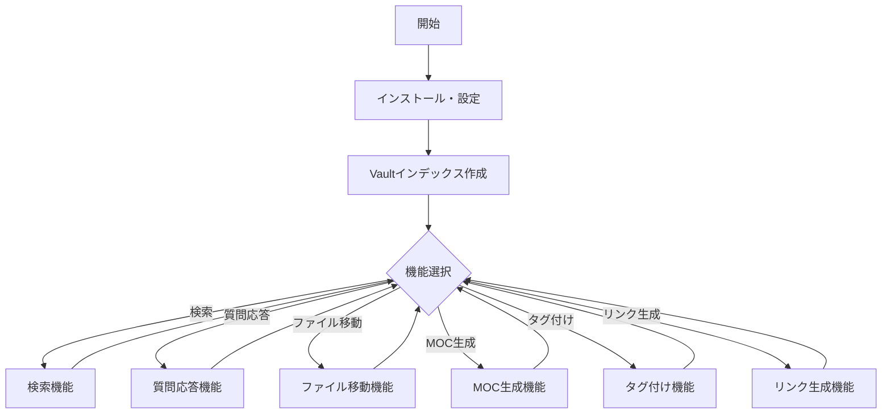

## 2. 初期セットアップフロー

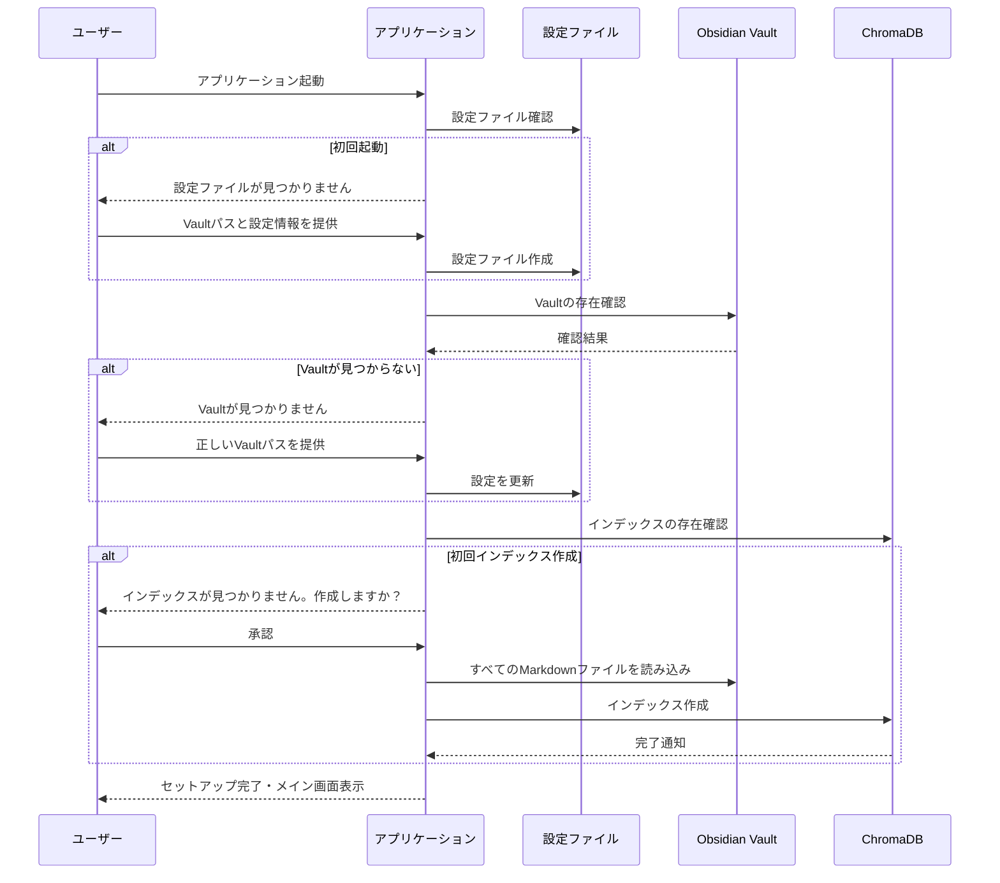

## 3. 検索機能フロー

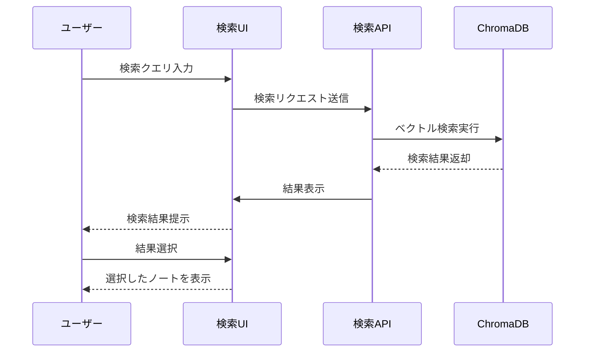

### 検索画面遷移

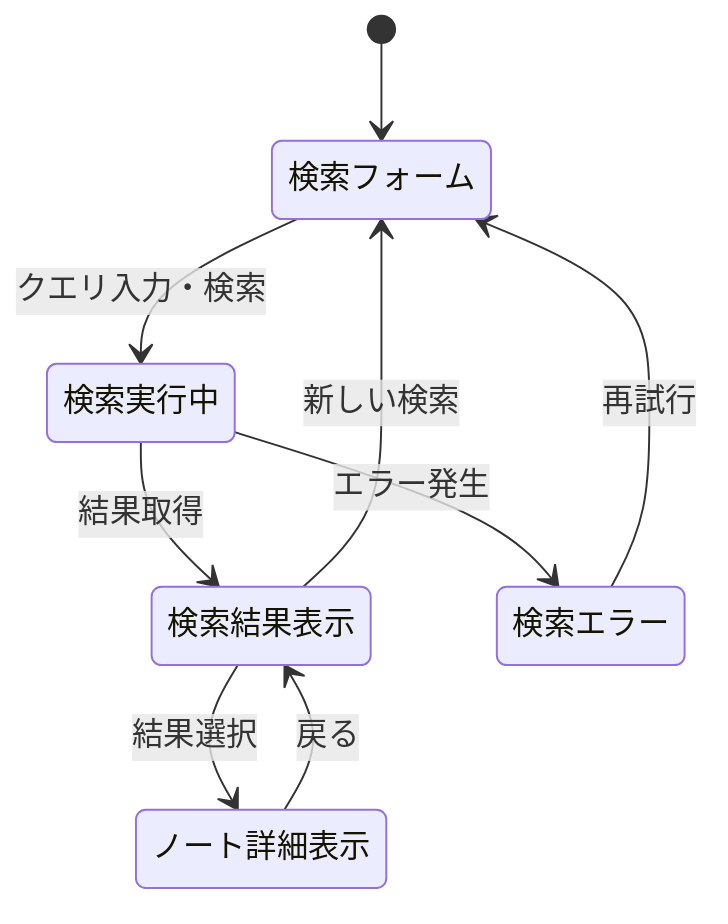

### 検索フィルタリングオプション

ユーザーは以下の条件で検索結果をフィルタリングできます：

- **タグ**: 特定のタグを持つノートのみ表示
- **フォルダ**: 特定のフォルダ内のノートのみ表示
- **更新日時**: 特定の期間に更新されたノートのみ表示
- **タイトル**: タイトルに特定の文字列を含むノートのみ表示

## 4. 質問応答機能フロー

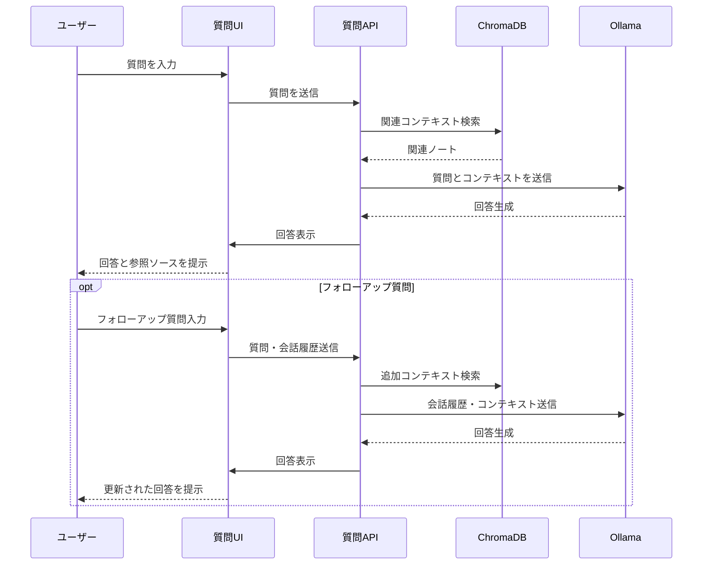

### 回答生成プロセス

1. ユーザーの質問を受け取る
2. 質問に関連するノートをベクトル検索で見つける
3. 見つかったノートから関連コンテキストを抽出
4. LLMに質問とコンテキストを提供
5. LLMが回答を生成
6. 回答と情報源となったノートへの参照を表示

## 5. ファイル移動機能フロー

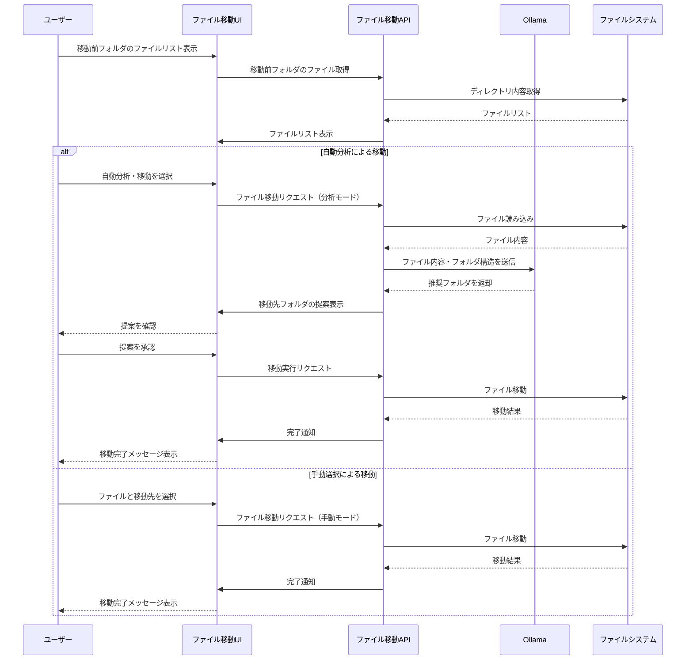

### 移動先推論プロセス

LLMはノートの内容を分析し、以下の要素に基づいて最適なフォルダを推論します：

1. ノートのタイトルとタグ
2. ノートの内容における主要キーワード
3. ノートの構造とフォーマット
4. 設定ファイルで定義されたフォルダ構造との一致度

## 6. MOC生成機能フロー

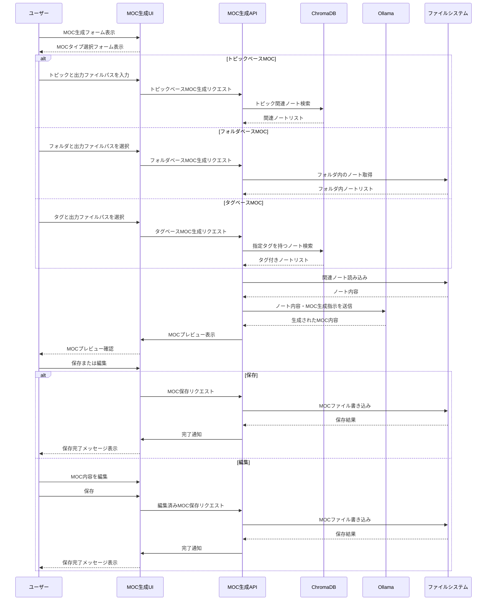

### MOC生成プロセス

MOC（Map of Content）は、関連ノートを整理して概要を提供するメタノートです：

1. ユーザーがMOCのタイプ（トピック、フォルダ、タグ）を選択
2. 関連ノートの検索・収集
3. 関連ノートの内容を分析
4. ノート間の関係性を特定
5. 階層的な構造を持つMOCを生成
6. リンクと簡潔な説明を含めた内容を提供

### MOCの例

```markdown
# Python Programming MOC

## 概要
このMOCはPythonプログラミングに関する知識をまとめたものです。

## 基礎概念
- [[Python基本構文]] - 変数、ループ、条件分岐
- [[Python関数]] - 関数定義と使用方法
- [[Pythonクラス]] - オブジェクト指向プログラミング

## ライブラリとフレームワーク
- [[NumPy入門]] - 数値計算ライブラリ
- [[Pandas基礎]] - データ分析ライブラリ
- [[Djangoの基本]] - ウェブフレームワーク

## プロジェクト
- [[Pythonスクレイピングプロジェクト]] - Webスクレイピングの実践例
```

## 7. タグ付け機能フロー

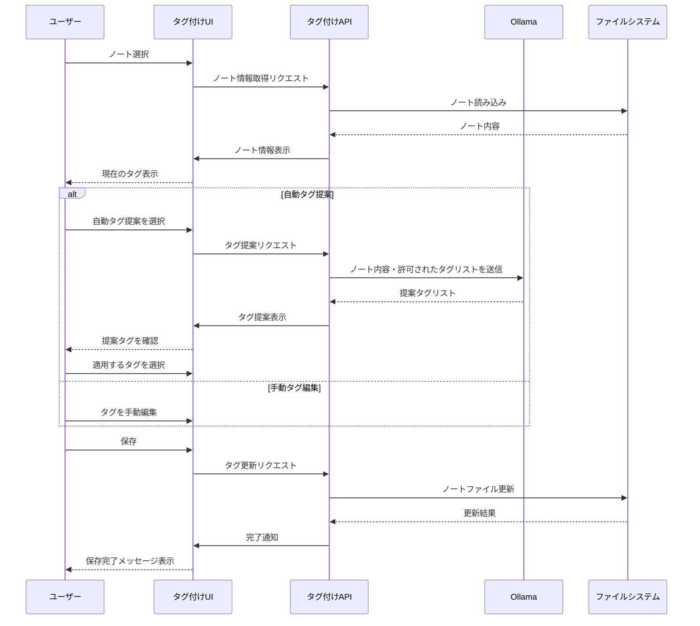

### タグ提案ロジック

LLMを使用して、ノートの内容から適切なタグを提案します：

1. ノートの内容を分析
2. 設定ファイルで定義された許可タグリストを参照
3. ノートの主題、キーワード、構造に基づいてタグを推論
4. 既存のタグを考慮し、追加すべき新しいタグを提案
5. タグの階層（例: `project/active`）も適切に提案

## 8. リンク生成機能フロー

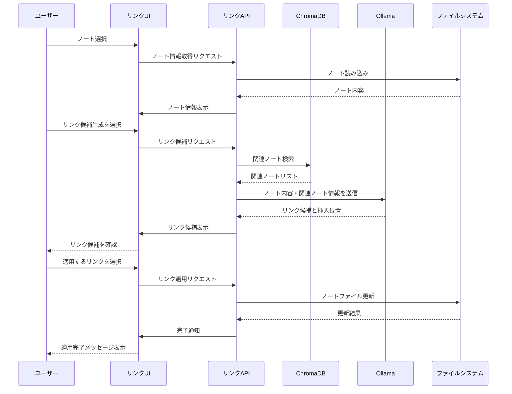

### リンク候補生成ロジック

関連ノートへのリンクを提案するプロセス：

1. 対象ノートの内容を分析
2. ベクトル検索で意味的に関連するノートを見つける
3. キーフレーズを抽出し、一致するノートタイトルを検索
4. LLMを使用して最も適切な挿入位置を特定
5. リンクの重要度と関連性のスコアを計算
6. 可能な限り自然な形でリンクを挿入できる場所を提案

## 9. エラーハンドリングとリカバリー

### 一般的なエラーフロー

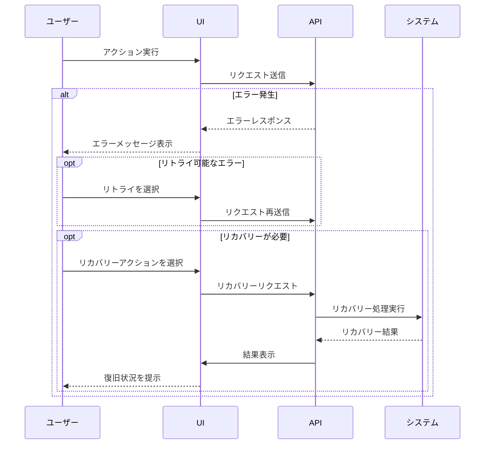

### バックアップとロールバック

重要な操作（ファイル移動、MOC生成、タグ編集など）の前に自動的にバックアップを作成し、問題が発生した場合に復元できるようにします：

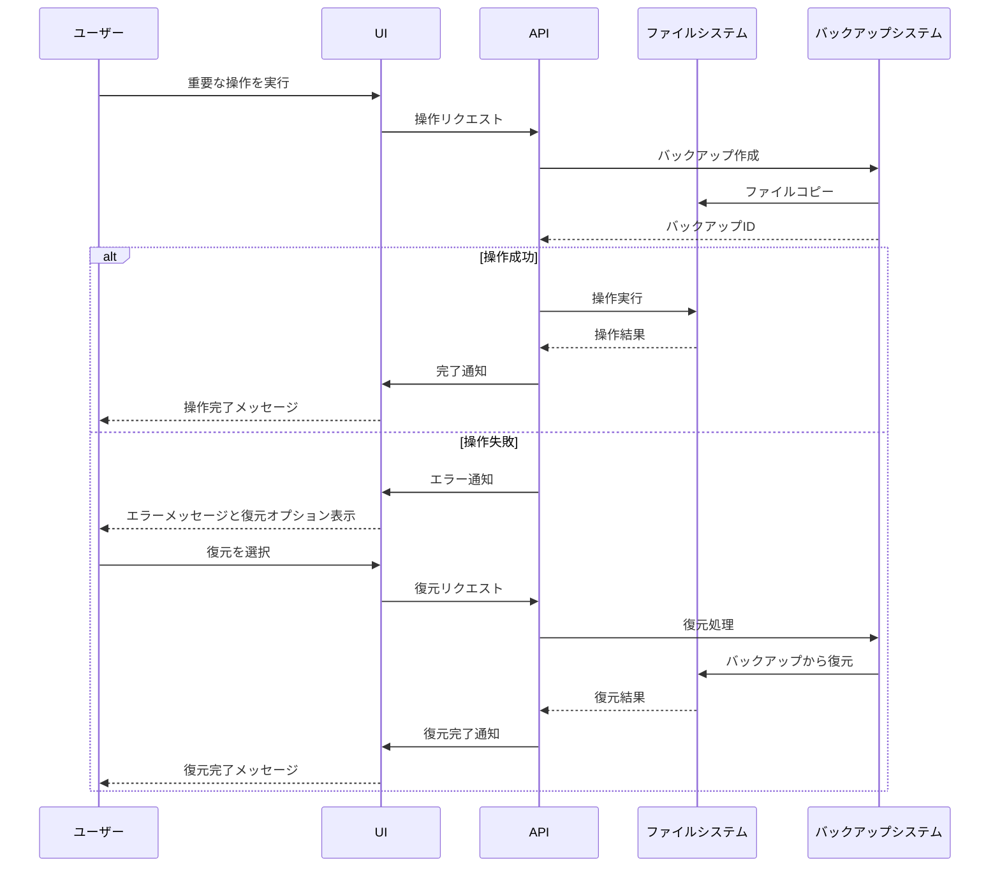

## 10. アプリケーション設定フロー

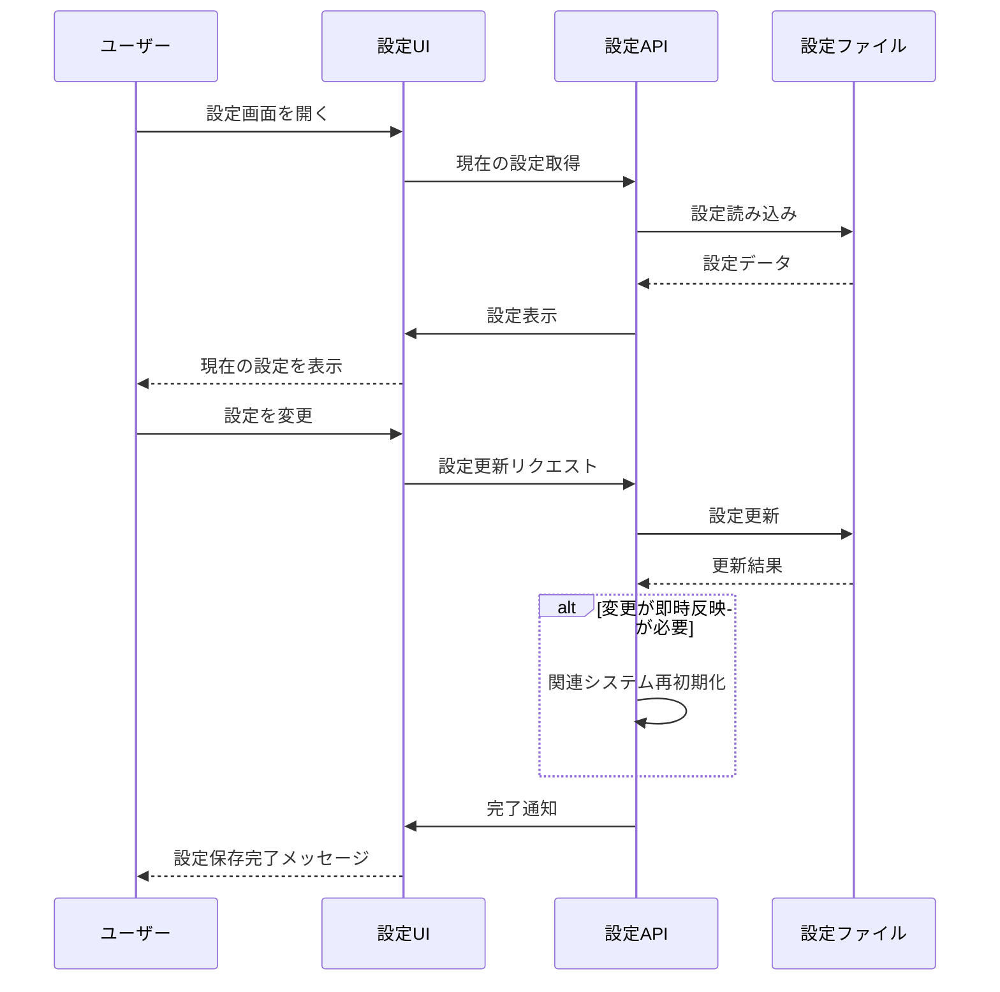

### 設定可能な項目

Obsidian Conciergeでは、以下の設定が可能です：

- **基本設定**
  - Vaultパス
  - UIテーマ（ライト/ダーク）
  - ログレベル

- **フォルダ構造**
  - フォルダ階層の定義
  - 自動生成されるフォルダ

- **タグ管理**
  - 許可されたタグのリスト
  - 自動タグ付けルール

- **LLM設定**
  - 使用するモデル
  - 温度（創造性）パラメーター
  - コンテキスト長
  - API設定

- **インデックス設定**
  - 自動インデックス更新
  - インデックス除外フォルダ
  - 差分更新頻度

## 11. トラブルシューティングガイド

一般的な問題と解決策のフローチャート：

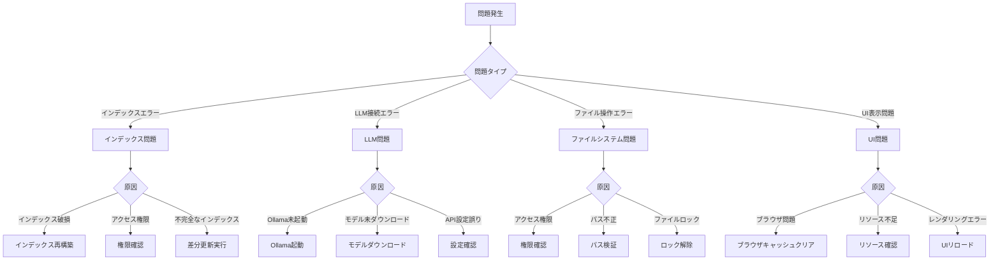