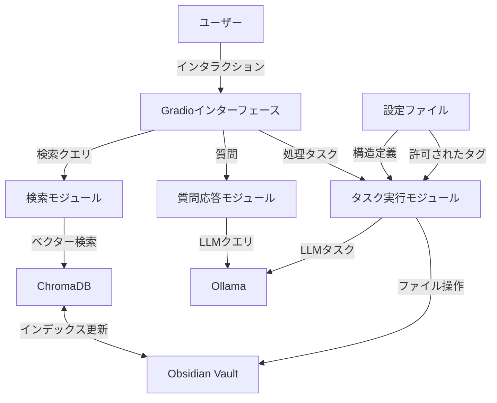
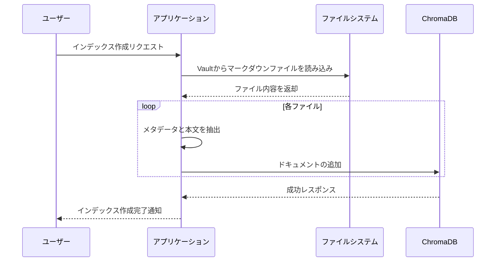
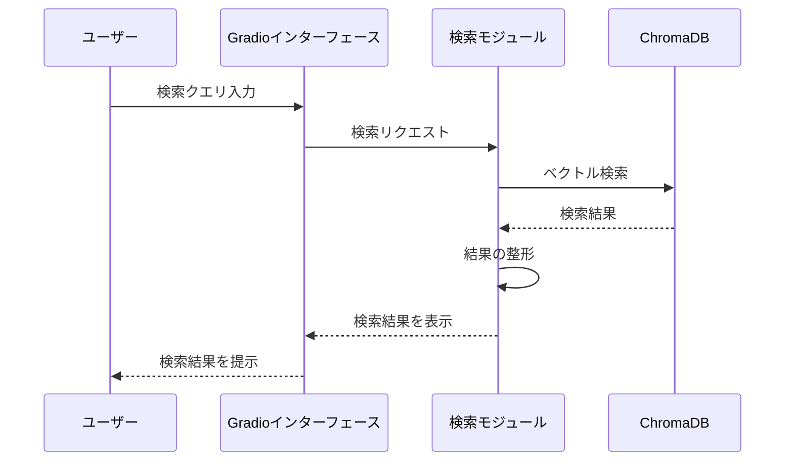
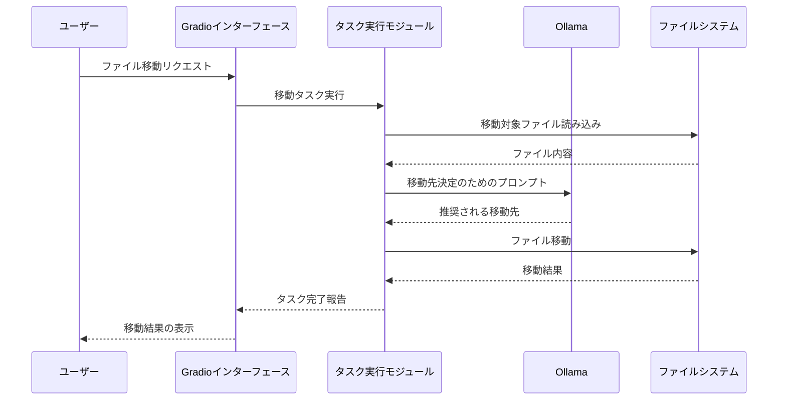

# Obsidian Concierge システムアーキテクチャ

このドキュメントでは、Obsidian Conciergeの全体的なシステムアーキテクチャ、主要コンポーネント、データフローについて説明します。

## 1. システム全体像

Obsidian Conciergeは、Obsidian Vaultの内容を分析し、検索、整理、リンク生成などの機能を提供するLLMベースのアシスタントです。



## 2. 主要コンポーネント

### 2.1 ユーザーインターフェース

- **技術**: Gradio（FastAPIベース）
- **役割**: ユーザーとシステムの間のインタラクションを提供
- **特徴**: タブ構造で検索、質問応答、タスク実行などの機能にアクセス可能

### 2.2 データインデックスモジュール

- **技術**: ChromaDB
- **役割**: Obsidian Vaultのマークダウンファイルをベクトル化し、検索可能な形で保存
- **特徴**: 差分更新によるインデックスの効率的な維持

### 2.3 検索モジュール

- **技術**: ChromaDB（ベクトル検索）
- **役割**: ユーザーのクエリに基づいて関連するノートを検索
- **特徴**: セマンティック検索によるキーワードマッチングを超えた関連性の検出

### 2.4 質問応答モジュール

- **技術**: Ollama（LLM）、ChromaDB（検索）
- **役割**: ユーザーの質問に対して、Vault内の情報に基づいた回答を生成
- **特徴**: RAG（検索拡張生成）を活用した正確な回答の提供

### 2.5 タスク実行モジュール

- **技術**: Ollama（LLM）、ファイルシステム操作
- **役割**: ファイル移動、MOC生成、タグ付けなどのタスクを実行
- **特徴**: LLMを活用した知的なファイル操作と内容分析

### 2.6 LLMクライアント

- **技術**: Ollama API
- **役割**: LLMとの通信を管理
- **特徴**: gemma3:27bモデルを使用した高品質な文章生成と理解

## 3. データフロー

### 3.1 インデックス作成フロー



### 3.2 検索フロー



### 3.3 ファイル移動フロー



## 4. フォルダ構成

```
/obsidian-concierge/
├── .github/                        # GitHub関連の設定
│   └── workflows/                  # GitHub Actions
├── docs/                           # プロジェクトドキュメント
│   ├── architecture/               # アーキテクチャ関連
│   ├── api/                        # API仕様
│   ├── guides/                     # 使用・開発ガイド
│   └── images/                     # ドキュメント用画像
├── obsidian_concierge/             # メインのソースコード
│   ├── __init__.py
│   ├── api/                        # API関連コード
│   │   ├── __init__.py
│   │   ├── routes.py               # APIルート定義
│   │   └── models.py               # APIモデル定義
│   ├── core/                       # コア機能
│   │   ├── __init__.py
│   │   ├── search.py               # 検索モジュール
│   │   ├── qa.py                   # 質問応答モジュール
│   │   ├── file_mover.py           # ファイル移動モジュール
│   │   ├── moc_generator.py        # MOC生成モジュール
│   │   └── tagging.py              # タグ付けモジュール
│   ├── db/                         # データベース関連
│   │   ├── __init__.py
│   │   ├── chroma.py               # ChromaDB接続
│   │   └── indexer.py              # インデックス作成
│   ├── llm/                        # LLM連携機能
│   │   ├── __init__.py
│   │   ├── ollama.py               # Ollama連携
│   │   └── prompts.py              # プロンプトテンプレート
│   ├── utils/                      # ユーティリティ
│   │   ├── __init__.py
│   │   ├── config.py               # 設定読み込み
│   │   ├── file_utils.py           # ファイル操作
│   │   └── logging.py              # ロギング
│   ├── app.py                      # アプリケーションエントリーポイント
│   └── ui.py                       # Gradio UI定義
├── tests/                          # テストコード
├── .gitignore
├── pyproject.toml                  # Poetry設定ファイル
├── config.example.yaml             # 設定ファイルのテンプレート
├── README.md                       # プロジェクト概要
├── ARCHITECTURE.md                 # このファイル
├── CONTRIBUTING.md                 # コントリビューションガイド
└── LICENSE                         # ライセンス情報
```

## 5. 技術選定理由

| 技術 | 選定理由 |
|------|----------|
| **FastAPI** | 高速なパフォーマンス、自動APIドキュメント生成、非同期サポート |
| **Gradio** | シンプルなUI構築、Pythonコードとの統合の容易さ |
| **ChromaDB** | 効率的なベクトル検索、ローカル実行可能、シンプルなAPI |
| **Ollama** | ローカルLLM実行、APIの簡易さ、gemma3:27bのサポート |
| **Poetry** | 依存関係の厳密な管理、仮想環境の簡易な構築 |

## 6. 拡張性と将来の展望

システムは以下の方向性で拡張可能に設計されています：

1. **プラグインシステム**: 機能を動的に追加できる仕組み
2. **複数のLLMモデル対応**: 異なるモデルの切り替えやマルチモデル戦略
3. **ノート同期機能**: Obisidianの変更をリアルタイムで検出し自動インデックス更新
4. **複数Vault対応**: 複数のObsidian Vaultを同時に管理
5. **APIエンドポイント**: 外部アプリケーションからの利用
6. **ダッシュボード**: 知識ベースの統計情報可視化

## 7. セキュリティ考慮事項

- すべての処理はローカル環境で完結（データの外部送信なし）
- 設定ファイルの安全な管理
- ファイルシステム操作の制限（Vault内のみ）
- バックアップ・ロールバック機能による安全な変更