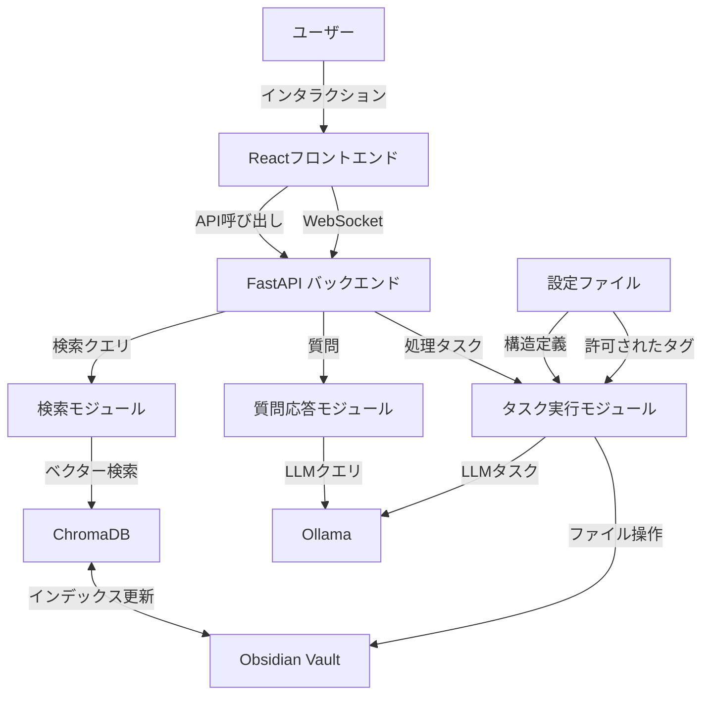
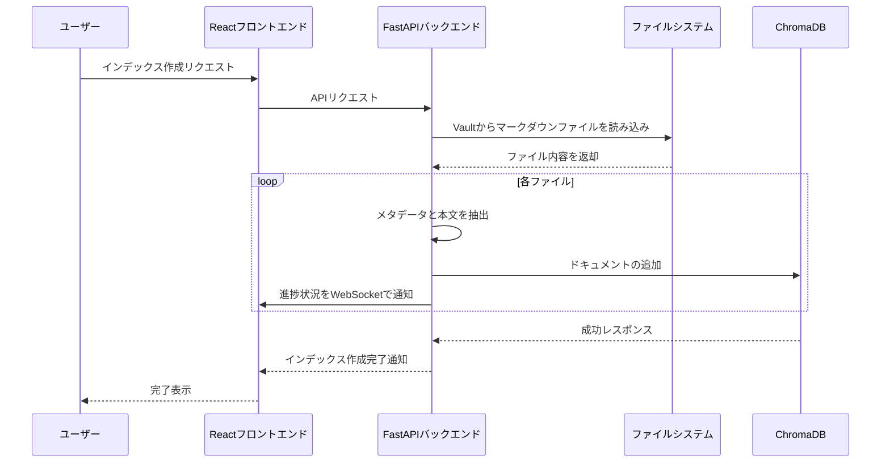
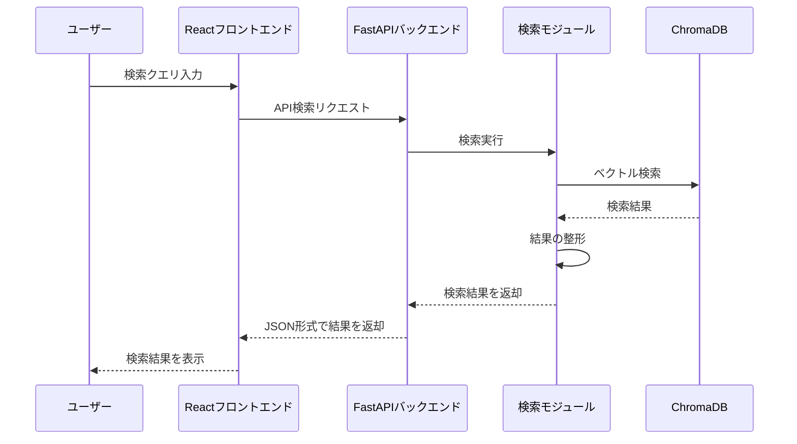
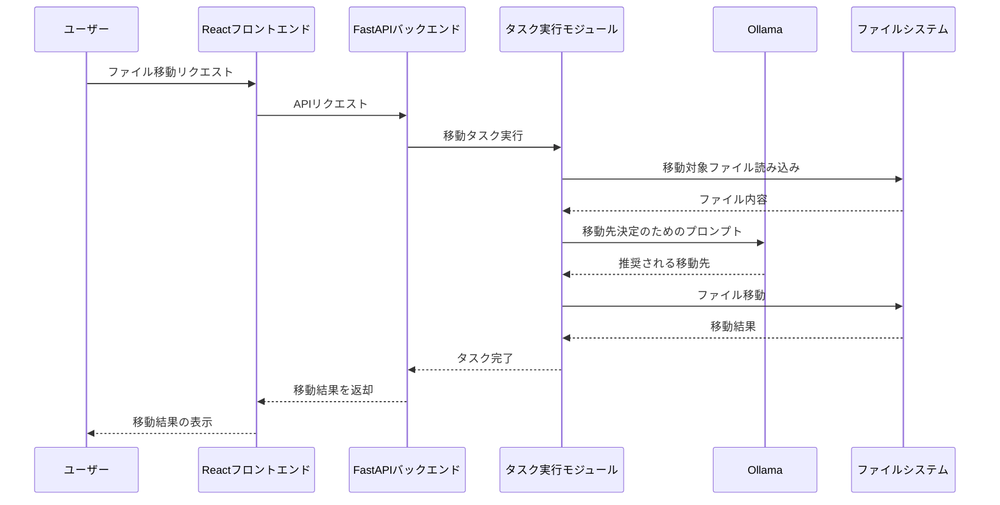

# Obsidian Concierge システムアーキテクチャ

このドキュメントでは、Obsidian Conciergeの全体的なシステムアーキテクチャ、主要コンポーネント、データフローについて説明します。

## 1. システム全体像

Obsidian Conciergeは、Obsidian Vaultの内容を分析し、検索、整理、リンク生成などの機能を提供するLLMベースのアシスタントです。



## 2. 主要コンポーネント

### 2.1 フロントエンド

- **技術**: React + TypeScript
- **役割**: モダンで使いやすいユーザーインターフェースを提供
- **特徴**:
  - シングルページアプリケーション（SPA）
  - リアルタイム更新（WebSocket）
  - レスポンシブデザイン
  - アクセシビリティ対応
  - 効率的な状態管理

### 2.2 バックエンドAPI

- **技術**: FastAPI
- **役割**: フロントエンドとバックエンドの通信を管理
- **特徴**:
  - RESTful APIとWebSocketの両方をサポート
  - 非同期処理による高パフォーマンス
  - OpenAPI (Swagger) による自動ドキュメント生成
  - 型安全なAPIエンドポイント
  - ミドルウェアによる認証・認可の一元管理
  - エラーハンドリングの統一化

### 2.3 データインデックスモジュール

- **技術**: ChromaDB
- **役割**: Obsidianのノートをベクトルデータベースに格納
- **特徴**:
  - 効率的なベクトル検索
  - インクリメンタルなインデックス更新
  - メタデータとコンテンツの統合管理
  - マルチモーダルデータのサポート
  - スケーラブルなデータ構造
  - 高速なクエリ実行

### 2.4 検索モジュール

- **技術**: ChromaDB + カスタム検索ロジック
- **役割**: ユーザーのクエリに基づいて関連ノートを検索
- **特徴**:
  - セマンティック検索とキーワード検索の統合
  - コンテキストを考慮した検索結果のランキング
  - ファセット検索とフィルタリング
  - 検索結果のキャッシング
  - 検索パフォーマンスの最適化
  - 柔軟なクエリ拡張機能

### 2.5 質問応答モジュール

- **技術**: LangChain + カスタムQAロジック
- **役割**: ユーザーの質問に対して適切な回答を生成
- **特徴**:
  - RAG（Retrieval Augmented Generation）アプローチ
  - 文脈を考慮した回答生成
  - 信頼性スコアの計算と提示
  - ソース引用の自動生成
  - マルチホップ推論のサポート
  - 回答の説明可能性の確保

### 2.6 タスク実行モジュール

- **技術**: カスタムタスクエンジン
- **役割**: ファイル操作やMOC生成などのタスクを実行
- **特徴**:
  - 非同期タスク処理
  - プログレス報告機能
  - エラーリカバリーメカニズム
  - タスクの優先順位付け
  - リソース使用の最適化
  - 実行履歴の管理

### 2.7 LLMクライアント

- **技術**: Ollama API
- **役割**: LLMとの通信を管理
- **特徴**: 
  - 高品質な文章生成と理解
  - 複数のLLMモデルに対応可能
  - コンテキスト管理の最適化

## 3. データフロー

### 3.1 インデックス作成フロー



### 3.2 検索フロー



### 3.3 ファイル移動フロー



## 4. フォルダ構成

```
/obsidian-concierge/
├── .github/                        # GitHub関連の設定
│   └── workflows/                  # GitHub Actions
├── docs/                           # プロジェクトドキュメント
│   ├── architecture/               # アーキテクチャ関連
│   ├── api/                        # API仕様
│   ├── guides/                     # 使用・開発ガイド
│   └── images/                     # ドキュメント用画像
├── src/                           # メインのソースコード
│   ├── api/                       # APIクライアント
│   ├── architecture/              # アーキテクチャ定義
│   ├── guides/                    # 開発ガイド
│   └── images/                    # 画像リソース
├── obsidian_concierge/            # バックエンドのソースコード
│   ├── __init__.py
│   ├── api/                       # API関連コード
│   │   ├── __init__.py
│   │   ├── routes/               # APIルート定義
│   │   └── models/               # APIモデル定義
│   ├── core/                      # コア機能
│   ├── db/                        # データベース関連
│   ├── llm/                       # LLM連携機能
│   ├── utils/                     # ユーティリティ
│   └── app.py                     # アプリケーションエントリーポイント
├── tests/                         # テストコード
├── data/                          # データファイル
├── snippet/                       # コードスニペット
├── .gitignore
├── pyproject.toml                 # Poetry設定ファイル
├── poetry.lock                    # Poetry依存関係ロック
├── config.example.yaml            # 設定ファイルのテンプレート
├── README.md                      # プロジェクト概要
├── TODO.md                        # タスクリスト
├── TEST_PLAN.md                   # テスト計画
└── LICENSE                        # ライセンス情報
```

## 5. 技術選定理由

| 技術 | 選定理由 |
|------|----------|
| **React + TypeScript** | 型安全性、豊富なエコシステム、優れた開発者体験、高いパフォーマンス |
| **FastAPI** | 高速なパフォーマンス、自動APIドキュメント生成、非同期サポート、WebSocket対応 |
| **ChromaDB** | 効率的なベクトル検索、ローカル実行可能、シンプルなAPI |
| **Ollama** | ローカルLLM実行、APIの簡易さ、gemma3:27bのサポート |
| **Poetry** | 依存関係の厳密な管理、仮想環境の簡易な構築 |
| **Vite** | 高速な開発サーバー、最適化されたビルド、モダンな開発体験 |

## 6. 拡張性と将来の展望

システムは以下の方向性で拡張可能に設計されています：

1. **プラグインシステム**: 機能を動的に追加できる仕組み
2. **複数のLLMモデル対応**: 異なるモデルの切り替えやマルチモデル戦略
3. **ノート同期機能**: Obisidianの変更をリアルタイムで検出し自動インデックス更新
4. **複数Vault対応**: 複数のObsidian Vaultを同時に管理
5. **APIエンドポイント**: 外部アプリケーションからの利用
6. **ダッシュボード**: 知識ベースの統計情報可視化
7. **オフライン対応**: ServiceWorkerを活用したオフライン機能
8. **モバイル対応**: PWA（Progressive Web App）としての展開

## 7. セキュリティ考慮事項

- すべての処理はローカル環境で完結（データの外部送信なし）
- 設定ファイルの安全な管理
- ファイルシステム操作の制限（Vault内のみ）
- バックアップ・ロールバック機能による安全な変更
- CORS設定による適切なアクセス制御
- WebSocketの安全な通信管理
- フロントエンドでのXSS対策
- APIエンドポイントの認証・認可