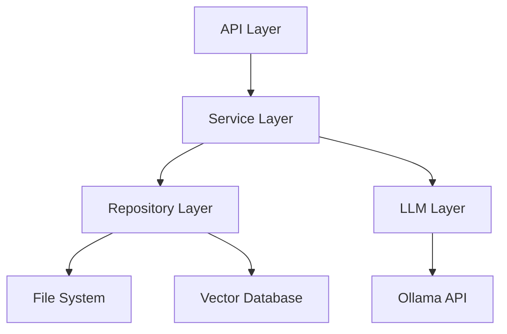

# Obsidian Concierge バックエンド開発ガイド

このドキュメントでは、Obsidian Conciergeのバックエンド設計、アーキテクチャ、主要コンポーネントの実装方法について説明します。

## アーキテクチャ概要

Obsidian Conciergeのバックエンドは、モジュール式のアーキテクチャを採用しており、各コンポーネントが明確な責任を持ちます。主要なレイヤーは以下の通りです：



### レイヤー構造

1. **API Layer**: FastAPIを使用したRESTful APIエンドポイント
2. **Service Layer**: ビジネスロジックとワークフロー
3. **Repository Layer**: データアクセス抽象化
4. **LLM Layer**: 言語モデルとのインタラクション

## ディレクトリ構造

```
obsidian_concierge/
├── api/                    # API定義
│   ├── __init__.py
│   ├── routes/
│   │   ├── __init__.py
│   │   ├── search.py       # 検索API
│   │   ├── question.py     # 質問応答API
│   │   ├── vault.py        # Vault操作API
│   │   ├── moc.py          # MOC生成API
│   │   └── links.py        # リンクAPI
│   └── models/             # Pydanticモデル
│       ├── __init__.py
│       ├── search.py
│       ├── question.py
│       └── ...
├── core/                   # コア機能
│   ├── __init__.py
│   ├── search.py           # 検索機能
│   ├── qa.py               # 質問応答機能
│   ├── file_mover.py       # ファイル移動機能
│   ├── moc_generator.py    # MOC生成機能
│   ├── tagging.py          # タグ付け機能
│   └── link_generator.py   # リンク生成機能
├── db/                     # データベース連携
│   ├── __init__.py
│   ├── chroma.py           # ChromaDB連携
│   └── indexer.py          # インデックス作成
├── llm/                    # LLM連携
│   ├── __init__.py
│   ├── ollama.py           # Ollama連携
│   └── prompts.py          # プロンプトテンプレート
├── utils/                  # ユーティリティ
│   ├── __init__.py
│   ├── config.py           # 設定管理
│   ├── file_utils.py       # ファイル操作
│   └── logging.py          # ロギング
├── app.py                  # アプリケーションエントリーポイント
└── ui.py                   # Gradio UI定義
```

## 主要コンポーネントの実装

### 1. API層

FastAPIを使用してRESTful APIを実装します。各エンドポイントは適切なルートファイルに定義します。

#### 例: 検索APIの実装

```python
# obsidian_concierge/api/routes/search.py
from fastapi import APIRouter, Depends, Query
from typing import Optional

from ...core.search import SearchService
from ...api.models.search import SearchResponse
from ...utils.dependencies import get_search_service

router = APIRouter(prefix="/search", tags=["search"])

@router.get("/", response_model=SearchResponse)
async def search_vault(
    query: str = Query(..., description="検索クエリ"),
    limit: Optional[int] = Query(10, description="返す結果の最大数"),
    search_service: SearchService = Depends(get_search_service)
):
    """
    Vault内のコンテンツを検索する
    """
    results = await search_service.search(query, limit=limit)
    return SearchResponse(
        results=results,
        total=len(results),
        query=query
    )
```

#### データモデル定義

Pydanticを使用して、リクエストとレスポンスのデータモデルを定義します：

```python
# obsidian_concierge/api/models/search.py
from pydantic import BaseModel, Field
from typing import List

class SearchResult(BaseModel):
    id: str
    title: str
    path: str
    excerpt: str
    relevance: float

class SearchResponse(BaseModel):
    results: List[SearchResult]
    total: int
    query: str
```

### 2. サービス層

各機能のビジネスロジックを実装します：

#### 例: 検索サービスの実装

```python
# obsidian_concierge/core/search.py
from typing import List, Optional
import logging

from ..db.chroma import ChromaRepository
from ..api.models.search import SearchResult

logger = logging.getLogger(__name__)

class SearchService:
    def __init__(self, repository: ChromaRepository):
        self.repository = repository
    
    async def search(self, query: str, limit: Optional[int] = 10) -> List[SearchResult]:
        """
        指定されたクエリでVault内を検索する
        
        Args:
            query: 検索クエリ
            limit: 返す結果の最大数
            
        Returns:
            検索結果のリスト
        """
        logger.info(f"検索実行: query='{query}', limit={limit}")
        
        try:
            db_results = await self.repository.query(query, n_results=limit)
            
            results = []
            for i, (doc_id, doc, metadata, distance) in enumerate(zip(
                db_results.ids[0], 
                db_results.documents[0], 
                db_results.metadatas[0], 
                db_results.distances[0]
            )):
                # 距離をスコアに変換（1 - 正規化された距離）
                relevance = 1.0 - min(distance, 1.0)
                
                # 抜粋の作成
                excerpt = doc[:200] + "..." if len(doc) > 200 else doc
                
                result = SearchResult(
                    id=doc_id,
                    title=metadata.get("title", "無題"),
                    path=metadata.get("path", ""),
                    excerpt=excerpt,
                    relevance=round(relevance, 2)
                )
                results.append(result)
            
            logger.info(f"検索完了: {len(results)}件の結果")
            return results
            
        except Exception as e:
            logger.error(f"検索中にエラーが発生しました: {str(e)}")
            raise
```

### 3. リポジトリ層

データアクセスを抽象化します：

#### 例: ChromaDBリポジトリの実装

```python
# obsidian_concierge/db/chroma.py
import os
import logging
from typing import Dict, Any, List, Optional
import chromadb
from chromadb.config import Settings

logger = logging.getLogger(__name__)

class ChromaRepository:
    def __init__(self, persist_directory: str, collection_name: str = "obsidian_notes"):
        """
        ChromaDBリポジトリを初期化
        
        Args:
            persist_directory: データを永続化するディレクトリ
            collection_name: コレクション名
        """
        self.persist_directory = persist_directory
        self.collection_name = collection_name
        
            # ディレクトリが存在しない場合は作成
    try:
        os.makedirs(os.path.dirname(full_path), exist_ok=True)
        
        with open(full_path, "w", encoding="utf-8") as f:
            f.write(content)
            
        logger.info(f"ファイル書き込み成功: {relative_path}")
        return True
    except Exception as e:
        logger.error(f"ファイル書き込みエラー: {relative_path}, {str(e)}")
        return False

def safe_move_file(vault_path: str, source: str, destination: str) -> bool:
    """
    安全にファイルを移動する
    
    Args:
        vault_path: Vaultのルートパス
        source: 移動元の相対パス
        destination: 移動先の相対パス
        
    Returns:
        成功したかどうか
    """
    import shutil
    
    full_source = os.path.join(vault_path, source)
    full_dest = os.path.join(vault_path, destination)
    
    # Vault外のファイルアクセスを防止
    if not (is_within_vault(vault_path, full_source) and is_within_vault(vault_path, full_dest)):
        logger.error(f"不正なファイル移動試行: {source} -> {destination}")
        return False
        
    try:
        # 移動先ディレクトリが存在しない場合は作成
        os.makedirs(os.path.dirname(full_dest), exist_ok=True)
        
        # ファイルを移動
        shutil.move(full_source, full_dest)
        
        logger.info(f"ファイル移動成功: {source} -> {destination}")
        return True
    except Exception as e:
        logger.error(f"ファイル移動エラー: {source} -> {destination}, {str(e)}")
        return False
```

## ロールバックと変更の安全性

変更操作前にバックアップを作成し、必要に応じてロールバックできるようにします：

```python
# obsidian_concierge/utils/backup.py
import os
import shutil
import json
import time
from typing import Dict, Any, Optional
import logging

logger = logging.getLogger(__name__)

class BackupManager:
    def __init__(self, vault_path: str):
        """
        バックアップマネージャーを初期化
        
        Args:
            vault_path: Vaultのルートパス
        """
        self.vault_path = vault_path
        self.backup_dir = os.path.join(vault_path, ".obsidian-concierge", "backups")
        
        # バックアップディレクトリが存在しない場合は作成
        os.makedirs(self.backup_dir, exist_ok=True)
        
    def create_backup(self, file_path: str) -> Optional[str]:
        """
        ファイルのバックアップを作成
        
        Args:
            file_path: バックアップするファイルの相対パス
            
        Returns:
            バックアップID、またはNone（エラー時）
        """
        full_path = os.path.join(self.vault_path, file_path)
        
        if not os.path.exists(full_path):
            logger.error(f"バックアップエラー: ファイルが存在しません: {file_path}")
            return None
            
        try:
            # バックアップIDを生成
            backup_id = f"{int(time.time())}_{os.path.basename(file_path)}"
            backup_path = os.path.join(self.backup_dir, backup_id)
            
            # ファイルをコピー
            shutil.copy2(full_path, backup_path)
            
            # メタ情報を保存
            meta_path = f"{backup_path}.meta"
            meta_data = {
                "original_path": file_path,
                "timestamp": time.time(),
                "backup_id": backup_id
            }
            
            with open(meta_path, "w", encoding="utf-8") as f:
                json.dump(meta_data, f, indent=2)
                
            logger.info(f"バックアップ作成: {file_path} -> {backup_id}")
            return backup_id
            
        except Exception as e:
            logger.error(f"バックアップエラー: {file_path}, {str(e)}")
            return None
            
    def restore_backup(self, backup_id: str) -> bool:
        """
        バックアップからファイルを復元
        
        Args:
            backup_id: バックアップID
            
        Returns:
            成功したかどうか
        """
        backup_path = os.path.join(self.backup_dir, backup_id)
        meta_path = f"{backup_path}.meta"
        
        if not (os.path.exists(backup_path) and os.path.exists(meta_path)):
            logger.error(f"復元エラー: バックアップが見つかりません: {backup_id}")
            return False
            
        try:
            # メタ情報を読み込み
            with open(meta_path, "r", encoding="utf-8") as f:
                meta_data = json.load(f)
                
            original_path = meta_data["original_path"]
            full_path = os.path.join(self.vault_path, original_path)
            
            # 復元先ディレクトリが存在しない場合は作成
            os.makedirs(os.path.dirname(full_path), exist_ok=True)
            
            # ファイルを復元
            shutil.copy2(backup_path, full_path)
            
            logger.info(f"バックアップ復元: {backup_id} -> {original_path}")
            return True
            
        except Exception as e:
            logger.error(f"復元エラー: {backup_id}, {str(e)}")
            return False
            
    def list_backups(self, file_path: Optional[str] = None) -> Dict[str, Any]:
        """
        バックアップの一覧を取得
        
        Args:
            file_path: 特定のファイルのバックアップのみ取得（オプション）
            
        Returns:
            バックアップ情報のディクショナリ
        """
        backups = {}
        
        try:
            for item in os.listdir(self.backup_dir):
                if item.endswith(".meta"):
                    meta_path = os.path.join(self.backup_dir, item)
                    
                    with open(meta_path, "r", encoding="utf-8") as f:
                        meta_data = json.load(f)
                        
                    if file_path is None or meta_data["original_path"] == file_path:
                        backup_id = meta_data["backup_id"]
                        backups[backup_id] = meta_data
                        
            return backups
            
        except Exception as e:
            logger.error(f"バックアップ一覧取得エラー: {str(e)}")
            return {}
```

## パフォーマンス最適化のヒント

### 非同期処理

ファイルI/OやLLM呼び出しなど、時間のかかる操作は非同期処理を活用して効率化します：

```python
import asyncio
from typing import List, Dict, Any

async def process_files_concurrently(files: List[str], max_workers: int = 5) -> List[Dict[str, Any]]:
    """
    ファイルを並行処理
    
    Args:
        files: 処理するファイルのリスト
        max_workers: 同時実行の最大数
        
    Returns:
        処理結果のリスト
    """
    semaphore = asyncio.Semaphore(max_workers)
    
    async def process_with_semaphore(file_path: str) -> Dict[str, Any]:
        async with semaphore:
            # 実際の処理を行う関数
            return await process_single_file(file_path)
    
    # 並行タスクを作成
    tasks = [process_with_semaphore(file) for file in files]
    
    # すべてのタスクを実行して結果を待機
    results = await asyncio.gather(*tasks)
    return results
```

### キャッシング

頻繁に使用されるデータはキャッシュを活用して処理を高速化します：

```python
# obsidian_concierge/utils/cache.py
import time
import functools
from typing import Dict, Any, Callable, Optional
import logging

logger = logging.getLogger(__name__)

class Cache:
    """シンプルなインメモリキャッシュ"""
    
    def __init__(self, max_size: int = 1000, ttl: int = 3600):
        """
        キャッシュを初期化
        
        Args:
            max_size: キャッシュの最大エントリ数
            ttl: キャッシュエントリの有効期間（秒）
        """
        self.max_size = max_size
        self.ttl = ttl
        self.cache: Dict[str, Dict[str, Any]] = {}
        
    def get(self, key: str) -> Optional[Any]:
        """
        キャッシュからデータを取得
        
        Args:
            key: キャッシュキー
            
        Returns:
            キャッシュされた値、またはNone（存在しない場合）
        """
        if key not in self.cache:
            return None
            
        entry = self.cache[key]
        if time.time() > entry["expires"]:
            # 有効期限切れ
            del self.cache[key]
            return None
            
        return entry["value"]
        
    def set(self, key: str, value: Any) -> None:
        """
        データをキャッシュに保存
        
        Args:
            key: キャッシュキー
            value: 保存する値
        """
        # キャッシュサイズが上限に達した場合、古いエントリを削除
        if len(self.cache) >= self.max_size:
            oldest_key = min(self.cache, key=lambda k: self.cache[k]["expires"])
            del self.cache[oldest_key]
            
        self.cache[key] = {
            "value": value,
            "expires": time.time() + self.ttl
        }
        
    def clear(self) -> None:
        """キャッシュをクリア"""
        self.cache.clear()
        
    def remove(self, key: str) -> None:
        """
        キャッシュからエントリを削除
        
        Args:
            key: 削除するキー
        """
        if key in self.cache:
            del self.cache[key]


# デコレータを使用したキャッシング
def cached(cache: Cache, key_func: Optional[Callable] = None):
    """
    関数の結果をキャッシュするデコレータ
    
    Args:
        cache: 使用するキャッシュオブジェクト
        key_func: キャッシュキーを生成する関数（オプション）
        
    Returns:
        デコレータ関数
    """
    def decorator(func):
        @functools.wraps(func)
        async def async_wrapper(*args, **kwargs):
            # キャッシュキーを生成
            if key_func:
                key = key_func(*args, **kwargs)
            else:
                # デフォルトのキー生成（引数に基づく）
                key = f"{func.__name__}:{str(args)}:{str(kwargs)}"
                
            # キャッシュからデータを取得
            cached_result = cache.get(key)
            if cached_result is not None:
                logger.debug(f"キャッシュヒット: {key}")
                return cached_result
                
            # 関数を実行して結果を取得
            result = await func(*args, **kwargs)
            
            # 結果をキャッシュに保存
            cache.set(key, result)
            
            return result
            
        @functools.wraps(func)
        def sync_wrapper(*args, **kwargs):
            # キャッシュキーを生成
            if key_func:
                key = key_func(*args, **kwargs)
            else:
                # デフォルトのキー生成（引数に基づく）
                key = f"{func.__name__}:{str(args)}:{str(kwargs)}"
                
            # キャッシュからデータを取得
            cached_result = cache.get(key)
            if cached_result is not None:
                logger.debug(f"キャッシュヒット: {key}")
                return cached_result
                
            # 関数を実行して結果を取得
            result = func(*args, **kwargs)
            
            # 結果をキャッシュに保存
            cache.set(key, result)
            
            return result
            
        # 非同期関数か通常の関数かによってラッパーを選択
        if asyncio.iscoroutinefunction(func):
            return async_wrapper
        return sync_wrapper
        
    return decorator
```

## パッケージング

Poetry を使ってプロジェクトをパッケージ化する方法：

```bash
# パッケージのビルド
poetry build

# テスト用PyPIにアップロード
poetry publish --repository testpypi

# 本番PyPIにアップロード
poetry publish
```

## まとめ

Obsidian Conciergeのバックエンド開発には、以下の主要コンポーネントと技術が使用されています：

1. **FastAPI**: 高性能なRESTful APIの提供
2. **ChromaDB**: ベクトル検索によるセマンティック検索
3. **Ollama**: ローカルLLMとの連携
4. **非同期処理**: 効率的なI/Oと並行処理
5. **レイヤー化アーキテクチャ**: 関心の分離と拡張性の向上

開発を始める前に、このドキュメントと[開発環境のセットアップガイド](../DEVELOPMENT_SETUP.md)を確認し、プロジェクトの構造と設計原則を理解してください。

また、新しい機能の追加やバグ修正を行う際は、[コントリビューションガイド](../CONTRIBUTING.md)に従ってください。
クトリが存在しない場合は作成
        os.makedirs(persist_directory, exist_ok=True)
        
        # クライアントの初期化
        self.client = chromadb.Client(Settings(
            persist_directory=persist_directory,
            anonymized_telemetry=False
        ))
        
        # コレクションの取得または作成
        self.collection = self.client.get_or_create_collection(collection_name)
        
        logger.info(f"ChromaRepository initialized: {collection_name}")
    
    async def add(self, documents: List[str], metadatas: List[Dict[str, Any]], ids: List[str]) -> None:
        """
        ドキュメントをインデックスに追加
        
        Args:
            documents: ドキュメントのリスト
            metadatas: メタデータのリスト
            ids: IDのリスト
        """
        self.collection.add(
            documents=documents,
            metadatas=metadatas,
            ids=ids
        )
        logger.info(f"{len(documents)}件のドキュメントを追加しました")
    
    async def query(self, query_text: str, n_results: int = 10, filter_dict: Optional[Dict[str, Any]] = None):
        """
        ベクトル検索を実行
        
        Args:
            query_text: 検索クエリ
            n_results: 返す結果の最大数
            filter_dict: フィルター条件
            
        Returns:
            検索結果
        """
        results = self.collection.query(
            query_texts=[query_text],
            n_results=n_results,
            where=filter_dict
        )
        
        logger.info(f"クエリ実行: '{query_text}', 結果: {len(results.ids[0])}件")
        return results
    
    async def update(self, documents: List[str], metadatas: List[Dict[str, Any]], ids: List[str]) -> None:
        """
        既存のドキュメントを更新
        
        Args:
            documents: ドキュメントのリスト
            metadatas: メタデータのリスト
            ids: IDのリスト
        """
        self.collection.update(
            documents=documents,
            metadatas=metadatas,
            ids=ids
        )
        logger.info(f"{len(documents)}件のドキュメントを更新しました")
    
    async def delete(self, ids: List[str]) -> None:
        """
        ドキュメントを削除
        
        Args:
            ids: 削除するドキュメントのID
        """
        self.collection.delete(ids=ids)
        logger.info(f"{len(ids)}件のドキュメントを削除しました")
```

### 4. LLM層

Ollamaとの通信を管理します：

```python
# obsidian_concierge/llm/ollama.py
import aiohttp
import logging
from typing import Dict, Any, Optional

logger = logging.getLogger(__name__)

class OllamaClient:
    def __init__(self, base_url: str = "http://localhost:11434"):
        """
        Ollamaクライアントを初期化
        
        Args:
            base_url: OllamaサーバーのベースURL
        """
        self.base_url = base_url
        logger.info(f"OllamaClient initialized: {base_url}")
    
    async def generate(
        self, 
        prompt: str, 
        model: str = "gemma3:27b",
        temperature: float = 0.7,
        max_tokens: Optional[int] = None,
        top_p: float = 0.9,
        top_k: int = 40
    ) -> str:
        """
        テキスト生成リクエストを送信
        
        Args:
            prompt: プロンプト
            model: 使用するモデル
            temperature: 温度パラメータ
            max_tokens: 生成する最大トークン数
            top_p: 上位p確率によるサンプリング
            top_k: 上位k個の選択肢からのサンプリング
            
        Returns:
            生成されたテキスト
        """
        url = f"{self.base_url}/api/generate"
        
        payload = {
            "model": model,
            "prompt": prompt,
            "temperature": temperature,
            "top_p": top_p,
            "top_k": top_k
        }
        
        if max_tokens is not None:
            payload["max_tokens"] = max_tokens
        
        logger.debug(f"Ollamaリクエスト: model={model}, prompt長={len(prompt)}")
        
        async with aiohttp.ClientSession() as session:
            async with session.post(url, json=payload) as response:
                if response.status != 200:
                    error_text = await response.text()
                    logger.error(f"Ollamaエラー: {response.status}, {error_text}")
                    raise Exception(f"Ollama API error: {response.status}, {error_text}")
                
                data = await response.json()
                generated_text = data.get("response", "")
                logger.debug(f"生成完了: 長さ={len(generated_text)}")
                
                return generated_text
```

#### プロンプトテンプレート管理

プロンプトを個別ファイルで管理し、再利用可能にします：

```python
# obsidian_concierge/llm/prompts.py
from string import Template
from pathlib import Path
import os
import yaml
import logging

logger = logging.getLogger(__name__)

class PromptTemplates:
    def __init__(self, templates_dir: str):
        """
        プロンプトテンプレートを初期化
        
        Args:
            templates_dir: テンプレートファイルのディレクトリ
        """
        self.templates = {}
        self.templates_dir = templates_dir
        self._load_templates()
        
    def _load_templates(self) -> None:
        """テンプレートファイルを読み込む"""
        path = Path(self.templates_dir)
        if not path.exists():
            logger.warning(f"テンプレートディレクトリが見つかりません: {self.templates_dir}")
            return
            
        for file in path.glob("*.yaml"):
            try:
                with open(file, "r", encoding="utf-8") as f:
                    template_data = yaml.safe_load(f)
                
                for name, content in template_data.items():
                    self.templates[name] = Template(content)
                    logger.debug(f"テンプレート読み込み: {name}")
            except Exception as e:
                logger.error(f"テンプレート読み込みエラー: {file.name}, {str(e)}")
    
    def get(self, name: str, **kwargs) -> str:
        """
        名前付きテンプレートを取得し、パラメータを置換
        
        Args:
            name: テンプレート名
            **kwargs: 置換パラメータ
            
        Returns:
            処理済みのプロンプト
        """
        if name not in self.templates:
            logger.error(f"テンプレートが見つかりません: {name}")
            raise ValueError(f"Template not found: {name}")
            
        return self.templates[name].substitute(**kwargs)
```

プロンプトテンプレートの例（`prompts/file_mover.yaml`）：

```yaml
file_move_decision: |
    以下のObsidianノートを分析し、最適な保存先フォルダを選んでください。

    ノート内容：
    $content

    選択可能なフォルダ：
    $folders

    最適なフォルダパスを一つだけ答えてください。特別な理由がなければ、ノートの内容に最も関連するフォルダを選んでください：
```

### 5. 設定管理

```python
# obsidian_concierge/utils/config.py
import yaml
import os
from typing import Dict, Any, Optional
import logging

logger = logging.getLogger(__name__)

class Config:
    def __init__(self, config_path: str):
        """
        設定を初期化
        
        Args:
            config_path: 設定ファイルのパス
        """
        self.config_path = config_path
        self.config_data: Dict[str, Any] = {}
        self._load_config()
        
    def _load_config(self) -> None:
        """設定ファイルを読み込む"""
        if not os.path.exists(self.config_path):
            logger.error(f"設定ファイルが見つかりません: {self.config_path}")
            raise FileNotFoundError(f"Config file not found: {self.config_path}")
            
        try:
            with open(self.config_path, "r", encoding="utf-8") as f:
                self.config_data = yaml.safe_load(f)
            logger.info(f"設定を読み込みました: {self.config_path}")
        except Exception as e:
            logger.error(f"設定ファイル読み込みエラー: {str(e)}")
            raise
    
    def get(self, key: str, default: Optional[Any] = None) -> Any:
        """
        設定値を取得
        
        Args:
            key: キー（ドット区切りで階層アクセス可能）
            default: デフォルト値
            
        Returns:
            設定値
        """
        parts = key.split(".")
        current = self.config_data
        
        for part in parts:
            if isinstance(current, dict) and part in current:
                current = current[part]
            else:
                return default
                
        return current
```

## 依存性注入の実装

FastAPIの依存性注入を使用して、各コンポーネントを初期化し、連携させます：

```python
# obsidian_concierge/utils/dependencies.py
from fastapi import Depends
import os
from typing import Generator

from ..db.chroma import ChromaRepository
from ..llm.ollama import OllamaClient
from ..llm.prompts import PromptTemplates
from ..core.search import SearchService
from ..core.qa import QuestionAnswerService
from ..core.file_mover import FileMoverService
from ..utils.config import Config

def get_config() -> Config:
    """設定オブジェクトを取得"""
    config_path = os.environ.get("CONFIG_PATH", "config.yaml")
    return Config(config_path)

def get_chroma_repository(config: Config = Depends(get_config)) -> ChromaRepository:
    """ChromaDBリポジトリを取得"""
    persist_dir = config.get("db.persist_directory", ".chroma")
    collection = config.get("db.collection_name", "obsidian_notes")
    return ChromaRepository(persist_dir, collection)

def get_ollama_client(config: Config = Depends(get_config)) -> OllamaClient:
    """Ollamaクライアントを取得"""
    base_url = config.get("llm.ollama_url", "http://localhost:11434")
    return OllamaClient(base_url)

def get_prompt_templates(config: Config = Depends(get_config)) -> PromptTemplates:
    """プロンプトテンプレートを取得"""
    templates_dir = config.get("llm.templates_dir", "prompts")
    return PromptTemplates(templates_dir)

def get_search_service(
    repository: ChromaRepository = Depends(get_chroma_repository)
) -> SearchService:
    """検索サービスを取得"""
    return SearchService(repository)

def get_qa_service(
    repository: ChromaRepository = Depends(get_chroma_repository),
    ollama: OllamaClient = Depends(get_ollama_client),
    prompts: PromptTemplates = Depends(get_prompt_templates)
) -> QuestionAnswerService:
    """質問応答サービスを取得"""
    return QuestionAnswerService(repository, ollama, prompts)

def get_file_mover_service(
    config: Config = Depends(get_config),
    ollama: OllamaClient = Depends(get_ollama_client),
    prompts: PromptTemplates = Depends(get_prompt_templates)
) -> FileMoverService:
    """ファイル移動サービスを取得"""
    vault_path = config.get("app.vault_path")
    folder_structure = config.get("folder_structure", [])
    return FileMoverService(vault_path, folder_structure, ollama, prompts)
```

## アプリケーションの初期化

全体を組み合わせたアプリケーションの初期化処理：

```python
# obsidian_concierge/app.py
import os
import logging
from fastapi import FastAPI
from typing import List
import uvicorn

from .api.routes import search, question, vault, moc, links
from .utils.config import Config
from .ui import create_ui

# ロギングの設定
logging.basicConfig(
    level=logging.INFO,
    format="%(asctime)s - %(name)s - %(levelname)s - %(message)s",
    handlers=[
        logging.StreamHandler(),
        logging.FileHandler("obsidian_concierge.log")
    ]
)

logger = logging.getLogger(__name__)

def create_app() -> FastAPI:
    """FastAPIアプリケーションを作成"""
    app = FastAPI(
        title="Obsidian Concierge API",
        description="Obsidian Vaultを検索・操作するためのAPI",
        version="0.1.0"
    )
    
    # APIルートの登録
    app.include_router(search.router, prefix="/api/v1")
    app.include_router(question.router, prefix="/api/v1")
    app.include_router(vault.router, prefix="/api/v1")
    app.include_router(moc.router, prefix="/api/v1")
    app.include_router(links.router, prefix="/api/v1")
    
    return app

def run_app(host: str = "0.0.0.0", port: int = 8000, debug: bool = False):
    """アプリケーションを実行"""
    app = create_app()
    
    # 設定を読み込み
    config_path = os.environ.get("CONFIG_PATH", "config.yaml")
    config = Config(config_path)
    
    # Gradio UIを作成して統合
    ui_port = port + 1  # APIとは別ポートでUI実行
    ui = create_ui(api_url=f"http://localhost:{port}")
    
    # APIサーバー起動
    logger.info(f"APIサーバーを起動します: {host}:{port}")
    uvicorn.run(app, host=host, port=port, log_level="debug" if debug else "info")
    
    # Gradio UI起動
    # 注: 実際の実装では別プロセスで起動するか、FastAPIにマウントする
    logger.info(f"Gradio UIを起動します: {host}:{ui_port}")
    ui.launch(server_name=host, server_port=ui_port)

if __name__ == "__main__":
    import argparse
    
    parser = argparse.ArgumentParser(description="Obsidian Conciergeを起動")
    parser.add_argument("--host", default="0.0.0.0", help="ホストアドレス")
    parser.add_argument("--port", type=int, default=8000, help="ポート番号")
    parser.add_argument("--debug", action="store_true", help="デバッグモード")
    
    args = parser.parse_args()
    run_app(host=args.host, port=args.port, debug=args.debug)
```

## エラーハンドリング

一貫したエラーハンドリングを実装します：

```python
# obsidian_concierge/api/errors.py
from fastapi import HTTPException, status
from typing import Dict, Any, Optional

class APIError(HTTPException):
    """APIエラーの基底クラス"""
    def __init__(
        self, 
        status_code: int, 
        error_code: str,
        message: str,
        details: Optional[Any] = None
    ):
        self.error_code = error_code
        self.details = details
        
        content = {
            "error": {
                "code": error_code,
                "message": message
            }
        }
        
        if details is not None:
            content["error"]["details"] = details
            
        super().__init__(status_code=status_code, detail=content)

class BadRequestError(APIError):
    """無効なリクエストエラー"""
    def __init__(self, message: str, details: Optional[Any] = None):
        super().__init__(
            status_code=status.HTTP_400_BAD_REQUEST,
            error_code="invalid_request",
            message=message,
            details=details
        )

class NotFoundError(APIError):
    """リソースが見つからないエラー"""
    def __init__(self, resource_type: str, identifier: str):
        super().__init__(
            status_code=status.HTTP_404_NOT_FOUND,
            error_code=f"{resource_type.lower()}_not_found",
            message=f"指定された{resource_type}が見つかりません",
            details=identifier
        )

class ServerError(APIError):
    """サーバー内部エラー"""
    def __init__(self, message: str, details: Optional[Any] = None):
        super().__init__(
            status_code=status.HTTP_500_INTERNAL_SERVER_ERROR,
            error_code="server_error",
            message=message,
            details=details
        )
```

## テスト戦略

各コンポーネントのテスト方法の概要：

```python
# tests/test_core/test_search.py
import pytest
from unittest.mock import AsyncMock, MagicMock
from obsidian_concierge.core.search import SearchService
from obsidian_concierge.api.models.search import SearchResult

@pytest.fixture
def mock_repository():
    repository = AsyncMock()
    
    # レスポンス構造をモック
    mock_response = MagicMock()
    mock_response.ids = [["doc1", "doc2"]]
    mock_response.documents = [["Document 1 content", "Document 2 content"]]
    mock_response.metadatas = [[
        {"title": "Doc 1", "path": "path/to/doc1.md"},
        {"title": "Doc 2", "path": "path/to/doc2.md"}
    ]]
    mock_response.distances = [[0.1, 0.3]]
    
    repository.query.return_value = mock_response
    return repository

@pytest.mark.asyncio
async def test_search(mock_repository):
    # SearchServiceをテスト対象としてセットアップ
    service = SearchService(mock_repository)
    
    # 検索を実行
    results = await service.search("test query", limit=2)
    
    # リポジトリが正しいパラメータで呼び出されたことを確認
    mock_repository.query.assert_called_once_with("test query", n_results=2)
    
    # 結果が正しく変換されたことを確認
    assert len(results) == 2
    assert isinstance(results[0], SearchResult)
    assert results[0].id == "doc1"
    assert results[0].title == "Doc 1"
    assert results[0].path == "path/to/doc1.md"
    assert results[0].relevance == 0.9  # 1.0 - 0.1

@pytest.mark.asyncio
async def test_search_empty_results(mock_repository):
    # 空の結果をモック
    mock_response = MagicMock()
    mock_response.ids = [[]]
    mock_response.documents = [[]]
    mock_response.metadatas = [[]]
    mock_response.distances = [[]]
    mock_repository.query.return_value = mock_response
    
    service = SearchService(mock_repository)
    results = await service.search("no matches")
    
    assert len(results) == 0
```

## 性能最適化

### インデックス最適化

ChromaDBのインデックスを効率的に更新するための差分更新機能：

```python
# obsidian_concierge/db/indexer.py
import os
import hashlib
from typing import Dict, List, Tuple, Set
from pathlib import Path
import logging

from .chroma import ChromaRepository
from ..utils.file_utils import read_markdown_file, extract_frontmatter, extract_content

logger = logging.getLogger(__name__)

class VaultIndexer:
    def __init__(self, vault_path: str, repository: ChromaRepository):
        """
        Vaultインデクサーを初期化
        
        Args:
            vault_path: Obsidian Vaultのパス
            repository: ChromaDBリポジトリ
        """
        self.vault_path = vault_path
        self.repository = repository
        self.state_file = os.path.join(vault_path, ".obsidian-concierge", "index_state.json")
        
    async def index_vault(self, force_rebuild: bool = False) -> Dict[str, int]:
        """
        Vaultをインデックス化
        
        Args:
            force_rebuild: 強制的に再構築するか
            
        Returns:
            インデックス統計情報
        """
        # 前回の状態を読み込む
        previous_state = self._load_state() if not force_rebuild else {}
        
        # 現在のファイル状態を取得
        current_files = self._scan_vault_files()
        
        # 変更を検出
        added, modified, deleted = self._detect_changes(previous_state, current_files)
        
        # 変更を適用
        await self._apply_changes(added, modified, deleted)
        
        # 新しい状態を保存
        self._save_state(current_files)
        
        return {
            "added": len(added),
            "modified": len(modified),
            "deleted": len(deleted),
            "total": len(current_files)
        }
        
    def _scan_vault_files(self) -> Dict[str, str]:
        """
        Vault内のMarkdownファイルをスキャン
        
        Returns:
            ファイルパスとハッシュのマップ
        """
        files = {}
        vault_path = Path(self.vault_path)
        
        for path in vault_path.glob("**/*.md"):
            # .obsidianディレクトリはスキップ
            if ".obsidian" in path.parts:
                continue
                
            rel_path = str(path.relative_to(vault_path))
            files[rel_path] = self._calculate_file_hash(path)
            
        logger.info(f"{len(files)}件のMarkdownファイルを検出しました")
        return files
        
    def _calculate_file_hash(self, file_path: Path) -> str:
        """
        ファイルのハッシュを計算
        
        Args:
            file_path: ファイルパス
            
        Returns:
            ファイルのSHA-256ハッシュ
        """
        hasher = hashlib.sha256()
        with open(file_path, "rb") as f:
            for chunk in iter(lambda: f.read(4096), b""):
                hasher.update(chunk)
        return hasher.hexdigest()
        
    def _detect_changes(
        self, previous_state: Dict[str, str], current_files: Dict[str, str]
    ) -> Tuple[List[str], List[str], List[str]]:
        """
        前回の状態と比較して変更を検出
        
        Args:
            previous_state: 前回の状態
            current_files: 現在のファイル状態
            
        Returns:
            追加, 変更, 削除されたファイルのリスト
        """
        # 新しいファイル
        added = [f for f in current_files if f not in previous_state]
        
        # 変更されたファイル
        modified = [
            f for f in current_files 
            if f in previous_state and current_files[f] != previous_state[f]
        ]
        
        # 削除されたファイル
        deleted = [f for f in previous_state if f not in current_files]
        
        logger.info(f"変更検出: {len(added)}件追加, {len(modified)}件変更, {len(deleted)}件削除")
        return added, modified, deleted
        
    async def _apply_changes(self, added: List[str], modified: List[str], deleted: List[str]) -> None:
        """
        検出された変更をインデックスに適用
        
        Args:
            added: 追加されたファイル
            modified: 変更されたファイル
            deleted: 削除されたファイル
        """
        # 追加と変更をバッチ処理
        to_process = added + modified
        if to_process:
            documents = []
            metadatas = []
            ids = []
            
            for file_path in to_process:
                full_path = os.path.join(self.vault_path, file_path)
                content = read_markdown_file(full_path)
                
                if content:
                    frontmatter = extract_frontmatter(content)
                    main_content = extract_content(content)
                    
                    # メタデータを準備
                    metadata = {
                        "path": file_path,
                        "title": self._extract_title(file_path, frontmatter, main_content),
                        "tags": frontmatter.get("tags", [])
                    }
                    
                    # フロントマターの他のフィールドを追加
                    for key, value in frontmatter.items():
                        if key != "tags" and isinstance(value, (str, int, float, bool)):
                            metadata[key] = value
                    
                    documents.append(main_content)
                    metadatas.append(metadata)
                    ids.append(self._generate_id(file_path))
            
            # バッチ更新
            if added:
                await self.repository.add(
                    documents=documents[:len(added)],
                    metadatas=metadatas[:len(added)],
                    ids=ids[:len(added)]
                )
                
            if modified:
                await self.repository.update(
                    documents=documents[len(added):],
                    metadatas=metadatas[len(added):],
                    ids=ids[len(added):]
                )
        
        # 削除を処理
        if deleted:
            await self.repository.delete(ids=[self._generate_id(f) for f in deleted])
    
    def _extract_title(self, file_path: str, frontmatter: Dict, content: str) -> str:
        """
        ノートのタイトルを抽出
        
        Args:
            file_path: ファイルパス
            frontmatter: フロントマターデータ
            content: ノート本文
            
        Returns:
            ノートタイトル
        """
        # フロントマターからタイトルを取得
        if "title" in frontmatter:
            return frontmatter["title"]
            
        # 最初のH1見出しからタイトルを取得
        lines = content.split("\n")
        for line in lines:
            if line.startswith("# "):
                return line[2:].strip()
                
        # ファイル名からタイトルを生成
        basename = os.path.basename(file_path)
        title, _ = os.path.splitext(basename)
        return title
        
    def _generate_id(self, file_path: str) -> str:
        """
        ファイルパスからユニークIDを生成
        
        Args:
            file_path: ファイルパス
            
        Returns:
            ユニークID
        """
        return hashlib.md5(file_path.encode()).hexdigest()
        
    def _load_state(self) -> Dict[str, str]:
        """
        前回の状態を読み込む
        
        Returns:
            ファイルパスとハッシュのマップ
        """
        import json
        
        if not os.path.exists(self.state_file):
            return {}
            
        try:
            with open(self.state_file, "r", encoding="utf-8") as f:
                return json.load(f)
        except Exception as e:
            logger.error(f"状態ファイル読み込みエラー: {str(e)}")
            return {}
            
    def _save_state(self, state: Dict[str, str]) -> None:
        """
        現在の状態を保存
        
        Args:
            state: ファイルパスとハッシュのマップ
        """
        import json
        
        # ディレクトリが存在しない場合は作成
        os.makedirs(os.path.dirname(self.state_file), exist_ok=True)
        
        try:
            with open(self.state_file, "w", encoding="utf-8") as f:
                json.dump(state, f, indent=2)
        except Exception as e:
            logger.error(f"状態ファイル保存エラー: {str(e)}")
```

## セキュリティに関する考慮事項

### ファイルアクセスの制限

ファイル操作を行う際のセキュリティ対策：

```python
# obsidian_concierge/utils/file_utils.py
import os
from pathlib import Path
import logging
from typing import Optional, Dict, Any

logger = logging.getLogger(__name__)

def is_within_vault(vault_path: str, file_path: str) -> bool:
    """
    ファイルがVault内に存在するか確認
    
    Args:
        vault_path: Vaultのルートパス
        file_path: チェックするファイルパス
        
    Returns:
        Vault内に存在するかどうか
    """
    vault_abs = os.path.abspath(vault_path)
    file_abs = os.path.abspath(file_path)
    
    # ファイルパスがVaultパスで始まるか確認
    return file_abs.startswith(vault_abs)

def safe_read_file(vault_path: str, relative_path: str) -> Optional[str]:
    """
    安全にファイルを読み込む
    
    Args:
        vault_path: Vaultのルートパス
        relative_path: Vaultルートからの相対パス
        
    Returns:
        ファイル内容、またはNone（エラー時）
    """
    full_path = os.path.join(vault_path, relative_path)
    
    # Vault外のファイルアクセスを防止
    if not is_within_vault(vault_path, full_path):
        logger.error(f"不正なファイルアクセス試行: {relative_path}")
        return None
        
    try:
        with open(full_path, "r", encoding="utf-8") as f:
            return f.read()
    except Exception as e:
        logger.error(f"ファイル読み込みエラー: {relative_path}, {str(e)}")
        return None

def safe_write_file(vault_path: str, relative_path: str, content: str) -> bool:
    """
    安全にファイルを書き込む
    
    Args:
        vault_path: Vaultのルートパス
        relative_path: Vaultルートからの相対パス
        content: 書き込む内容
        
    Returns:
        成功したかどうか
    """
    full_path = os.path.join(vault_path, relative_path)
    
    # Vault外のファイルアクセスを防止
    if not is_within_vault(vault_path, full_path):
        logger.error(f"不正なファイル書き込み試行: {relative_path}")
        return False
        
    # ディレ