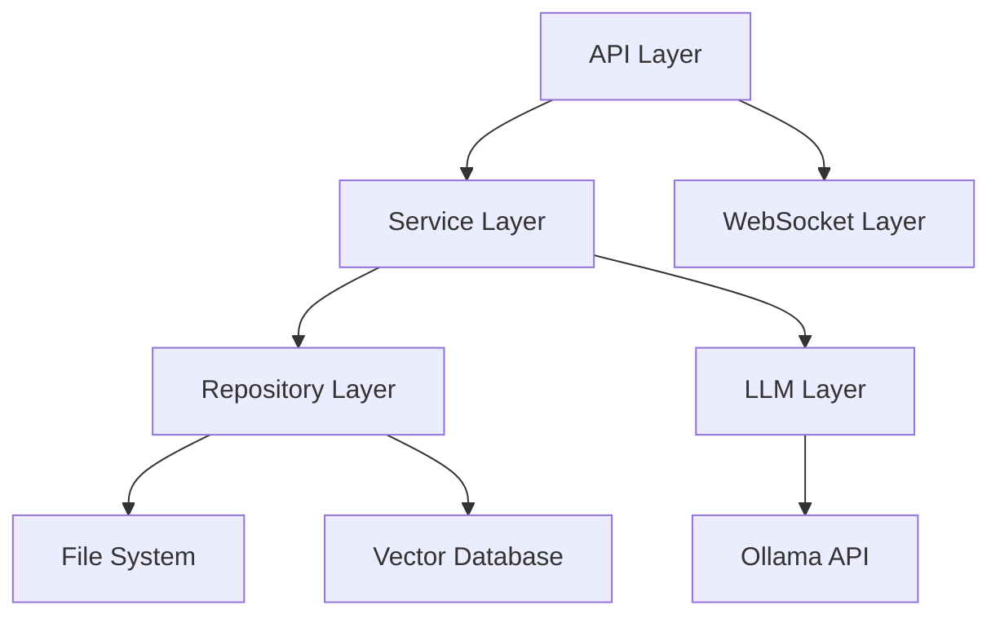

# Obsidian Concierge バックエンド開発ガイド

このドキュメントでは、Obsidian Conciergeのバックエンド設計、アーキテクチャ、主要コンポーネントの実装方法について説明します。

## アーキテクチャ概要

Obsidian Conciergeのバックエンドは、モジュール式のアーキテクチャを採用しており、各コンポーネントが明確な責任を持ちます。主要なレイヤーは以下の通りです：



### レイヤー構造

1. **API Layer**: FastAPIを使用したRESTful APIエンドポイントとWebSocket
2. **Service Layer**: ビジネスロジックとワークフロー
3. **Repository Layer**: データアクセス抽象化
4. **LLM Layer**: 言語モデルとのインタラクション

## ディレクトリ構造

```
obsidian_concierge/
├── api/                    # API定義
│   ├── __init__.py
│   ├── routes/
│   │   ├── __init__.py
│   │   ├── search.py       # 検索API
│   │   ├── question.py     # 質問応答API
│   │   ├── vault.py        # Vault操作API
│   │   ├── moc.py          # MOC生成API
│   │   ├── links.py        # リンクAPI
│   │   ├── auth.py         # 認証API
│   │   └── ws.py          # WebSocket API
│   └── models/             # Pydanticモデル
│       ├── __init__.py
│       ├── search.py
│       ├── question.py
│       ├── auth.py
│       └── ...
├── core/                   # コア機能
│   ├── __init__.py
│   ├── search.py           # 検索機能
│   ├── qa.py               # 質問応答機能
│   ├── file_mover.py       # ファイル移動機能
│   ├── moc_generator.py    # MOC生成機能
│   ├── tagging.py          # タグ付け機能
│   └── link_generator.py   # リンク生成機能
├── db/                     # データベース連携
│   ├── __init__.py
│   ├── chroma.py           # ChromaDB連携
│   └── indexer.py          # インデックス作成
├── llm/                    # LLM連携
│   ├── __init__.py
│   ├── ollama.py           # Ollama連携
│   └── prompts.py          # プロンプトテンプレート
├── utils/                  # ユーティリティ
│   ├── __init__.py
│   ├── config.py           # 設定管理
│   ├── file_utils.py       # ファイル操作
│   └── logging.py          # ロギング
└── app.py                  # アプリケーションエントリーポイント
```

## 主要コンポーネントの実装

### 1. API層

FastAPIを使用してRESTful APIとWebSocketを実装します。各エンドポイントは適切なルートファイルに定義します。

#### 例: 検索APIの実装

```python
# obsidian_concierge/api/routes/search.py
from fastapi import APIRouter, Depends, Query, HTTPException
from typing import Optional
from fastapi.security import OAuth2PasswordBearer

from ...core.search import SearchService
from ...api.models.search import SearchResponse
from ...utils.dependencies import get_search_service, get_current_user

router = APIRouter(prefix="/search", tags=["search"])
oauth2_scheme = OAuth2PasswordBearer(tokenUrl="token")

@router.get("/", response_model=SearchResponse)
async def search_vault(
    query: str = Query(..., description="検索クエリ"),
    limit: Optional[int] = Query(10, description="返す結果の最大数"),
    search_service: SearchService = Depends(get_search_service),
    current_user: User = Depends(get_current_user)
):
    """
    Vault内のコンテンツを検索する
    """
    try:
        results = await search_service.search(query, limit=limit)
        return SearchResponse(
            results=results,
            total=len(results),
            query=query
        )
    except Exception as e:
        raise HTTPException(status_code=500, detail=str(e))
```

#### WebSocket APIの実装

```python
# obsidian_concierge/api/routes/ws.py
from fastapi import APIRouter, WebSocket, WebSocketDisconnect, Depends
from typing import List
import json

router = APIRouter()
active_connections: List[WebSocket] = []

@router.websocket("/ws")
async def websocket_endpoint(
    websocket: WebSocket,
    token: str,
    current_user: User = Depends(get_current_user_ws)
):
    await websocket.accept()
    active_connections.append(websocket)
    try:
        while True:
            data = await websocket.receive_text()
            message = json.loads(data)
            
            # メッセージの種類に応じた処理
            if message["type"] == "search":
                results = await search_service.search(message["query"])
                await websocket.send_json({
                    "type": "search_results",
                    "data": results
                })
            elif message["type"] == "question":
                answer = await qa_service.answer(message["question"])
                await websocket.send_json({
                    "type": "answer",
                    "data": answer
                })
    except WebSocketDisconnect:
        active_connections.remove(websocket)
```

#### CORS設定

```python
# obsidian_concierge/app.py
from fastapi import FastAPI
from fastapi.middleware.cors import CORSMiddleware

app = FastAPI()

# CORS設定
app.add_middleware(
    CORSMiddleware,
    allow_origins=["http://localhost:3000"],  # フロントエンドのURL
    allow_credentials=True,
    allow_methods=["*"],
    allow_headers=["*"],
)
```

#### データモデル定義

Pydanticを使用して、リクエストとレスポンスのデータモデルを定義します：

```python
# obsidian_concierge/api/models/search.py
from pydantic import BaseModel, Field
from typing import List

class SearchResult(BaseModel):
    id: str
    title: str
    path: str
    excerpt: str
    relevance: float

class SearchResponse(BaseModel):
    results: List[SearchResult]
    total: int
    query: str
```

### 2. サービス層

各機能のビジネスロジックを実装します：

#### 例: 検索サービスの実装

```python
# obsidian_concierge/core/search.py
from typing import List, Optional
import logging

from ..db.chroma import ChromaRepository
from ..api.models.search import SearchResult

logger = logging.getLogger(__name__)

class SearchService:
    def __init__(self, repository: ChromaRepository):
        self.repository = repository
    
    async def search(self, query: str, limit: Optional[int] = 10) -> List[SearchResult]:
        """
        指定されたクエリでVault内を検索する
        
        Args:
            query: 検索クエリ
            limit: 返す結果の最大数
            
        Returns:
            検索結果のリスト
        """
        logger.info(f"検索実行: query='{query}', limit={limit}")
        
        try:
            db_results = await self.repository.query(query, n_results=limit)
            
            results = []
            for i, (doc_id, doc, metadata, distance) in enumerate(zip(
                db_results.ids[0], 
                db_results.documents[0], 
                db_results.metadatas[0], 
                db_results.distances[0]
            )):
                # 距離をスコアに変換（1 - 正規化された距離）
                relevance = 1.0 - min(distance, 1.0)
                
                # 抜粋の作成
                excerpt = doc[:200] + "..." if len(doc) > 200 else doc
                
                result = SearchResult(
                    id=doc_id,
                    title=metadata.get("title", "無題"),
                    path=metadata.get("path", ""),
                    excerpt=excerpt,
                    relevance=round(relevance, 2)
                )
                results.append(result)
            
            logger.info(f"検索完了: {len(results)}件の結果")
            return results
            
        except Exception as e:
            logger.error(f"検索中にエラーが発生しました: {str(e)}")
            raise
```

### 3. リポジトリ層

データアクセスを抽象化します：

#### 例: ChromaDBリポジトリの実装

```python
# obsidian_concierge/db/chroma.py
import os
import logging
from typing import Dict, Any, List, Optional
import chromadb
from chromadb.config import Settings

logger = logging.getLogger(__name__)

class ChromaRepository:
    def __init__(self, persist_directory: str, collection_name: str = "obsidian_notes"):
        """
        ChromaDBリポジトリを初期化
        
        Args:
            persist_directory: データを永続化するディレクトリ
            collection_name: コレクション名
        """
        self.persist_directory = persist_directory
        self.collection_name = collection_name
        
        # クライアントの初期化
        self.client = chromadb.Client(Settings(
            persist_directory=persist_directory,
            anonymized_telemetry=False
        ))
        
        # コレクションの取得または作成
        try:
            self.collection = self.client.get_collection(collection_name)
            logger.info(f"既存のコレクションを取得: {collection_name}")
        except ValueError:
            self.collection = self.client.create_collection(collection_name)
            logger.info(f"新しいコレクションを作成: {collection_name}")
```

### 4. フロントエンドとの統合

#### API クライアントの実装例

フロントエンドでは、以下のようなAPIクライアントを実装することを推奨します：

```typescript
// frontend/src/api/client.ts
import axios from 'axios';
import { SearchResult, SearchResponse } from '../types';

const API_BASE_URL = process.env.VITE_API_URL || 'http://localhost:8000';

export class ApiClient {
  private readonly baseUrl: string;
  private readonly token: string | null;

  constructor(baseUrl: string = API_BASE_URL) {
    this.baseUrl = baseUrl;
    this.token = localStorage.getItem('auth_token');
  }

  private get headers() {
    return {
      'Authorization': this.token ? `Bearer ${this.token}` : '',
      'Content-Type': 'application/json',
    };
  }

  async search(query: string, limit: number = 10): Promise<SearchResponse> {
    const response = await axios.get(`${this.baseUrl}/search`, {
      params: { query, limit },
      headers: this.headers,
    });
    return response.data;
  }

  // WebSocket接続の確立
  connectWebSocket(): WebSocket {
    const ws = new WebSocket(`ws://${this.baseUrl.replace('http://', '')}/ws`);
    
    ws.onopen = () => {
      console.log('WebSocket接続確立');
    };
    
    ws.onclose = () => {
      console.log('WebSocket接続終了');
    };
    
    ws.onerror = (error) => {
      console.error('WebSocketエラー:', error);
    };
    
    return ws;
  }
}
```

#### エラーハンドリング

APIエンドポイントでは、適切なエラーハンドリングを実装することが重要です：

```python
# obsidian_concierge/api/routes/error_handlers.py
from fastapi import Request
from fastapi.responses import JSONResponse
from ..exceptions import NotFoundError, ValidationError, AuthenticationError

async def not_found_handler(request: Request, exc: NotFoundError):
    return JSONResponse(
        status_code=404,
        content={"message": str(exc)}
    )

async def validation_error_handler(request: Request, exc: ValidationError):
    return JSONResponse(
        status_code=400,
        content={"message": str(exc)}
    )

async def auth_error_handler(request: Request, exc: AuthenticationError):
    return JSONResponse(
        status_code=401,
        content={"message": str(exc)}
    )
```

#### API ドキュメント

FastAPIの自動ドキュメント生成機能を活用します：

```python
# obsidian_concierge/app.py
from fastapi import FastAPI
from fastapi.openapi.docs import get_swagger_ui_html

app = FastAPI(
    title="Obsidian Concierge API",
    description="Obsidian ConciergeのバックエンドAPI",
    version="1.0.0",
    docs_url=None,  # カスタムSwagger UIを使用
)

@app.get("/docs", include_in_schema=False)
async def custom_swagger_ui_html():
    return get_swagger_ui_html(
        openapi_url="/openapi.json",
        title="Obsidian Concierge API Documentation",
        swagger_js_url="https://cdn.jsdelivr.net/npm/swagger-ui-dist@5/swagger-ui-bundle.js",
        swagger_css_url="https://cdn.jsdelivr.net/npm/swagger-ui-dist@5/swagger-ui.css",
    )
```

## ロールバックと変更の安全性

変更操作前にバックアップを作成し、必要に応じてロールバックできるようにします：

```python
# obsidian_concierge/utils/backup.py
import os
import shutil
import json
import time
from typing import Dict, Any, Optional
import logging

logger = logging.getLogger(__name__)

class BackupManager:
    def __init__(self, vault_path: str):
        """
        バックアップマネージャーを初期化
        
        Args:
            vault_path: Vaultのルートパス
        """
        self.vault_path = vault_path
        self.backup_dir = os.path.join(vault_path, ".obsidian-concierge", "backups")
        
        # バックアップディレクトリが存在しない場合は作成
        os.makedirs(self.backup_dir, exist_ok=True)
        
    def create_backup(self, file_path: str) -> Optional[str]:
        """
        ファイルのバックアップを作成
        
        Args:
            file_path: バックアップするファイルの相対パス
            
        Returns:
            バックアップID、またはNone（エラー時）
        """
        full_path = os.path.join(self.vault_path, file_path)
        
        if not os.path.exists(full_path):
            logger.error(f"バックアップエラー: ファイルが存在しません: {file_path}")
            return None
            
        try:
            # バックアップIDを生成
            backup_id = f"{int(time.time())}_{os.path.basename(file_path)}"
            backup_path = os.path.join(self.backup_dir, backup_id)
            
            # ファイルをコピー
            shutil.copy2(full_path, backup_path)
            
            # メタ情報を保存
            meta_path = f"{backup_path}.meta"
            meta_data = {
                "original_path": file_path,
                "timestamp": time.time(),
                "backup_id": backup_id
            }
            
            with open(meta_path, "w", encoding="utf-8") as f:
                json.dump(meta_data, f, indent=2)
                
            logger.info(f"バックアップ作成: {file_path} -> {backup_id}")
            return backup_id
            
        except Exception as e:
            logger.error(f"バックアップエラー: {file_path}, {str(e)}")
            return None
            
    def restore_backup(self, backup_id: str) -> bool:
        """
        バックアップからファイルを復元
        
        Args:
            backup_id: バックアップID
            
        Returns:
            成功したかどうか
        """
        backup_path = os.path.join(self.backup_dir, backup_id)
        meta_path = f"{backup_path}.meta"
        
        if not (os.path.exists(backup_path) and os.path.exists(meta_path)):
            logger.error(f"復元エラー: バックアップが見つかりません: {backup_id}")
            return False
            
        try:
            # メタ情報を読み込み
            with open(meta_path, "r", encoding="utf-8") as f:
                meta_data = json.load(f)
                
            original_path = meta_data["original_path"]
            full_path = os.path.join(self.vault_path, original_path)
            
            # 復元先ディレクトリが存在しない場合は作成
            os.makedirs(os.path.dirname(full_path), exist_ok=True)
            
            # ファイルを復元
            shutil.copy2(backup_path, full_path)
            
            logger.info(f"バックアップ復元: {backup_id} -> {original_path}")
            return True
            
        except Exception as e:
            logger.error(f"復元エラー: {backup_id}, {str(e)}")
            return False
            
    def list_backups(self, file_path: Optional[str] = None) -> Dict[str, Any]:
        """
        バックアップの一覧を取得
        
        Args:
            file_path: 特定のファイルのバックアップのみ取得（オプション）
            
        Returns:
            バックアップ情報のディクショナリ
        """
        backups = {}
        
        try:
            for item in os.listdir(self.backup_dir):
                if item.endswith(".meta"):
                    meta_path = os.path.join(self.backup_dir, item)
                    
                    with open(meta_path, "r", encoding="utf-8") as f:
                        meta_data = json.load(f)
                        
                    if file_path is None or meta_data["original_path"] == file_path:
                        backup_id = meta_data["backup_id"]
                        backups[backup_id] = meta_data
                        
            return backups
            
        except Exception as e:
            logger.error(f"バックアップ一覧取得エラー: {str(e)}")
            return {}
```

## パフォーマンス最適化のヒント

### 非同期処理

ファイルI/OやLLM呼び出しなど、時間のかかる操作は非同期処理を活用して効率化します：

```python
import asyncio
from typing import List, Dict, Any

async def process_files_concurrently(files: List[str], max_workers: int = 5) -> List[Dict[str, Any]]:
    """
    ファイルを並行処理
    
    Args:
        files: 処理するファイルのリスト
        max_workers: 同時実行の最大数
        
    Returns:
        処理結果のリスト
    """
    semaphore = asyncio.Semaphore(max_workers)
    
    async def process_with_semaphore(file_path: str) -> Dict[str, Any]:
        async with semaphore:
            # 実際の処理を行う関数
            return await process_single_file(file_path)
    
    # 並行タスクを作成
    tasks = [process_with_semaphore(file) for file in files]
    
    # すべてのタスクを実行して結果を待機
    results = await asyncio.gather(*tasks)
    return results
```

### キャッシング

頻繁に使用されるデータはキャッシュを活用して処理を高速化します：

```python
# obsidian_concierge/utils/cache.py
import time
import functools
from typing import Dict, Any, Callable, Optional
import logging

logger = logging.getLogger(__name__)

class Cache:
    """シンプルなインメモリキャッシュ"""
    
    def __init__(self, max_size: int = 1000, ttl: int = 3600):
        """
        キャッシュを初期化
        
        Args:
            max_size: キャッシュの最大エントリ数
            ttl: キャッシュエントリの有効期間（秒）
        """
        self.max_size = max_size
        self.ttl = ttl
        self.cache: Dict[str, Dict[str, Any]] = {}
        
    def get(self, key: str) -> Optional[Any]:
        """
        キャッシュからデータを取得
        
        Args:
            key: キャッシュキー
            
        Returns:
            キャッシュされた値、またはNone（存在しない場合）
        """
        if key not in self.cache:
            return None
            
        entry = self.cache[key]
        if time.time() > entry["expires"]:
            # 有効期限切れ
            del self.cache[key]
            return None
            
        return entry["value"]
        
    def set(self, key: str, value: Any) -> None:
        """
        データをキャッシュに保存
        
        Args:
            key: キャッシュキー
            value: 保存する値
        """
        # キャッシュサイズが上限に達した場合、古いエントリを削除
        if len(self.cache) >= self.max_size:
            oldest_key = min(self.cache, key=lambda k: self.cache[k]["expires"])
            del self.cache[oldest_key]
            
        self.cache[key] = {
            "value": value,
            "expires": time.time() + self.ttl
        }
        
    def clear(self) -> None:
        """キャッシュをクリア"""
        self.cache.clear()
        
    def remove(self, key: str) -> None:
        """
        キャッシュからエントリを削除
        
        Args:
            key: 削除するキー
        """
        if key in self.cache:
            del self.cache[key]


# デコレータを使用したキャッシング
def cached(cache: Cache, key_func: Optional[Callable] = None):
    """
    関数の結果をキャッシュするデコレータ
    
    Args:
        cache: 使用するキャッシュオブジェクト
        key_func: キャッシュキーを生成する関数（オプション）
        
    Returns:
        デコレータ関数
    """
    def decorator(func):
        @functools.wraps(func)
        async def async_wrapper(*args, **kwargs):
            # キャッシュキーを生成
            if key_func:
                key = key_func(*args, **kwargs)
            else:
                # デフォルトのキー生成（引数に基づく）
                key = f"{func.__name__}:{str(args)}:{str(kwargs)}"
                
            # キャッシュからデータを取得
            cached_result = cache.get(key)
            if cached_result is not None:
                logger.debug(f"キャッシュヒット: {key}")
                return cached_result
                
            # 関数を実行して結果を取得
            result = await func(*args, **kwargs)
            
            # 結果をキャッシュに保存
            cache.set(key, result)
            
            return result
            
        @functools.wraps(func)
        def sync_wrapper(*args, **kwargs):
            # キャッシュキーを生成
            if key_func:
                key = key_func(*args, **kwargs)
            else:
                # デフォルトのキー生成（引数に基づく）
                key = f"{func.__name__}:{str(args)}:{str(kwargs)}"
                
            # キャッシュからデータを取得
            cached_result = cache.get(key)
            if cached_result is not None:
                logger.debug(f"キャッシュヒット: {key}")
                return cached_result
                
            # 関数を実行して結果を取得
            result = func(*args, **kwargs)
            
            # 結果をキャッシュに保存
            cache.set(key, result)
            
            return result
            
        # 非同期関数か通常の関数かによってラッパーを選択
        if asyncio.iscoroutinefunction(func):
            return async_wrapper
        return sync_wrapper
        
    return decorator
```

## パッケージング

Poetry を使ってプロジェクトをパッケージ化する方法：

```bash
# パッケージのビルド
poetry build

# テスト用PyPIにアップロード
poetry publish --repository testpypi

# 本番PyPIにアップロード
poetry publish
```

## まとめ

Obsidian Conciergeのバックエンド開発には、以下の主要コンポーネントと技術が使用されています：

1. **FastAPI**: 高性能なRESTful APIの提供
2. **ChromaDB**: ベクトル検索によるセマンティック検索
3. **Ollama**: ローカルLLMとの連携
4. **非同期処理**: 効率的なI/Oと並行処理
5. **レイヤー化アーキテクチャ**: 関心の分離と拡張性の向上

開発を始める前に、このドキュメントと[開発環境のセットアップガイド](../DEVELOPMENT_SETUP.md)を確認し、プロジェクトの構造と設計原則を理解してください。

また、新しい機能の追加やバグ修正を行う際は、[コントリビューションガイド](../CONTRIBUTING.md)に従ってください。