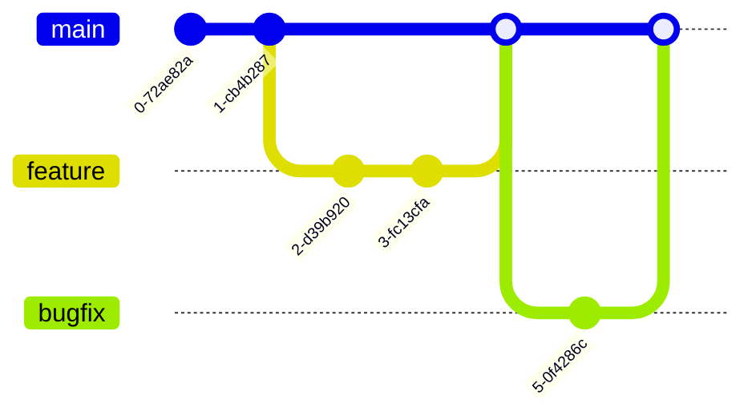

# Obsidian Concierge への貢献ガイド

Obsidian Conciergeプロジェクトへの貢献に興味を持っていただき、ありがとうございます。このドキュメントでは、プロジェクトに貢献するための方法やガイドラインについて説明します。

## 🌱 始め方

1. このリポジトリをフォークする
2. リポジトリをクローンする: `git clone https://github.com/yourusername/obsidian-concierge.git`
3. 開発環境をセットアップする: [DEVELOPMENT_SETUP.md](docs/DEVELOPMENT_SETUP.md)を参照

## 🔄 開発ワークフロー

### ブランチ戦略

以下のブランチ戦略に従ってください:



- `main`: 安定版のコード（本番環境用）
- `develop`: 開発中のコード（次のリリース用）
- `feature/*`: 新機能開発用（例: `feature/moc-generator`）
- `bugfix/*`: バグ修正用（例: `bugfix/search-results`）
- `release/*`: リリース準備用（例: `release/v1.0.0`）

### イシューとプルリクエストのフロー


1. **イシューの作成**: 追加する機能やバグについてイシューを作成する
2. **ブランチの作成**: `feature/issue-123` のような形式で命名する
3. **コードの実装**: 以下のコーディング規約に従う
4. **テストの追加**: 新機能や修正にはテストを追加する
5. **プルリクエストの作成**: テンプレートに従って作成する
6. **コードレビュー**: レビュアーからのフィードバックに対応する
7. **マージ**: 承認された変更をマージする

## 📝 コーディング規約

### コードスタイル

- Pythonコードは[PEP 8](https://peps.python.org/pep-0008/)に準拠すること
- [Black](https://github.com/psf/black)フォーマッターを使用すること
- [isort](https://pycqa.github.io/isort/)でインポートを整理すること
- [mypy](http://mypy-lang.org/)で型チェックを行うこと

```bash
# コードフォーマット
poetry run black obsidian_concierge tests
poetry run isort obsidian_concierge tests
poetry run mypy obsidian_concierge
poetry run flake8 obsidian_concierge tests
```

### 命名規則

- **クラス名**: `PascalCase` (例: `FileManager`)
- **関数と変数**: `snake_case` (例: `calculate_total`, `user_id`)
- **定数**: `UPPER_CASE_WITH_UNDERSCORES` (例: `MAX_RETRY_COUNT`)
- **プライベートメンバー**: アンダースコア接頭辞 (例: `_private_method`)
- **モジュール名**: 短く、全て小文字 (例: `search.py`, `utils.py`)

### ドキュメント

- すべての公開関数、クラス、メソッドには[Google style](https://sphinxcontrib-napoleon.readthedocs.io/en/latest/example_google.html)のdocstringsを付けること

```python
def search_vault(query: str, vault_path: str) -> List[SearchResult]:
    """
    指定されたクエリでVault内を検索する。

    Args:
        query: 検索クエリ文字列
        vault_path: Obsidian Vaultのパス

    Returns:
        検索結果のリスト

    Raises:
        ValueError: vault_pathが無効な場合
    """
    # 実装
```

### コミットメッセージ

コミットメッセージは以下の形式に従ってください:

```
<type>: <短い説明>

<詳細な説明（省略可）>
```

**type**:
- `feat`: 新機能
- `fix`: バグ修正
- `docs`: ドキュメントのみの変更
- `style`: コードの動作に影響しない変更（フォーマット等）
- `refactor`: バグ修正や機能追加ではないコード変更
- `test`: テストの追加・修正
- `chore`: ビルドプロセスやツールの変更

例:
```
feat: MOC生成機能の追加

- トピックベースのMOC生成
- 既存のタグとリンクの活用
- 生成されたMOCの保存機能
```

## 🧪 テストガイドライン

- 新機能には単体テストを追加する
- バグ修正には回帰テストを追加する
- テストはモジュールごとに分類する
- モックを使用して外部依存関係を隔離する

```python
def test_search_vault_returns_correct_results():
    # テストコード
```

## 📋 プルリクエストのチェックリスト

提出する前に以下のチェックリストを確認してください:

- [ ] コードは適切にフォーマットされている
- [ ] 型チェックにエラーがない
- [ ] すべてのテストが通過している
- [ ] ドキュメントを更新した（必要な場合）
- [ ] APIの変更をドキュメントに反映した（必要な場合）
- [ ] コミットメッセージは規約に従っている

## 📚 追加リソース

- [開発環境のセットアップ](docs/DEVELOPMENT_SETUP.md)
- [アーキテクチャ概要](ARCHITECTURE.md)
- [APIドキュメント](docs/api/API_DOCUMENTATION.md)
- [テスト計画](docs/TEST_PLAN.md)

## ❓ 質問がある場合

質問や疑問がある場合は、以下の方法で連絡できます:

- Issueを作成する
- Discussionsセクションで質問する

ご協力ありがとうございます！