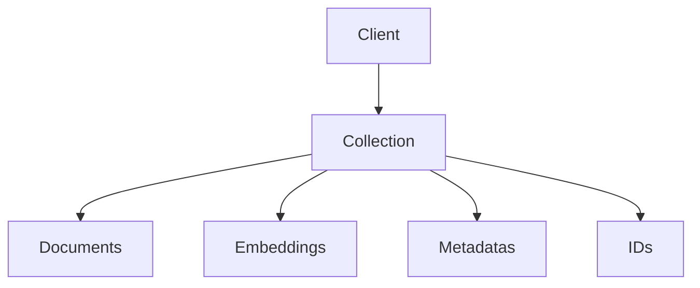
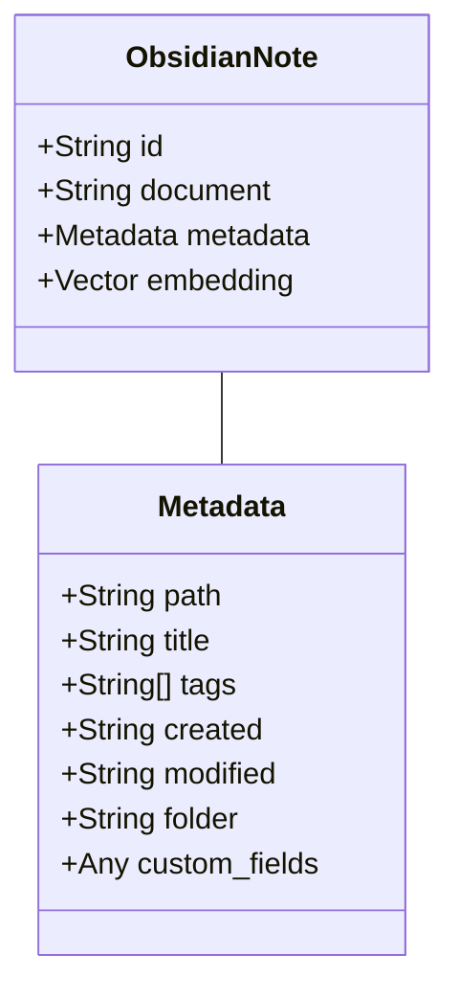
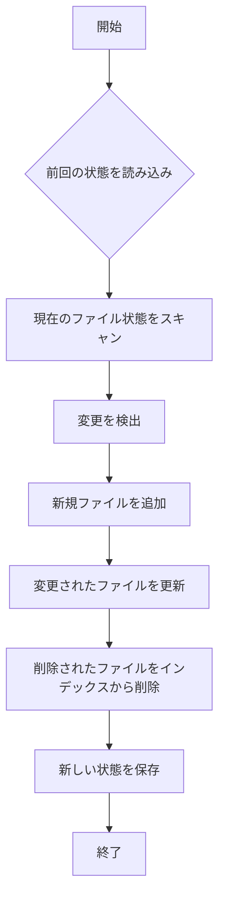

# Obsidian Concierge データベーススキーマ設計

このドキュメントでは、Obsidian Conciergeで使用するChromaDBのスキーマ設計と設定について説明します。

## 1. 概要

Obsidian ConciergeはベクトルデータベースとしてChromaDBを使用し、Obsidian Vaultの内容をセマンティック検索可能な形で保存しています。ChromaDBは組み込み型のベクトルデータベースで、埋め込みベクトルの生成と高効率な類似性検索を提供します。

## 2. ChromaDB概要

ChromaDBは以下の主要コンポーネントで構成されています：



- **Client**: データベース接続を管理
- **Collection**: ドキュメントとその埋め込みを格納する論理的なグループ
- **Documents**: 原文テキスト
- **Embeddings**: ドキュメントのベクトル表現
- **Metadatas**: 各ドキュメントに関連するメタデータ
- **IDs**: 各ドキュメントの一意の識別子

## 3. コレクション設計

### 3.1 メインコレクション: "obsidian_notes"



### 3.2 ドキュメント構造

各ドキュメントは単一のObsidianノートに対応し、そのテキスト内容（フロントマターを除く）が保存されます。

### 3.3 メタデータ構造

メタデータには、ノートに関する重要な情報が含まれます：

| フィールド | 型 | 説明 | 例 |
|----------|------|-------------|---------|
| path | string | Vault内の相対パス | "Projects/ProjectA.md" |
| title | string | ノートのタイトル | "ProjectA" |
| tags | array | ノートのタグ | ["project", "active"] |
| created | string | 作成日時（ISO形式） | "2023-01-01T12:00:00Z" |
| modified | string | 最終更新日時（ISO形式） | "2023-01-15T18:30:00Z" |
| folder | string | 親フォルダのパス | "Projects" |

#### フロントマターからのカスタムフィールド

Obsidianノートのフロントマターから追加のフィールドもメタデータとして保存されます：

```yaml
---
type: project
status: active
priority: high
due: 2023-03-15
---
```

これらは自動的にメタデータにマッピングされます：

```json
{
  "type": "project",
  "status": "active",
  "priority": "high",
  "due": "2023-03-15"
}
```

## 4. ID生成スキーム

各ドキュメントには一意のIDが必要です。IDはファイルパスからMD5ハッシュを生成することで作成されます：

```python
import hashlib

def generate_id(file_path: str) -> str:
    return hashlib.md5(file_path.encode()).hexdigest()
```

このようにしてファイルパスからIDを生成することで、同じファイルに対して常に同じIDが生成され、更新や削除が容易になります。

## 5. 埋め込みベクトル

ChromaDBは、テキストドキュメントを高次元のベクトル空間に埋め込みます。デフォルトでは、Sentence Transformersの`all-MiniLM-L6-v2`モデルが使用されます。

主な特徴：
- 次元数: 384
- モデル: all-MiniLM-L6-v2
- 正規化: コサイン類似度のために正規化済み

## 6. クエリとフィルタリング

### 6.1 セマンティック検索

セマンティック検索は、クエリテキストの意味に基づいて関連するドキュメントを見つけます：

```python
results = collection.query(
    query_texts=["Pythonプログラミング"],
    n_results=5
)
```

### 6.2 メタデータフィルタリング

メタデータに基づいたフィルタリングも可能です：

```python
# タグによるフィルタリング
results = collection.query(
    query_texts=["Pythonプログラミング"],
    where={"tags": {"$contains": "project"}},
    n_results=5
)

# フォルダによるフィルタリング
results = collection.query(
    query_texts=["Pythonプログラミング"],
    where={"folder": "Projects"},
    n_results=5
)

# 複合条件
results = collection.query(
    query_texts=["Pythonプログラミング"],
    where={
        "$and": [
            {"tags": {"$contains": "project"}},
            {"status": "active"}
        ]
    },
    n_results=5
)
```

## 7. データベース設定

### 7.1 永続化設定

ChromaDBのデータは、指定したディレクトリに永続化されます：

```python
import chromadb
from chromadb.config import Settings

# 設定
client = chromadb.Client(Settings(
    persist_directory="./chroma_db",
    anonymized_telemetry=False
))
```

永続化ディレクトリの構造：

```
chroma_db/
├── chroma.sqlite3       # メタデータと設定
├── embeddings/          # 埋め込みベクトルデータ
└── index/               # インデックスデータ
```

### 7.2 メモリ使用量とキャッシュ

ChromaDBはデフォルトでインメモリキャッシュを使用します。大規模なVaultに対応するため、以下の調整が可能です：

```python
client = chromadb.Client(Settings(
    persist_directory="./chroma_db",
    anonymized_telemetry=False,
    allow_reset=True,
    is_persistent=True
))
```

## 8. 差分更新アルゴリズム

Obsidian Vaultのファイル変更を効率的に追跡し、インデックスを更新するアルゴリズムを使用しています：



差分更新によって、大規模なVaultでも効率的なインデックス維持が可能になります。

## 9. スキーマ進化と将来の拡張性

### 9.1 将来の拡張

今後、以下のような拡張が計画されています：

1. **複数コレクション対応**：
   - ノートタイプ別のコレクション（プロジェクト、MOC、デイリーノートなど）
   - 異なるエンベディングモデルに対応

2. **高度なインデックス**：
   - 階層的なタグインデックス
   - 時系列インデックス

3. **データバージョニング**：
   - ノートの変更履歴の追跡
   - 特定時点のVault状態の復元

### 9.2 マイグレーション戦略

スキーマが変更された場合は、以下のマイグレーション戦略を使用します：

1. 現在のインデックスのバックアップを作成
2. 新しいスキーマでコレクションを再作成
3. 既存のデータを新しいスキーマに変換して再インデックス
4. 検証後、バックアップを削除

## 10. チューニングとパフォーマンス

### 10.1 埋め込みパラメータ

埋め込みモデルとパラメータは、精度とパフォーマンスのバランスに大きく影響します：

| パラメータ | 推奨値 | 影響 |
|----------|---------|------|
| モデル | all-MiniLM-L6-v2 | 精度とパフォーマンスのバランス |
| チャンクサイズ | 1000文字 | 大きすぎると検索精度が低下、小さすぎるとノイズが増加 |
| オーバーラップ | 200文字 | 文脈の連続性を維持 |

### 10.2 クエリパフォーマンス最適化

検索パフォーマンスを最適化するためのテクニック：

1. **正確なメタデータフィルタリング**：可能な限りメタデータでフィルタリングし、検索対象を絞り込む
2. **キャッシュの活用**：頻繁に行われる検索をキャッシュする
3. **非同期クエリ**：大規模な検索を非同期的に実行し、UIの応答性を維持する

## 11. 例：コレクションの作成と使用

以下は、ChromaDBコレクションの作成と使用例です：

```python
import chromadb
from chromadb.config import Settings

# クライアントの初期化
client = chromadb.Client(Settings(
    persist_directory="./chroma_db",
    anonymized_telemetry=False
))

# コレクションの作成（存在しない場合）
collection = client.get_or_create_collection("obsidian_notes")

# ドキュメントの追加
collection.add(
    documents=["This is a sample note about Python programming."],
    metadatas=[{
        "path": "Programming/Python.md",
        "title": "Python Programming",
        "tags": ["programming", "python"],
        "folder": "Programming"
    }],
    ids=["md5-hash-of-path"]
)

# 検索
results = collection.query(
    query_texts=["how to program in python"],
    n_results=5
)

# 結果の処理
for i, (id, document, metadata, distance) in enumerate(zip(
    results.ids[0],
    results.documents[0],
    results.metadatas[0],
    results.distances[0]
)):
    print(f"Result {i+1}:")
    print(f"  ID: {id}")
    print(f"  Title: {metadata['title']}")
    print(f"  Path: {metadata['path']}")
    print(f"  Distance: {distance}")
    print(f"  Preview: {document[:100]}...")
    print()
```