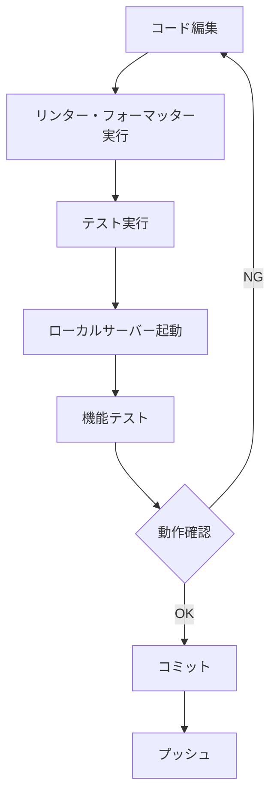

# Obsidian Concierge 開発環境のセットアップ

このドキュメントでは、Obsidian Conciergeの開発環境をセットアップする手順を説明します。

## 前提条件

開発を始める前に、以下のソフトウェアがインストールされていることを確認してください：

- **Python 3.10以上**: [Python公式サイト](https://www.python.org/downloads/)からダウンロード
- **Poetry 1.6.0以上**: 依存関係管理ツール
- **Git**: バージョン管理システム
- **Ollama**: ローカルLLMを実行するためのツール（gemma3:27bモデルが必要）

## 環境構築手順

### 1. Poetry のインストール

Poetry がまだインストールされていない場合は、以下のコマンドでインストールします：

#### Linux, macOS, WSL
```bash
curl -sSL https://install.python-poetry.org | python3 -
```

#### Windows PowerShell
```powershell
(Invoke-WebRequest -Uri https://install.python-poetry.org -UseBasicParsing).Content | python -
```

インストール後、Poetryがパスに追加されていることを確認します：
```bash
poetry --version
```

### 2. リポジトリのクローンとセットアップ

```bash
# リポジトリのクローン
git clone https://github.com/yourusername/obsidian-concierge.git
cd obsidian-concierge

# 依存関係のインストール
poetry install

# 仮想環境の有効化
poetry shell
```

### 3. Ollama のセットアップ

Ollamaをまだインストールしていない場合は、[Ollama公式サイト](https://ollama.ai/download)からインストールしてください。

インストール後、必要なモデルをダウンロードします：
```bash
ollama pull gemma3:27b
```

モデルがダウンロードされたことを確認します：
```bash
ollama list
```

### 4. 設定ファイルの作成

```bash
# 設定ファイルテンプレートをコピー
cp config.example.yaml config.yaml
```

`config.yaml` を編集して、以下の設定を行います：

```yaml
app:
  name: "Obsidian Concierge"
  version: "0.1.0"
  vault_path: "/path/to/your/obsidian/vault"  # あなたのObsidian Vaultのパスに変更

folder_structure:
  - name: "Projects"
    subfolders:
      - "Active"
      - "Archive"
  - name: "Areas"
    subfolders:
      - "Health"
      - "Finance"
      - "Career"
  # 必要に応じて追加

allowed_tags:
  - project
  - area
  - resource
  # 必要に応じて追加
```

### 5. 開発サーバーの起動

以下のコマンドで開発サーバーを起動します：

```bash
# Poetry環境内で
python -m obsidian_concierge

# または
poetry run python -m obsidian_concierge
```

ブラウザで http://localhost:7860 にアクセスしてUIを開きます。

## 開発ワークフロー



### コード品質チェック

```bash
# コードフォーマット
poetry run black obsidian_concierge tests

# インポートの整理
poetry run isort obsidian_concierge tests

# 型チェック
poetry run mypy obsidian_concierge

# リンター
poetry run flake8 obsidian_concierge tests
```

### テストの実行

```bash
# すべてのテストを実行
poetry run pytest

# カバレッジレポート付きでテストを実行
poetry run pytest --cov=obsidian_concierge
```

## フォルダ構造

```
/obsidian-concierge/
├── obsidian_concierge/            # メインのソースコード
│   ├── __init__.py
│   ├── api/                       # API関連コード
│   ├── core/                      # コア機能
│   ├── db/                        # データベース関連
│   ├── llm/                       # LLM連携機能
│   ├── utils/                     # ユーティリティ
│   ├── app.py                     # アプリケーションエントリーポイント
│   └── ui.py                      # Gradio UI定義
├── tests/                         # テストコード
│   ├── __init__.py
│   ├── conftest.py                # テスト用フィクスチャ
│   ├── test_api/                  # APIテスト
│   ├── test_core/                 # コア機能テスト
│   ├── test_db/                   # データベーステスト
│   └── test_llm/                  # LLM連携テスト
├── docs/                          # ドキュメント
└── ...
```

## 依存関係の管理

新しい依存関係を追加する場合：

```bash
# 本番環境の依存関係
poetry add package-name

# 開発環境のみの依存関係
poetry add --group dev package-name

# 依存関係の更新
poetry update
```

## よくある問題と解決策

### 問題: Ollamaが起動しない

**症状**: `ConnectionRefusedError: [Errno 111] Connection refused`

**解決策**:
1. Ollamaが実行されているか確認します
```bash
ps aux | grep ollama
```
2. 実行されていない場合は起動します
```bash
ollama serve
```

### 問題: ChromaDBのインポートエラー

**症状**: `ImportError: No module named 'chromadb'`

**解決策**:
```bash
poetry install
# もしくは明示的に
poetry add chromadb
```

### 問題: Vaultパスのアクセス権限

**症状**: `PermissionError: [Errno 13] Permission denied`

**解決策**:
1. `config.yaml`のVaultパスが正しいか確認
2. アプリケーションに適切なアクセス権限があるか確認
```bash
# Linuxの場合
chmod -R 755 /path/to/your/vault
```

### 問題: Gradioのインターフェースが表示されない

**症状**: ブラウザでローカルホストに接続できない

**解決策**:
1. アプリケーションが起動しているか確認
2. ポートが別のアプリケーションで使用されていないか確認
```bash
# Linuxの場合
netstat -tuln | grep 7860
```
3. 必要に応じて別のポートを指定して起動
```bash
python -m obsidian_concierge --port 7861
```

## 開発環境のカスタマイズ

### エディタ設定

#### VS Code

`.vscode/settings.json`の推奨設定:

```json
{
    "python.linting.enabled": true,
    "python.linting.flake8Enabled": true,
    "python.linting.mypyEnabled": true,
    "python.formatting.provider": "black",
    "editor.formatOnSave": true,
    "editor.codeActionsOnSave": {
        "source.organizeImports": true
    },
    "python.analysis.typeCheckingMode": "basic"
}
```

#### PyCharm

1. **Black**をコードフォーマッターとして設定
   - Settings → Tools → Black
   - "On code reformat" にチェック

2. **isort**をインポート整理ツールとして設定
   - Settings → Editor → Code Style → Python → Imports
   - "Use isort" にチェック

### コミットフック

pre-commitを使用して自動的にリントとフォーマットをコミット前に実行することをお勧めします:

```bash
# pre-commitのインストール
poetry add --group dev pre-commit

# 設定ファイルを作成
cat > .pre-commit-config.yaml << EOF
repos:
-   repo: https://github.com/pre-commit/pre-commit-hooks
    rev: v4.4.0
    hooks:
    -   id: trailing-whitespace
    -   id: end-of-file-fixer
    -   id: check-yaml
    -   id: check-added-large-files

-   repo: https://github.com/pycqa/isort
    rev: 5.12.0
    hooks:
    -   id: isort

-   repo: https://github.com/psf/black
    rev: 23.7.0
    hooks:
    -   id: black

-   repo: https://github.com/pycqa/flake8
    rev: 6.1.0
    hooks:
    -   id: flake8
EOF

# フックをインストール
pre-commit install
```

## CI/CD 設定

GitHub Actionsが設定されています。各プルリクエストで以下が自動的に実行されます:

- コードのフォーマットチェック
- リンター
- 型チェック
- テスト

`.github/workflows/ci.yml`を参照してください。

## デバッグ技術

### ロギング

アプリケーションは詳細なログを`logs/`ディレクトリに出力します。問題のトラブルシューティングには、これらのログを確認してください。

ログレベルは`config.yaml`で設定できます:

```yaml
logging:
  level: "DEBUG"  # または "INFO", "WARNING", "ERROR"
  file: "logs/obsidian_concierge.log"
```

### デバッグモード

デバッグモードでアプリケーションを実行するには:

```bash
python -m obsidian_concierge --debug
```

これにより、より詳細なログが出力され、自動リロードが有効になります。

## 開発ツール

### パフォーマンスプロファイリング

```bash
# プロファイリングの実行
python -m cProfile -o profile.pstats -m obsidian_concierge

# 結果の分析（SnakeViz）
pip install snakeviz
snakeviz profile.pstats
```

### ドキュメント生成

```bash
# Sphinxドキュメントの生成
cd docs
sphinx-build -b html source build
```

## 貢献

開発に貢献する方法については、[CONTRIBUTING.md](../CONTRIBUTING.md)を参照してください。