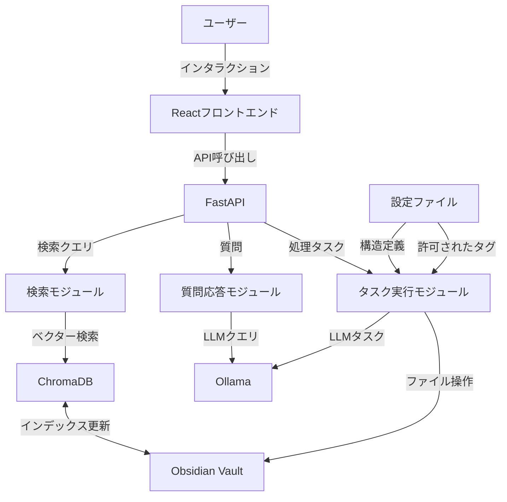

# Obsidian Concierge - システム設計ドキュメント

## 1. システム概要

Obsidian Conciergeは、Obsidianユーザーのための知識管理アシスタントで、RAG検索、インテリジェントなファイル移動、MOC生成、タグ付けを支援するLLMベースのウェブアプリケーションです。

## 2. 技術スタック

- **フロントエンド**: React + TypeScript（モダンなWebインターフェース）
- **バックエンド**: FastAPI（RESTful API）
- **言語モデル**: Ollama（gemma3:27b）
- **ベクターデータベース**: ChromaDB
- **エージェントフレームワーク**: Agno
- **プログラミング言語**: Python, TypeScript

## 3. システムアーキテクチャ



## 4. 主要モジュール

### 4.1. フロントエンドモジュール

ユーザーインターフェースとAPIとの通信を担当します。

```typescript
// src/api/client.ts
interface ApiClient {
  // 検索API
  search(query: string): Promise<SearchResult[]>;
  
  // 質問応答API
  askQuestion(question: string): Promise<string>;
  
  // ファイル移動API
  moveFiles(): Promise<string[]>;
  
  // MOC生成API
  generateMOC(topic: string): Promise<string>;
  
  // タグ付けAPI
  suggestTags(filePath: string): Promise<string[]>;
}

// src/components/Search.tsx
interface SearchProps {
  onSearch: (query: string) => void;
  results: SearchResult[];
  isLoading: boolean;
}

const Search: React.FC<SearchProps> = ({ onSearch, results, isLoading }) => {
  const [query, setQuery] = useState('');

  const handleSubmit = (e: React.FormEvent) => {
    e.preventDefault();
    onSearch(query);
  };

  return (
    <div className="search-container">
      <form onSubmit={handleSubmit}>
        <input
          type="text"
          value={query}
          onChange={(e) => setQuery(e.target.value)}
          placeholder="検索キーワードを入力..."
          className="search-input"
        />
        <button type="submit" disabled={isLoading}>
          {isLoading ? '検索中...' : '検索'}
        </button>
      </form>
      
      <div className="search-results">
        {results.map((result) => (
          <SearchResultCard key={result.id} result={result} />
        ))}
      </div>
    </div>
  );
};
```

### 4.2. バックエンドAPI

RESTful APIエンドポイントを提供します。

```python
from fastapi import FastAPI, HTTPException
from pydantic import BaseModel

app = FastAPI()

class SearchQuery(BaseModel):
    query: str
    limit: int = 10

class QuestionQuery(BaseModel):
    question: str

@app.post("/api/search")
async def search(query: SearchQuery):
    try:
        results = await search_service.search(query.query, limit=query.limit)
        return results
    except Exception as e:
        raise HTTPException(status_code=500, detail=str(e))

@app.post("/api/ask")
async def ask_question(query: QuestionQuery):
    try:
        answer = await qa_service.answer_question(query.question)
        return {"answer": answer}
    except Exception as e:
        raise HTTPException(status_code=500, detail=str(e))

@app.post("/api/move-files")
async def move_files():
    try:
        results = await file_service.process_pending_files()
        return results
    except Exception as e:
        raise HTTPException(status_code=500, detail=str(e))
```

### 4.3. データインデックスモジュール

ファイルの読み込みとベクターDBへのインデックス作成を担当します。

```
FUNCTION インデックス作成(vault_path, db_client)
    // 入力: Obsidian Vaultのパス、ChromaDBクライアント
    // 出力: 成功/失敗メッセージ
    
    // コレクションの作成または取得
    collection = db_client.get_or_create_collection("obsidian_notes")
    
    // Vaultからすべてのマークダウンファイルを取得
    files = GET_ALL_MARKDOWN_FILES(vault_path)
    
    FOR EACH file IN files
        // ファイル内容を読み取る
        content = READ_FILE(file)
        
        // frontmatterからメタデータを抽出
        metadata = EXTRACT_FRONTMATTER(content)
        
        // 本文テキストを抽出（frontmatterを除く）
        text = EXTRACT_BODY_TEXT(content)
        
        // 一意のIDを生成
        file_id = GENERATE_UNIQUE_ID(file)
        
        // ChromaDBにドキュメントを追加
        collection.add(
            documents=[text],
            metadatas=[metadata],
            ids=[file_id]
        )
    END FOR
    
    RETURN "インデックス作成完了: " + files.length + "ファイルを処理しました"
END FUNCTION
```

### 4.4. 検索モジュール

ユーザーのクエリに基づいて関連ドキュメントを検索します。

```
FUNCTION 検索実行(query_text, db_client, top_k=5)
    // 入力: 検索クエリ、ChromaDBクライアント、取得件数
    // 出力: 検索結果リスト
    
    // コレクションを取得
    collection = db_client.get_collection("obsidian_notes")
    
    // クエリを実行
    results = collection.query(
        query_texts=[query_text],
        n_results=top_k
    )
    
    // 結果を整形
    formatted_results = []
    FOR i FROM 0 TO results.ids.length - 1
        result_item = {
            "id": results.ids[i],
            "title": results.metadatas[i].title,
            "tags": results.metadatas[i].tags,
            "content_preview": TRUNCATE(results.documents[i], 200),
            "similarity_score": results.distances[i]
        }
        formatted_results.APPEND(result_item)
    END FOR
    
    RETURN formatted_results
END FUNCTION
```

### 4.5. 質問応答モジュール

LLMを利用して質問に回答します。

```
FUNCTION 質問応答(question, db_client, llm_client)
    // 入力: ユーザーの質問、ChromaDBクライアント、LLMクライアント
    // 出力: LLMからの回答
    
    // 関連ドキュメントを検索
    relevant_docs = 検索実行(question, db_client, top_k=3)
    
    // コンテキストを構築
    context = ""
    FOR EACH doc IN relevant_docs
        context += doc.content_preview + "\n\n"
    END FOR
    
    // プロンプトを構築
    prompt = "以下のObsidianノートのコンテキストを基に質問に答えてください：\n\n"
    prompt += "コンテキスト：\n" + context + "\n\n"
    prompt += "質問：" + question + "\n\n"
    prompt += "回答："
    
    // LLMに問い合わせ
    response = llm_client.generate(prompt, model="gemma3:27b")
    
    RETURN response
END FUNCTION
```

### 4.6. ファイル移動モジュール

ファイルの内容を分析して適切な移動先を決定します。

```
FUNCTION ファイル移動(vault_path, config, llm_client)
    // 入力: Vaultパス、設定情報、LLMクライアント
    // 出力: 移動結果リスト
    
    // 移動前フォルダのパス
    pending_folder = vault_path + "/移動前"
    
    // フォルダ存在チェック
    IF NOT FOLDER_EXISTS(pending_folder) THEN
        RETURN "移動前フォルダが見つかりません"
    END IF
    
    // 移動前フォルダ内のファイルリスト取得
    files = GET_MARKDOWN_FILES(pending_folder)
    
    results = []
    FOR EACH file IN files
        // ファイル内容を読み取る
        content = READ_FILE(file)
        
        // LLMを使って適切な移動先を決定
        destination = 移動先決定(content, config, llm_client)
        
        // 移動先フォルダ存在チェック
        dest_folder = vault_path + "/" + destination
        IF NOT FOLDER_EXISTS(dest_folder) THEN
            CREATE_FOLDER(dest_folder)
        END IF
        
        // ファイル移動
        MOVE_FILE(file, dest_folder + "/" + file.name)
        
        // 結果を記録
        results.APPEND(file.name + " を " + destination + " に移動しました")
    END FOR
    
    RETURN results
END FUNCTION

FUNCTION 移動先決定(content, config, llm_client)
    // 入力: ファイル内容、設定情報、LLMクライアント
    // 出力: 適切な移動先フォルダパス
    
    // 許可されたフォルダ構造を抽出
    allowed_folders = EXTRACT_FOLDER_PATHS(config.folder_structure)
    
    // プロンプトを構築
    prompt = "以下のObsidianノートを分析し、最適な保存先フォルダを選んでください。\n\n"
    prompt += "ノート内容：\n" + content + "\n\n"
    prompt += "選択可能なフォルダ：\n"
    FOR EACH folder IN allowed_folders
        prompt += "- " + folder + "\n"
    END FOR
    prompt += "\n最適なフォルダパスを一つだけ答えてください："
    
    // LLMに問い合わせ
    response = llm_client.generate(prompt, model="gemma3:27b")
    
    // 回答が許可されたフォルダかチェック
    cleaned_response = CLEAN_RESPONSE(response)
    IF cleaned_response IN allowed_folders THEN
        RETURN cleaned_response
    ELSE
        // デフォルトのフォルダを返す
        RETURN "Inbox"
    END IF
END FUNCTION
```

### 4.7. MOC生成モジュール

特定のトピックに関するMap of Content（MOC）を生成します。

```
FUNCTION MOC生成(topic, vault_path, db_client, llm_client)
    // 入力: MOCのトピック、Vaultパス、ChromaDBクライアント、LLMクライアント
    // 出力: 生成されたMOCの内容
    
    // トピックに関連するドキュメントを検索
    relevant_docs = 検索実行(topic, db_client, top_k=15)
    
    // ドキュメントの内容を収集
    docs_content = ""
    FOR EACH doc IN relevant_docs
        file_path = FIND_FILE_BY_ID(doc.id, vault_path)
        IF file_path THEN
            full_content = READ_FILE(file_path)
            docs_content += "## " + doc.title + "\n\n" + full_content + "\n\n"
        END IF
    END FOR
    
    // MOC生成プロンプトを構築
    prompt = "以下のObsidianノート群を分析し、トピック「" + topic + "」に関するMap of Content（MOC）を生成してください。\n\n"
    prompt += "MOCには以下の要素を含めてください：\n"
    prompt += "1. トピックの概要\n"
    prompt += "2. 主要な概念や考え方\n"
    prompt += "3. 関連するノートへのリンク（[[ノート名]]の形式）\n"
    prompt += "4. 階層的な構造（見出しを使用）\n\n"
    prompt += "関連ノート：\n" + docs_content
    
    // LLMに問い合わせ
    moc_content = llm_client.generate(prompt, model="gemma3:27b")
    
    // MOCファイルを作成
    moc_file_path = vault_path + "/Maps/" + topic + " MOC.md"
    ENSURE_DIRECTORY(vault_path + "/Maps")
    WRITE_FILE(moc_file_path, moc_content)
    
    RETURN moc_content
END FUNCTION
```

### 4.8. タグ付けモジュール

ノートを分析して適切なタグを提案します。

```
FUNCTION タグ付け提案(file_path, config, llm_client)
    // 入力: ファイルパス、設定情報、LLMクライアント
    // 出力: 提案されたタグリスト
    
    // ファイル内容を読み取る
    content = READ_FILE(file_path)
    
    // 既存のタグを抽出
    existing_tags = EXTRACT_TAGS(content)
    
    // 許可されたタグを抽出
    allowed_tags = config.allowed_tags
    
    // プロンプトを構築
    prompt = "以下のObsidianノートを分析し、適切なタグを提案してください。\n\n"
    prompt += "ノート内容：\n" + content + "\n\n"
    prompt += "既存のタグ：" + JOIN(existing_tags, ", ") + "\n\n"
    prompt += "選択可能なタグ：\n"
    FOR EACH tag IN allowed_tags
        prompt += "- " + tag + "\n"
    END FOR
    prompt += "\n既存のタグに追加すべき適切なタグをカンマ区切りで5つまで答えてください："
    
    // LLMに問い合わせ
    response = llm_client.generate(prompt, model="gemma3:27b")
    
    // 回答を解析
    suggested_tags = PARSE_TAGS(response)
    
    // 許可されたタグのみをフィルタリング
    filtered_tags = []
    FOR EACH tag IN suggested_tags
        IF tag IN allowed_tags AND tag NOT IN existing_tags THEN
            filtered_tags.APPEND(tag)
        END IF
    END FOR
    
    RETURN filtered_tags
END FUNCTION
```

## 5. ユーザーインターフェース設計

Gradioを使用した3つのタブ構造のインターフェースを提供します。

```
FUNCTION UIの構築()
    // 入力: なし
    // 出力: Gradioアプリケーション
    
    // Gradioアプリケーションの作成
    app = CREATE_GRADIO_APP()
    
    // 検索タブ
    WITH app.tab("検索") DO
        // 検索入力フィールド
        search_input = CREATE_TEXTBOX("検索クエリ")
        
        // 検索ボタン
        search_button = CREATE_BUTTON("検索")
        
        // 検索結果表示領域
        search_results = CREATE_DATAFRAME()
        
        // ボタンクリックアクション
        search_button.ON_CLICK(検索実行, [search_input], [search_results])
    END WITH
    
    // 質問タブ
    WITH app.tab("質問") DO
        // 質問入力フィールド
        question_input = CREATE_TEXTBOX("質問")
        
        // 質問ボタン
        question_button = CREATE_BUTTON("質問する")
        
        // 回答表示領域
        answer_output = CREATE_MARKDOWN_VIEW()
        
        // ボタンクリックアクション
        question_button.ON_CLICK(質問応答, [question_input], [answer_output])
    END WITH
    
    // 処理タブ
    WITH app.tab("処理") DO
        // タスク選択ドロップダウン
        task_dropdown = CREATE_DROPDOWN(["ファイル移動", "MOC生成", "タグ付け"])
        
        // タスク設定領域（条件付き表示）
        WITH CONDITIONAL(task_dropdown == "MOC生成") DO
            topic_input = CREATE_TEXTBOX("MOCのトピック")
        END WITH
        
        WITH CONDITIONAL(task_dropdown == "タグ付け") DO
            file_picker = CREATE_FILE_PICKER("ファイルを選択")
        END WITH
        
        // 実行ボタン
        execute_button = CREATE_BUTTON("実行")
        
        // 結果表示領域
        result_output = CREATE_MARKDOWN_VIEW()
        
        // ボタンクリックアクション
        execute_button.ON_CLICK(タスク実行, [task_dropdown, topic_input, file_picker], [result_output])
    END WITH
    
    RETURN app
END FUNCTION

FUNCTION タスク実行(task, topic, file_path, config, vault_path, db_client, llm_client)
    // 入力: タスク種類、トピック、ファイルパス、設定情報、Vaultパス、各種クライアント
    // 出力: タスク実行結果
    
    IF task == "ファイル移動" THEN
        result = ファイル移動(vault_path, config, llm_client)
    ELSE IF task == "MOC生成" THEN
        result = MOC生成(topic, vault_path, db_client, llm_client)
    ELSE IF task == "タグ付け" THEN
        result = タグ付け提案(file_path, config, llm_client)
    ELSE
        result = "未サポートのタスクです"
    END IF
    
    RETURN result
END FUNCTION
```

## 6. 設定ファイル構造

YAML形式の設定ファイルで、フォルダ構造とタグを定義します。

```yaml
# config.yaml
app:
  name: "Obsidian Concierge"
  version: "0.1.0"
  vault_path: "/path/to/obsidian/vault"

folder_structure:
  - name: "Projects"
    subfolders:
      - "Active"
      - "Archive"
  - name: "Areas"
    subfolders:
      - "Health"
      - "Finance"
      - "Career"
  - name: "Resources"
    subfolders:
      - "Books"
      - "Courses"
      - "Articles"
  - name: "Archive"
  - name: "Maps"
  - name: "Inbox"

allowed_tags:
  - project
  - area
  - resource
  - meeting
  - idea
  - todo
  - reference
  - book
  - article
  - course
  - health
  - finance
  - career
  - technology
  - personal
```

## 7. システムフロー

### 7.1. 初期化フロー

```
FUNCTION システム初期化(config_path)
    // 入力: 設定ファイルパス
    // 出力: 初期化されたシステムインスタンス
    
    // 設定ファイル読み込み
    config = LOAD_CONFIG(config_path)
    
    // クライアント初期化
    db_client = INIT_CHROMADB_CLIENT()
    llm_client = INIT_OLLAMA_CLIENT()
    
    // Vaultの存在確認
    IF NOT FOLDER_EXISTS(config.app.vault_path) THEN
        THROW ERROR("指定されたVaultパスが存在しません")
    END IF
    
    // インデックス作成（または更新）
    インデックス作成(config.app.vault_path, db_client)
    
    // フォルダ構造確認
    ENSURE_FOLDER_STRUCTURE(config.app.vault_path, config.folder_structure)
    
    // 移動前フォルダ作成
    CREATE_FOLDER_IF_NOT_EXISTS(config.app.vault_path + "/移動前")
    
    // UIの構築
    app = UIの構築()
    
    // システムインスタンス
    system = {
        "config": config,
        "db_client": db_client,
        "llm_client": llm_client,
        "app": app
    }
    
    RETURN system
END FUNCTION
```

### 7.2. 実行フロー

```
FUNCTION アプリケーション実行(config_path)
    // 入力: 設定ファイルパス
    // 出力: なし（アプリケーションを実行）
    
    // システム初期化
    system = システム初期化(config_path)
    
    // アプリケーション起動
    system.app.launch(share=False, server_name="127.0.0.1", server_port=7860)
    
    RETURN
END FUNCTION
```

## 8. 追加機能モジュール

### 8.1. ベクターDB更新最適化モジュール

ファイル移動や変更時にベクターDBを効率的に更新するための機能です。

```
FUNCTION 差分更新(vault_path, db_client, previous_state)
    // 入力: Vaultパス、ChromaDBクライアント、前回の状態
    // 出力: 更新結果と新しい状態
    
    // 現在のファイル状態を取得
    current_files = GET_ALL_MARKDOWN_FILES_WITH_HASH(vault_path)
    
    // 変更を検出
    new_files = []
    modified_files = []
    moved_files = []
    deleted_files = []
    
    FOR EACH current_file IN current_files
        IF current_file.path NOT IN previous_state THEN
            new_files.APPEND(current_file)
        ELSE IF current_file.hash != previous_state[current_file.path].hash THEN
            modified_files.APPEND(current_file)
        ELSE IF current_file.parent_dir != previous_state[current_file.path].parent_dir THEN
            moved_files.APPEND(current_file)
        END IF
    END FOR
    
    FOR EACH prev_file_path IN previous_state.keys
        IF prev_file_path NOT IN current_files.path THEN
            deleted_files.APPEND(previous_state[prev_file_path])
        END IF
    END FOR
    
    // コレクションを取得
    collection = db_client.get_collection("obsidian_notes")
    
    // 新規ファイルを追加
    FOR EACH file IN new_files
        content = READ_FILE(file.path)
        metadata = EXTRACT_FRONTMATTER(content)
        metadata.file_path = file.path
        metadata.parent_dir = file.parent_dir
        
        text = EXTRACT_BODY_TEXT(content)
        file_id = GENERATE_UNIQUE_ID(file.path)
        
        collection.add(
            documents=[text],
            metadatas=[metadata],
            ids=[file_id]
        )
    END FOR
    
    // 変更されたファイルを更新
    FOR EACH file IN modified_files
        content = READ_FILE(file.path)
        metadata = EXTRACT_FRONTMATTER(content)
        metadata.file_path = file.path
        metadata.parent_dir = file.parent_dir
        
        text = EXTRACT_BODY_TEXT(content)
        file_id = FIND_ID_BY_PATH(file.path, collection)
        
        collection.update(
            documents=[text],
            metadatas=[metadata],
            ids=[file_id]
        )
    END FOR
    
    // 移動されたファイルのメタデータを更新
    FOR EACH file IN moved_files
        file_id = FIND_ID_BY_PATH(file.path, collection)
        metadata = collection.get(ids=[file_id]).metadatas[0]
        metadata.file_path = file.path
        metadata.parent_dir = file.parent_dir
        
        collection.update(
            metadatas=[metadata],
            ids=[file_id]
        )
    END FOR
    
    // 削除されたファイルをDBから削除
    FOR EACH file IN deleted_files
        file_id = FIND_ID_BY_PATH(file.path, collection)
        collection.delete(ids=[file_id])
    END FOR
    
    // 新しい状態を返す
    new_state = {}
    FOR EACH file IN current_files
        new_state[file.path] = {
            "hash": file.hash,
            "parent_dir": file.parent_dir
        }
    END FOR
    
    return {
        "new_files_count": new_files.length,
        "modified_files_count": modified_files.length,
        "moved_files_count": moved_files.length,
        "deleted_files_count": deleted_files.length,
        "new_state": new_state
    }
END FUNCTION
```

### 8.2. フォルダ構造とタグ分析モジュール

既存のVaultを分析して最適なフォルダ構造とタグ体系を提案します。

```
FUNCTION Vault分析(vault_path, llm_client)
    // 入力: Vaultパス、LLMクライアント
    // 出力: 分析結果と最適化提案
    
    // 現在のフォルダ構造を取得
    folder_structure = GET_FOLDER_STRUCTURE(vault_path)
    
    // タグ使用状況を取得
    all_tags = {}
    all_files = GET_ALL_MARKDOWN_FILES(vault_path)
    
    FOR EACH file IN all_files
        content = READ_FILE(file)
        tags = EXTRACT_TAGS(content)
        
        FOR EACH tag IN tags
            IF tag IN all_tags THEN
                all_tags[tag].count += 1
                all_tags[tag].files.APPEND(file.path)
            ELSE
                all_tags[tag] = {
                    "count": 1,
                    "files": [file.path]
                }
            END IF
        END FOR
    END FOR
    
    // タグ間の関連性を分析
    tag_relationships = {}
    FOR EACH tag1 IN all_tags.keys
        FOR EACH tag2 IN all_tags.keys
            IF tag1 != tag2 THEN
                common_files = INTERSECTION(all_tags[tag1].files, all_tags[tag2].files)
                IF common_files.length > 0 THEN
                    relationship_strength = common_files.length / UNION(all_tags[tag1].files, all_tags[tag2].files).length
                    tag_relationships[tag1 + "_" + tag2] = relationship_strength
                END IF
            END IF
        END FOR
    END FOR
    
    // LLMによる分析と提案
    analysis_prompt = "以下のObsidian Vaultのフォルダ構造とタグ使用パターンを分析し、最適化提案を行ってください。\n\n"
    analysis_prompt += "現在のフォルダ構造:\n" + JSON_STRING(folder_structure) + "\n\n"
    analysis_prompt += "現在のタグ使用状況:\n" + JSON_STRING(all_tags) + "\n\n"
    analysis_prompt += "タグ間の関連性:\n" + JSON_STRING(tag_relationships) + "\n\n"
    analysis_prompt += "以下のような観点から最適化提案を行ってください：\n"
    analysis_prompt += "1. 重複・類似タグの統合\n"
    analysis_prompt += "2. 階層的タグ構造の構築\n"
    analysis_prompt += "3. フォルダ構造の最適化\n"
    analysis_prompt += "4. ナビゲーション効率の向上\n"
    analysis_prompt += "5. PKM（Personal Knowledge Management）のベストプラクティスとの整合性\n"
    
    optimization_proposal = llm_client.generate(analysis_prompt, model="gemma3:27b")
    
    // 結果を構造化
    return {
        "current_structure": folder_structure,
        "tag_statistics": all_tags,
        "tag_relationships": tag_relationships,
        "optimization_proposal": optimization_proposal,
        "visualization_data": {
            "folder_tree": GENERATE_FOLDER_TREE_VIZ(folder_structure),
            "tag_graph": GENERATE_TAG_GRAPH_VIZ(all_tags, tag_relationships)
        }
    }
END FUNCTION
```

### 8.3. 自動リンク生成モジュール

関連するファイル間のリンクを自動的に検出して提案します。

```
FUNCTION リンク提案生成(file_path, vault_path, db_client, llm_client)
    // 入力: 対象ファイルパス、Vaultパス、ChromaDBクライアント、LLMクライアント
    // 出力: リンク提案と差分プレビュー
    
    // ファイル内容を読み取る
    content = READ_FILE(file_path)
    
    // 既存のリンクを抽出
    existing_links = EXTRACT_LINKS(content)
    existing_link_targets = []
    FOR EACH link IN existing_links
        existing_link_targets.APPEND(link.target)
    END FOR
    
    // ファイル内の主要キーワードを抽出
    keywords = EXTRACT_KEYWORDS(content)
    
    // 類似ドキュメント検索
    related_docs = 検索実行(EXTRACT_BODY_TEXT(content), db_client, top_k=10)
    
    // ノートタイトルとキーワードの一致を検索
    all_files = GET_ALL_MARKDOWN_FILES(vault_path)
    title_matches = []
    
    FOR EACH file IN all_files
        IF file.path != file_path THEN
            file_title = EXTRACT_TITLE(READ_FILE(file.path))
            
            FOR EACH keyword IN keywords
                IF keyword IN file_title THEN
                    similarity = CALCULATE_SIMILARITY(keyword, file_title)
                    IF similarity > 0.7 THEN
                        title_matches.APPEND({
                            "file_path": file.path,
                            "title": file_title,
                            "keyword": keyword,
                            "similarity": similarity
                        })
                    END IF
                END IF
            END FOR
        END IF
    END FOR
    
    // リンク候補を統合
    link_candidates = []
    
    // 類似ドキュメントからのリンク候補
    FOR EACH doc IN related_docs
        // ファイルパスからノート名を抽出
        note_name = EXTRACT_FILENAME_WITHOUT_EXTENSION(FIND_FILE_BY_ID(doc.id, vault_path))
        
        IF note_name NOT IN existing_link_targets THEN
            link_candidates.APPEND({
                "target": note_name,
                "source": "semantic_similarity",
                "context": doc.content_preview,
                "confidence": 1 - (doc.similarity_score / 2)  // スコアを0.5-1.0の範囲に変換
            })
        END IF
    END FOR
    
    // タイトル一致からのリンク候補
    FOR EACH match IN title_matches
        note_name = EXTRACT_FILENAME_WITHOUT_EXTENSION(match.file_path)
        
        IF note_name NOT IN existing_link_targets THEN
            link_candidates.APPEND({
                "target": note_name,
                "source": "title_keyword_match",
                "context": match.keyword,
                "confidence": match.similarity
            })
        END IF
    END FOR
    
    // 候補の重複を削除し、確信度でソート
    unique_candidates = REMOVE_DUPLICATES(link_candidates, "target")
    sorted_candidates = SORT_BY_CONFIDENCE(unique_candidates)
    
    // 上位の候補だけを選択
    top_candidates = sorted_candidates.slice(0, 5)
    
    // LLMを使って各候補の最適な挿入位置を特定
    proposed_links = []
    
    FOR EACH candidate IN top_candidates
        placement_prompt = "以下のObsidianノート内で、「" + candidate.target + "」へのリンク([[" + candidate.target + "]])を挿入するのに最適な場所を特定してください。\n\n"
        placement_prompt += "ノート内容：\n" + content + "\n\n"
        placement_prompt += "リンク候補の文脈：" + candidate.context + "\n\n"
        placement_prompt += "注意：\n"
        placement_prompt += "- 段落の境界や関連キーワードの近くが望ましい\n"
        placement_prompt += "- すでにリンクが多い部分は避ける\n"
        placement_prompt += "- 文の途中ではなく、自然な位置に挿入する\n\n"
        placement_prompt += "挿入位置の前後10文字と、挿入すべきリンクテキスト（例：[[ノート名]]）のみを回答してください。"
        
        placement_response = llm_client.generate(placement_prompt, model="gemma3:27b")
        
        // レスポンスから挿入位置を抽出
        insertion_info = PARSE_INSERTION_POSITION(placement_response, content)
        
        IF insertion_info THEN
            proposed_links.APPEND({
                "target": candidate.target,
                "confidence": candidate.confidence,
                "position": insertion_info.position,
                "context_before": insertion_info.before,
                "context_after": insertion_info.after,
                "full_link_text": insertion_info.link_text
            })
        END IF
    END FOR
    
    // 提案されたリンクを適用した内容を生成
    modified_content = APPLY_PROPOSED_LINKS(content, proposed_links)
    
    // 差分を計算
    diff = GENERATE_TEXT_DIFF(content, modified_content)
    
    return {
        "original_content": content,
        "modified_content": modified_content,
        "proposed_links": proposed_links,
        "diff_preview": diff
    }
END FUNCTION

FUNCTION リンク提案の適用(file_path, approved_links)
    // 入力: ファイルパス、承認されたリンクのリスト
    // 出力: 更新結果
    
    // ファイル内容を読み取る
    content = READ_FILE(file_path)
    
    // 承認されたリンクだけを適用
    modified_content = content
    offset = 0
    
    // ポジション順にソート
    sorted_links = SORT_BY_POSITION(approved_links)
    
    FOR EACH link IN sorted_links
        // オフセットを考慮した挿入位置
        adjusted_position = link.position + offset
        
        // リンクを挿入
        before = modified_content.substring(0, adjusted_position)
        after = modified_content.substring(adjusted_position)
        modified_content = before + link.full_link_text + after
        
        // 後続の挿入位置のためのオフセットを更新
        offset += link.full_link_text.length
    END FOR
    
    // 変更をファイルに書き込む
    WRITE_FILE(file_path, modified_content)
    
    return {
        "success": true,
        "applied_links_count": approved_links.length
    }
END FUNCTION
```

### 8.4. MOC生成拡張モジュール

フォルダ単位やタグ単位でMap of Contentを生成する拡張機能です。

```
FUNCTION フォルダベースMOC生成(folder_path, vault_path, db_client, llm_client)
    // 入力: 対象フォルダパス、Vaultパス、ChromaDBクライアント、LLMクライアント
    // 出力: 生成されたMOCの内容
    
    // フォルダ内のすべてのファイルを取得
    files = GET_MARKDOWN_FILES(folder_path)
    
    // ファイル情報を収集
    file_contents = []
    FOR EACH file IN files
        content = READ_FILE(file.path)
        title = EXTRACT_TITLE(content)
        tags = EXTRACT_TAGS(content)
        summary = SUMMARIZE_CONTENT(content, llm_client)
        
        file_contents.APPEND({
            "path": file.path,
            "title": title,
            "tags": tags,
            "summary": summary
        })
    END FOR
    
    // フォルダ構造とファイル間の関係を分析
    folder_name = EXTRACT_FOLDER_NAME(folder_path)
    subfolders = GET_SUBFOLDERS(folder_path)
    
    // LLMを使ってMOCを生成
    moc_prompt = "以下のフォルダ内のファイル情報を基に、Map of Content（MOC）を生成してください。\n\n"
    moc_prompt += "フォルダ名: " + folder_name + "\n\n"
    
    IF subfolders.length > 0 THEN
        moc_prompt += "サブフォルダ:\n"
        FOR EACH subfolder IN subfolders
            moc_prompt += "- " + subfolder.name + "\n"
        END FOR
        moc_prompt += "\n"
    END IF
    
    moc_prompt += "ファイル情報:\n"
    FOR EACH file IN file_contents
        moc_prompt += "---\n"
        moc_prompt += "タイトル: " + file.title + "\n"
        moc_prompt += "タグ: " + JOIN(file.tags, ", ") + "\n"
        moc_prompt += "概要: " + file.summary + "\n"
    END FOR
    
    moc_prompt += "\n以下の要素を含むMOCを作成してください：\n"
    moc_prompt += "1. フォルダの概要と目的\n"
    moc_prompt += "2. 含まれるファイルの論理的なグループ化\n"
    moc_prompt += "3. 各ファイルへのリンク([[ファイル名]])と簡潔な説明\n"
    moc_prompt += "4. サブフォルダがある場合はその概要\n"
    moc_prompt += "5. 関連するタグのリスト\n"
    
    moc_content = llm_client.generate(moc_prompt, model="gemma3:27b")
    
    // frontmatterを追加
    current_date = GET_CURRENT_DATE()
    frontmatter = "---\n"
    frontmatter += "title: " + folder_name + " MOC\n"
    frontmatter += "date: " + current_date + "\n"
    frontmatter += "type: moc\n"
    frontmatter += "tags: [moc, " + folder_name + "]\n"
    frontmatter += "---\n\n"
    
    full_moc = frontmatter + moc_content
    
    // MOCファイルを作成
    moc_file_path = folder_path + "/" + folder_name + " MOC.md"
    WRITE_FILE(moc_file_path, full_moc)
    
    RETURN full_moc
END FUNCTION

FUNCTION タグベースMOC生成(tag, vault_path, db_client, llm_client)
    // 入力: 対象タグ、Vaultパス、ChromaDBクライアント、LLMクライアント
    // 出力: 生成されたMOCの内容
    
    // タグを持つファイルをベクターDBから検索
    query = "tag:" + tag
    results = db_client.get_collection("obsidian_notes").query(
        query_texts=[query],
        n_results=50
    )
    
    // ファイル情報を収集
    file_contents = []
    FOR i FROM 0 TO results.ids.length - 1
        file_path = FIND_FILE_BY_ID(results.ids[i], vault_path)
        content = READ_FILE(file_path)
        title = EXTRACT_TITLE(content)
        all_tags = EXTRACT_TAGS(content)
        summary = SUMMARIZE_CONTENT(content, llm_client)
        
        file_contents.APPEND({
            "path": file_path,
            "title": title,
            "tags": all_tags,
            "summary": summary
        })
    END FOR
    
    // タグの使用パターンと関連タグを分析
    related_tags = {}
    FOR EACH file IN file_contents
        FOR EACH file_tag IN file.tags
            IF file_tag != tag THEN
                IF file_tag IN related_tags THEN
                    related_tags[file_tag] += 1
                ELSE
                    related_tags[file_tag] = 1
                END IF
            END IF
        END FOR
    END FOR
    
    // 関連タグをカウント順にソート
    sorted_related_tags = SORT_BY_COUNT(related_tags)
    
    // LLMを使ってMOCを生成
    moc_prompt = "以下のタグ「" + tag + "」を持つファイル情報を基に、Map of Content（MOC）を生成してください。\n\n"
    
    moc_prompt += "関連タグ:\n"
    FOR EACH related_tag IN sorted_related_tags.slice(0, 10)
        moc_prompt += "- " + related_tag.name + " (" + related_tag.count + "件)\n"
    END FOR
    moc_prompt += "\n"
    
    moc_prompt += "ファイル情報:\n"
    FOR EACH file IN file_contents
        moc_prompt += "---\n"
        moc_prompt += "タイトル: " + file.title + "\n"
        moc_prompt += "タグ: " + JOIN(file.tags, ", ") + "\n"
        moc_prompt += "概要: " + file.summary + "\n"
    END FOR
    
    moc_prompt += "\n以下の要素を含むMOCを作成してください：\n"
    moc_prompt += "1. タグの概念と使用目的の説明\n"
    moc_prompt += "2. 内容に基づくファイルの論理的なカテゴリ分け\n"
    moc_prompt += "3. 各ファイルへのリンク([[ファイル名]])と簡潔な説明\n"
    moc_prompt += "4. 関連タグとの関係性\n"
    moc_prompt += "5. このトピックの全体像や重要なポイント\n"
    
    moc_content = llm_client.generate(moc_prompt, model="gemma3:27b")
    
    // frontmatterを追加
    current_date = GET_CURRENT_DATE()
    frontmatter = "---\n"
    frontmatter += "title: " + tag + " MOC\n"
    frontmatter += "date: " + current_date + "\n"
    frontmatter += "type: moc\n"
    frontmatter += "tags: [moc, " + tag + "]\n"
    frontmatter += "---\n\n"
    
    full_moc = frontmatter + moc_content
    
    // MOCファイルを作成
    moc_file_path = vault_path + "/Maps/" + tag + " MOC.md"
    ENSURE_DIRECTORY(vault_path + "/Maps")
    WRITE_FILE(moc_file_path, full_moc)
    
    RETURN full_moc
END FUNCTION
```

## 9. 今後の拡張性

1. **プラグインシステム**: 機能を動的に追加できるプラグインの仕組み
2. **複数のLLMモデル対応**: 異なるモデルの切り替えやマルチモデル戦略
3. **ノート同期機能**: Obisidianの変更をリアルタイムで検出し自動インデックス更新
4. **複数Vault対応**: 複数のObsidian Vaultを同時に管理
5. **APIエンドポイント**: 外部アプリケーションからの利用
6. **ダッシュボード**: 知識ベースの統計情報可視化

## 9. 開発ロードマップ

### フェーズ1: 基本機能の実装

- Vault接続とインデックス作成
- 検索機能
- 基本的なUI

### フェーズ2: LLM統合機能

- 質問応答機能
- ファイル移動機能
- シンプルなMOC生成

### フェーズ3: 高度な機能と最適化

- タグ付け機能の強化
- 詳細なMOC生成
- パフォーマンス最適化

### フェーズ4: ユーザビリティと拡張性

- エラーハンドリングの強化
- ユーザーフレンドリーな設定インターフェース
- プラグインシステムの基盤構築

## 10. 拡張UIコンポーネント

Gradioを使用した拡張UIコンポーネントを追加して、新機能をサポートします。

```
FUNCTION 拡張UIの構築()
    // 入力: なし
    // 出力: Gradioアプリケーション
    
    // Gradioアプリケーションの作成
    app = CREATE_GRADIO_APP()
    
    // 検索タブ（基本機能）
    WITH app.tab("検索") DO
        // 基本機能は省略
    END WITH
    
    // 質問タブ（基本機能）
    WITH app.tab("質問") DO
        // 基本機能は省略
    END WITH
    
    // 処理タブ（基本機能）
    WITH app.tab("処理") DO
        // 基本機能は省略
    END WITH
    
    // Vault分析タブ（新機能）
    WITH app.tab("Vault分析") DO
        // 分析ボタン
        analysis_button = CREATE_BUTTON("Vaultを分析")
        
        // 分析結果表示領域
        folder_structure_output = CREATE_JSON_VIEW("フォルダ構造")
        tag_statistics_output = CREATE_JSON_VIEW("タグ統計")
        
        // 可視化領域
        visualization_output = CREATE_HTML("可視化")
        
        // 最適化提案
        optimization_output = CREATE_MARKDOWN_VIEW("最適化提案")
        
        // 提案の適用ボタン
        apply_suggestion_button = CREATE_BUTTON("提案を適用")
        
        // ボタンクリックアクション
        analysis_button.ON_CLICK(
            Vault分析, 
            [], 
            [folder_structure_output, tag_statistics_output, visualization_output, optimization_output]
        )
        
        apply_suggestion_button.ON_CLICK(
            提案適用, 
            [optimization_output], 
            []
        )
    END WITH
    
    // リンク管理タブ（新機能）
    WITH app.tab("リンク管理") DO
        // ファイル選択フィールド
        file_selector = CREATE_DROPDOWN("分析するファイル")
        
        // リンク生成ボタン
        generate_links_button = CREATE_BUTTON("リンク候補を生成")
        
        // リンク候補表示領域
        links_preview = CREATE_HTML("リンク候補プレビュー")
        
        // 選択チェックボックス
        link_checkboxes = CREATE_CHECKBOXGROUP("適用するリンク")
        
        // リンク適用ボタン
        apply_links_button = CREATE_BUTTON("選択したリンクを適用")
        
        // ボタンクリックアクション
        generate_links_button.ON_CLICK(
            リンク提案生成, 
            [file_selector], 
            [links_preview, link_checkboxes]
        )
        
        apply_links_button.ON_CLICK(
            リンク提案の適用, 
            [file_selector, link_checkboxes], 
            []
        )
    END WITH
    
    // MOC生成タブ（拡張機能）
    WITH app.tab("MOC生成") DO
        // 生成タイプ選択
        moc_type = CREATE_RADIO(["トピックベース", "フォルダベース", "タグベース"])
        
        // 条件付き入力フィールド
        WITH CONDITIONAL(moc_type == "トピックベース") DO
            topic_input = CREATE_TEXTBOX("MOCのトピック")
        END WITH
        
        WITH CONDITIONAL(moc_type == "フォルダベース") DO
            folder_selector = CREATE_DROPDOWN("対象フォルダ")
        END WITH
        
        WITH CONDITIONAL(moc_type == "タグベース") DO
            tag_selector = CREATE_DROPDOWN("対象タグ")
        END WITH
        
        // 生成ボタン
        generate_moc_button = CREATE_BUTTON("MOCを生成")
        
        // プレビュー領域
        moc_preview = CREATE_MARKDOWN_VIEW("MOCプレビュー")
        
        // 保存ボタン
        save_moc_button = CREATE_BUTTON("MOCを保存")
        
        // ボタンクリックアクション
        generate_moc_button.ON_CLICK(
            条件付きMOC生成, 
            [moc_type, topic_input, folder_selector, tag_selector], 
            [moc_preview]
        )
        
        save_moc_button.ON_CLICK(
            MOC保存, 
            [moc_type, topic_input, folder_selector, tag_selector, moc_preview], 
            []
        )
    END WITH
    
    // データベース管理タブ
    WITH app.tab("DB管理") DO
        // インデックス更新ボタン
        update_index_button = CREATE_BUTTON("インデックスを更新")
        
        // 更新ステータス表示
        update_status = CREATE_TEXT("更新ステータス")
        
        // データベース統計
        db_stats = CREATE_JSON_VIEW("データベース統計")
        
        // 更新ログ
        update_log = CREATE_TEXT("更新ログ", lines=10)
        
        // ボタンクリックアクション
        update_index_button.ON_CLICK(
            差分更新, 
            [], 
            [update_status, db_stats, update_log]
        )
    END WITH
    
    RETURN app
END FUNCTION

FUNCTION 条件付きMOC生成(moc_type, topic, folder, tag, vault_path, db_client, llm_client)
    // 入力: MOC生成タイプ、各種パラメータ
    // 出力: 生成されたMOC内容
    
    IF moc_type == "トピックベース" THEN
        return MOC生成(topic, vault_path, db_client, llm_client)
    ELSE IF moc_type == "フォルダベース" THEN
        return フォルダベースMOC生成(folder, vault_path, db_client, llm_client)
    ELSE IF moc_type == "タグベース" THEN
        return タグベースMOC生成(tag, vault_path, db_client, llm_client)
    ELSE
        return "未サポートのMOC生成タイプです"
    END IF
END FUNCTION
```

## 11. セキュリティと検証メカニズム

LLMの生成内容を検証し、安全に適用するためのメカニズムを実装します。

```
FUNCTION LLM変更検証(original_content, modified_content, operation_type)
    // 入力: 元の内容、変更後の内容、操作タイプ
    // 出力: 検証結果と警告
    
    // 変更差分を計算
    diff = GENERATE_TEXT_DIFF(original_content, modified_content)
    
    // 変更量チェック
    change_ratio = CALCULATE_CHANGE_RATIO(original_content, modified_content)
    
    warnings = []
    is_safe = true
    
    // 変更量が大きすぎる場合は警告
    IF change_ratio > 0.5 THEN
        warnings.APPEND("警告: 変更量が通常より大きいです（元のコンテンツの50%以上）")
        is_safe = false
    END IF
    
    // 操作タイプに基づく追加チェック
    IF operation_type == "MOC_GENERATION" THEN
        // MOC生成の場合の検証
        IF NOT CONTAINS_SECTION_HEADERS(modified_content) THEN
            warnings.APPEND("警告: 生成されたMOCに見出しが含まれていません")
            is_safe = false
        END IF
        
        // リンク形式のチェック
        IF NOT VERIFY_LINK_FORMAT(modified_content) THEN
            warnings.APPEND("警告: MOC内のリンク形式が不正です")
            is_safe = false
        END IF
    ELSE IF operation_type == "LINK_INSERTION" THEN
        // リンク挿入の検証
        IF COUNT_LINKS(modified_content) - COUNT_LINKS(original_content) > 10 THEN
            warnings.APPEND("警告: 一度に10個以上のリンクが追加されています")
            is_safe = false
        END IF
        
        // 既存テキストの破壊チェック
        IF NOT IS_TEXT_PRESERVED(original_content, modified_content) THEN
            warnings.APPEND("警告: 既存テキストが変更または削除されています")
            is_safe = false
        END IF
    ELSE IF operation_type == "FILE_MOVE" THEN
        // ファイル移動の検証
        // 特に処理なし（ファイル内容自体は変更されないため）
    END IF
    
    // frontmatterの変更チェック
    IF EXTRACT_FRONTMATTER(original_content) != EXTRACT_FRONTMATTER(modified_content) THEN
        warnings.APPEND("警告: frontmatterが変更されています")
        is_safe = false
    END IF
    
    return {
        "is_safe": is_safe,
        "warnings": warnings,
        "diff": diff,
        "change_ratio": change_ratio
    }
END FUNCTION
```

## 12. エラーハンドリングと回復メカニズム

操作の失敗時や予期せぬエラーからの回復を支援するメカニズムを実装します。

```
FUNCTION 操作履歴記録(operation_type, params, result, vault_path)
    // 入力: 操作タイプ、パラメータ、結果、Vaultパス
    // 出力: 記録ID
    
    // 操作履歴ディレクトリの確保
    history_dir = vault_path + "/.obsidian-concierge/history"
    ENSURE_DIRECTORY(history_dir)
    
    // 現在のタイムスタンプを取得
    timestamp = GET_CURRENT_TIMESTAMP()
    
    // 履歴エントリの作成
    history_entry = {
        "id": GENERATE_UUID(),
        "timestamp": timestamp,
        "operation_type": operation_type,
        "parameters": params,
        "result": result
    }
    
    // 履歴をファイルに保存
    history_file = history_dir + "/" + timestamp + "_" + operation_type + ".json"
    WRITE_JSON_FILE(history_file, history_entry)
    
    return history_entry.id
END FUNCTION

FUNCTION バックアップ作成(file_path)
    // 入力: バックアップするファイルのパス
    // 出力: バックアップファイルのパス
    
    // バックアップディレクトリの確保
    backup_dir = GET_PARENT_DIR(file_path) + "/.obsidian-concierge/backups"
    ENSURE_DIRECTORY(backup_dir)
    
    // バックアップファイル名の生成
    timestamp = GET_CURRENT_TIMESTAMP()
    filename = GET_FILENAME(file_path)
    backup_path = backup_dir + "/" + timestamp + "_" + filename
    
    // ファイルをコピー
    COPY_FILE(file_path, backup_path)
    
    return backup_path
END FUNCTION

FUNCTION 操作ロールバック(operation_id, vault_path)
    // 入力: 操作ID、Vaultパス
    // 出力: ロールバック結果
    
    // 操作履歴を検索
    history_dir = vault_path + "/.obsidian-concierge/history"
    operation = FIND_OPERATION_BY_ID(operation_id, history_dir)
    
    IF NOT operation THEN
        return {
            "success": false,
            "message": "指定された操作IDが見つかりません"
        }
    END IF
    
    // 操作タイプに基づくロールバック
    IF operation.operation_type == "FILE_MOVE" THEN
        // 移動先から移動元に戻す
        source_path = operation.parameters.destination
        destination_path = operation.parameters.source
        
        IF FILE_EXISTS(source_path) THEN
            MOVE_FILE(source_path, destination_path)
            return {
                "success": true,
                "message": "ファイル移動をロールバックしました: " + source_path + " → " + destination_path
            }
        ELSE
            return {
                "success": false,
                "message": "移動先ファイルが見つかりません: " + source_path
            }
        END IF
    ELSE IF operation.operation_type == "MOC_GENERATION" THEN
        // 生成されたMOCファイルを削除
        moc_path = operation.result.file_path
        
        IF FILE_EXISTS(moc_path) THEN
            DELETE_FILE(moc_path)
            return {
                "success": true,
                "message": "生成されたMOCを削除しました: " + moc_path
            }
        ELSE
            return {
                "success": false,
                "message": "MOCファイルが見つかりません: " + moc_path
            }
        END IF
    ELSE IF operation.operation_type == "LINK_INSERTION" THEN
        // バックアップからファイルを復元
        file_path = operation.parameters.file_path
        backup_path = operation.parameters.backup_path
        
        IF FILE_EXISTS(backup_path) THEN
            COPY_FILE(backup_path, file_path)
            return {
                "success": true,
                "message": "リンク挿入をロールバックしました: " + file_path
            }
        ELSE
            return {
                "success": false,
                "message": "バックアップファイルが見つかりません: " + backup_path
            }
        END IF
    ELSE
        return {
            "success": false,
            "message": "未サポートの操作タイプです: " + operation.operation_type
        }
    END IF
END FUNCTION
```

## 13. 開発ロードマップ

### フェーズ1: 基本機能の実装

- Vault接続とインデックス作成
- 検索機能
- 基本的なUI

### フェーズ2: LLM統合機能

- 質問応答機能
- ファイル移動機能
- シンプルなMOC生成

### フェーズ3: 高度な機能と最適化

- タグ付け機能の強化
- 詳細なMOC生成
- パフォーマンス最適化

### フェーズ4: ユーザビリティと拡張性

- エラーハンドリングの強化
- ユーザーフレンドリーな設定インターフェース
- プラグインシステムの基盤構築

### フェーズ5: 自動リンク生成と検証機能

- リンク提案システム
- 変更検証メカニズム
- ロールバック機能

### フェーズ6: Vault分析と最適化

- フォルダ構造分析
- タグ体系の最適化提案
- 視覚化ツール

## 14. クリティカルな質問

1. LLMの制約下で、どのようにしてファイルの移動やMOC生成で最大の精度を得るか？
2. ベクターDBと全文検索をどう組み合わせて検索精度を向上させるか？
3. Ollamaでの大規模モデル使用時のパフォーマンス問題をどう解決するか？
4. Obsidianの既存のメタデータ（タグやリンク）をどうRAGシステムに統合するか？
5. ユーザーの知識管理ワークフローを壊さないようにどうアプリを設計するか？
6. リンク生成においてLLMの誤出力や不適切な修正をどう検出し防止するか？
7. データベース更新とファイルシステム操作間の整合性をどう維持するか？
8. MOC生成において、単なる内容要約ではなく知識の構造化をどう実現するか？
9. セキュリティ面で、ローカルファイルへのアクセスをどう安全に管理するか？
10. システムの拡張性とパフォーマンスのバランスをどう取るか？